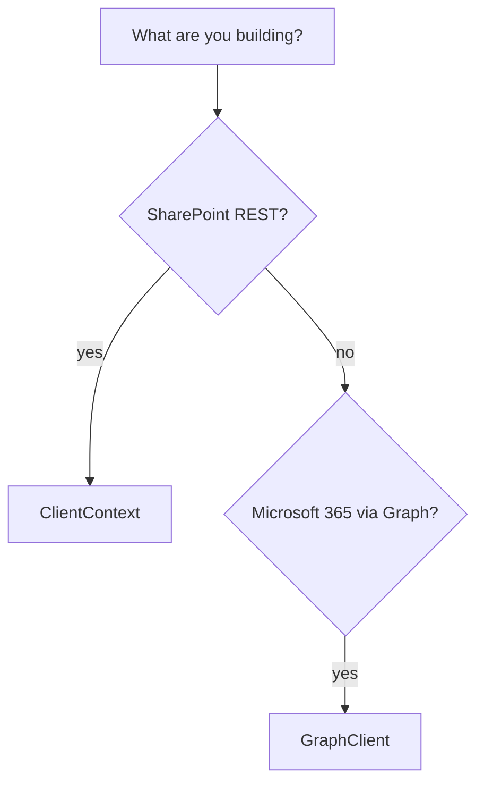

# Getting Started

## Choose your client

The library ships two clients that target two different APIs:

| | `ClientContext` | `GraphClient` |
|---|---|---|
| **Target API** | SharePoint REST API v1 | Microsoft Graph API |
| **Use for** | SharePoint lists, files, folders, search, site admin, permissions | Outlook, OneDrive, Teams, OneNote, Planner, Users, Groups |
| **SharePoint via Graph?** | — | Partial — use `ClientContext` for full SharePoint fidelity |
| **Typical auth** | `with_client_certificate`, `with_username_and_password`, device / interactive | `with_client_secret`, `with_certificate`, device / interactive |



Both clients use **Azure AD** (via [MSAL](https://github.com/AzureAD/microsoft-authentication-library-for-python)).
Pick a flow in **[Authentication](auth/index.md)**, then make your first call.

## SharePoint — `ClientContext`

```python
from office365.sharepoint.client_context import ClientContext

ctx = ClientContext("https://contoso.sharepoint.com/sites/team").with_client_certificate(
    tenant="contoso.onmicrosoft.com",
    client_id="client_id",
    thumbprint="thumbprint",
    cert_path="./cert.pem",
)
web = ctx.web.get().execute_query()
print(f"Site title: {web.title}")
```

## Microsoft Graph — `GraphClient`

```python
from office365.graph_client import GraphClient

client = GraphClient(tenant="contoso.onmicrosoft.com").with_client_secret(
    "client_id", "client_secret"
)
me = client.me.get().execute_query()
print(me.user_principal_name)
```

## Next steps

- **[Authentication](auth/index.md)** — pick the right flow (client secret,
  certificate, device code, interactive, …).
- **[Products](products/index.md)** — jump to the gallery for the service you
  need (SharePoint, OneDrive, Teams, Outlook, …).
- **[API Reference](api.md)** — query patterns, power features, and the full
  client surface.
