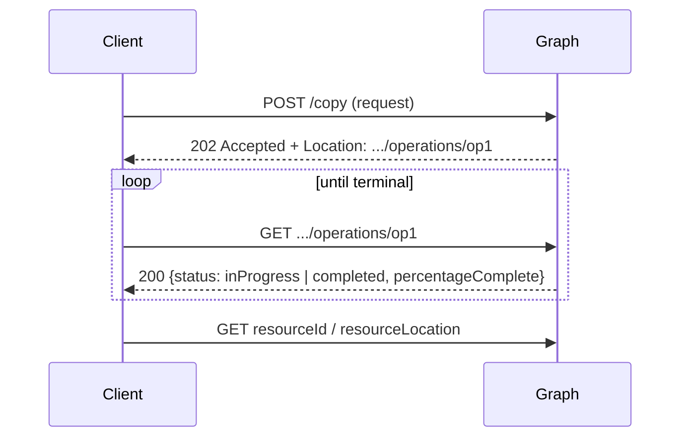

# Long-running operations

Some Microsoft 365 calls don't finish in one round-trip. Microsoft Graph answers
them with **`202 Accepted`** and a header pointing at an *operation-status*
(monitor) URL; you poll that URL until the work reaches a terminal status, then
read the result. This is the [Graph async pattern](https://learn.microsoft.com/en-us/graph/long-running-actions-overview),
and it is what copying a large Drive item, cloning a team, or recalculating a
workbook actually do:



The library gives you three levels of help, all built on the same
transport-agnostic poller (`office365.runtime.lro`):

1. **Waitable results** — `driveItem.copy()` returns a result whose
   `wait()` / `wait_async()` poll to completion and hand back the new item.
2. **Operation entities** — `TeamsAsyncOperation`, `WorkbookOperation`, and rich
   long-running operations are entities you `get()` and poll, with a generic
   `poll_for_status()` / `poll_for_status_async()`.
3. **The raw poller** — `OperationPoller`, for anything else, with pluggable
   URL resolution, `Retry-After` pacing, progress callbacks and continuation
   tokens.

All three are fully awaitable: `wait_async()` yields to the event loop between
polls, so it never blocks concurrent tasks. See [Async / await](async.md) for the
async model itself.

## Waitable results

The most ergonomic path. `DriveItem.copy()` returns a
`DriveItemCopyResult` (a `LongRunningOperationResult`); `execute_query()` submits
the copy and captures the monitor URL from the `Location` header, then
`wait_for_item()` / `wait_for_item_async()` poll and resolve the new item:

```python
source = client.me.drive.root.get_by_path("Reports/big.xlsx").get().execute_query()
result = source.copy(name="big (copy).xlsx", parent=dest).execute_query()

status = result.wait()  # blocking; or: status = await result.wait_async()

# The result is a LongRunningOperationResult: inspect or resolve it yourself
print(result.monitor_url, result.resource_id, result.resource_location)

# Or let the wrapper load the produced DriveItem for you
copied = result.wait_for_item()  # / await result.wait_for_item_async()
print(copied.web_url)
```

| Method | Purpose |
|---|---|
| `result.wait(...)` / `wait_async(...)` | Poll to terminal, return the `OperationStatus` |
| `result.wait_for_item()` / `wait_for_item_async()` | Poll, then load and return the produced `DriveItem` |
| `result.monitor_url` | The operation-status URL captured from `Location` |
| `result.last_status` | The most recent `OperationStatus` snapshot |
| `result.resource_id` / `result.resource_location` | The produced resource, once reported |

`LongRunningOperationResult` attaches credentials when polling by default, because
Graph hands back authenticated monitor URLs (often on the SharePoint host) for
these actions. The raw `OperationPoller` does **not** — see below.

- [Copy a large file and await it](products/async/copy_drive_item_async.md) —
  `wait_for_item_async()` with a live percentage.
- [Copy and wait (synchronous)](products/onedrive/files/copy_and_wait.md) — the
  blocking twin.

## Operation entities

When the service models the operation as a *resource* (rather than only a monitor
URL), the entity itself is pollable. `PollableOperation` supplies
`wait()` / `wait_async()`, `poll_for_status()` / `poll_for_status_async()`,
`next_poll_delay()`, `is_transient_poll_error()` and `normalize_status()`; the
concrete classes add typed properties.

**Teams** — `clone()` / `create()` return a `TeamsAsyncOperation`; `execute_query()`
submits it (HTTP `202`), then poll:

```python
from office365.teams.clonableteamparts import ClonableTeamParts
from office365.teams.visibility_type import TeamVisibilityType

operation = target_team.clone(
    mail_nickname="clone1",
    display_name="Project Falcon",
    parts_to_clone=ClonableTeamParts.settings,
    visibility=TeamVisibilityType.private,
).execute_query()

await operation.poll_for_status_async(timeout_sec=300, polling_interval=15)
cloned_id = operation.target_resource_id

# Or the one-shot convenience that returns the ready team
cloned = target_team.clone_and_wait(
    mail_nickname="clone1",
    display_name="Project Falcon",
    parts_to_clone=ClonableTeamParts.settings,
    visibility=TeamVisibilityType.private,
).execute_query()
```

`poll_for_status()` treats a transient `404`/`429`/`503` as "not ready yet" and
keeps polling; a `succeeded`/`failed` status ends it. `wait()` uses
`next_poll_delay()` (honoring `Retry-After`).

- [Clone a team asynchronously](products/async/wait_team_clone_async.md)
- [Wait for a team clone (synchronous)](products/teams/wait_for_clone.md)

**Workbook** — `workbook.operations` is an `EntityCollection[WorkbookOperation]`;
after a `respond-async` submission the operation is pollable:

```python
operation = workbook.operations["op-id"].get().execute_query()
operation.wait(interval=2, timeout=300)
print(operation.status, operation.resource_location, operation.error)
```

**Rich long-running operations** — `client.sites[site_id].operations[...]` exposes
Graph's `RichLongRunningOperation` (same `PollableOperation` surface), used by
site-level work.

## The raw poller

`OperationPoller` works with any `202` response, from either client. Build it from
the response, a known URL, or a continuation token:

```python
from office365.runtime.lro import OperationPoller, resolve_poll_url

response = ...  # a 202 Accepted response, however you obtained it
poller = OperationPoller.from_response(context, response, interval=5, timeout=1800)

status = poller.wait(on_progress=lambda s: print(s.status, s.percentage_complete))
# or, without blocking the loop:
status = await poller.wait_async(on_progress=...)

if status.is_success:
    print(status.resource_id, status.resource_location)
```

| Argument | Meaning |
|---|---|
| `interval` | Seconds between polls when the server sends no `Retry-After` (default `5`) |
| `timeout` | Maximum seconds to wait before `OperationTimeoutError` (default `1800`) |
| `authenticate` | Attach the context's credentials to each poll. Default `False`: Graph monitor URLs are unauthenticated and may live on another host (`api.onedrive.com`). Pass `True` for services such as Azure that require it |
| `on_progress` | Called with every `OperationStatus` snapshot |
| `transport` / `async_transport` | Override the transport used by `wait()` / `wait_async()` |
| `clock` / `sleep` / `async_sleep` | Injectable timing hooks (tests) |

The poller never sleeps past the deadline: if the next delay would exceed
`timeout`, it raises `OperationTimeoutError(timeout)` instead of waiting. It
honors `Retry-After` and backs off on `429`/`503`.

### Poll-URL resolution

`resolve_poll_url(response, final_state_via=...)` picks the monitor URL from the
response, in order, across `POLL_URL_HEADERS = ("Operation-Location", "Azure-AsyncOperation", "Location")`:

```python
from office365.runtime.lro import POLL_URL_HEADERS, resolve_poll_url

url = resolve_poll_url(response)  # "auto": first header present
url = resolve_poll_url(response, final_state_via="location")  # a specific header
url = resolve_poll_url(response, final_state_via="original-url", original_url=request.url)
```

`OperationPoller.from_response` raises `ValueError` when no monitor URL header is
present — i.e. the response was not an accepted async operation.

### Status vocabulary

`OperationStatus` is a dataclass snapshot: `status`, `http_status`,
`percentage_complete`, `resource_id`, `resource_location`, `error`, and the raw
`response`. Its `is_success` / `is_failure` / `is_terminal` predicates normalize
the service's wording, so Graph (`completed`) and Azure (`Succeeded`) both work:

```python
from office365.runtime.lro import FAILURE_STATUSES, SUCCESS_STATUSES

SUCCESS_STATUSES  # {"completed", "succeeded", "success", "finished"}
FAILURE_STATUSES  # {"failed", "failure", "cancelled", "canceled", "error"}
```

- A `3xx` (redirect to the final result) is terminal.
- A terminal failure raises `OperationFailedError(status)` from `wait()` unless
  you pass `raise_on_failure=False`.
- `OperationError` is the base class of both `OperationFailedError` and
  `OperationTimeoutError`.

## Resume across processes: continuation tokens

The monitor URL is the only state needed to resume. `ContinuationToken` captures
it (plus the resolution mode) as JSON, so a job can be polled in a later call,
process or host:

```python
from office365.runtime.lro import ContinuationToken, OperationPoller

# First process: submit and snapshot
poller = result.to_poller(interval=5, timeout=1800)
token = poller.to_continuation_token()
save(token.to_json())  # {"poll_url": ..., "final_state_via": "auto", "status": "inProgress"}

# Later process: resume
token = ContinuationToken.from_json(load())
poller = OperationPoller.from_continuation_token(client, token, interval=5, authenticate=True)
status = await poller.wait_async()
```

> Graph monitor URLs are short-lived and tied to the original caller. Persist the
> token for the duration of the operation, not indefinitely, and re-submit the
> action if the service has already expired it.

- [Resume an operation from a continuation token](products/async/resume_operation_async.md)

## `Prefer: respond-async` submissions

Some endpoints expose the async pattern *opt-in*: send `Prefer: respond-async` and
the service may accept with `202` (or answer synchronously when it's fast).
`RespondAsyncRequest` executes a **fresh** query with that preference and, when
accepted, returns a pollable `LongRunningOperationResult` — otherwise `None`, and
the query's return type holds the synchronous result:

```python
from office365.runtime.respond_async import RespondAsyncRequest

operation = await RespondAsyncRequest(context, fresh_query, wait=5).execute_async()
if operation is not None:
    await operation.wait_async(on_progress=lambda s: print(s.percentage_complete))
```

This is the mechanism behind long-running workbook operations.

- [Poll a workbook operation](products/async/workbook_operation_async.md)

## Batch vs long-running operations

Two different ideas, easy to confuse:

- **Batch** packs many independent short requests into one HTTP round-trip. It is
  about *how many requests* travel together.
- **Long-running operations** are a *single* request the service finishes later.

Batching an LRO does **not** wait for it: the `202` comes back inside the batch
and you still have to poll — and the batch envelope doesn't route the monitor URL
back to the operation result the way a normal query does. Keep LROs out of a
batch and await them individually (shared by all of them), while batching the
ordinary work:

```python
# 1. Batch the bulk, short-lived writes.
for item in rows:
    lst.add_item(item)
await ctx.execute_batch_async(items_per_batch=100, concurrency=4)

# 2. Submit LROs on the side and await each monitor URL.
copy_result = big_file.copy(name="archive.xlsx", parent=archive).execute_query()
await copy_result.wait_for_item_async()

# Or run several LROs concurrently — each keeps the loop free.
results = [f.copy(name=f"archived-{f.name}").execute_query() for f in files]
await asyncio.gather(*(r.wait_async() for r in results))
```

- [Guard against batching an LRO](products/async/lro_in_batch_guard.md) — a small
  helper that detects a `LongRunningOperationResult` in a batch's results and
  fails loudly instead of silently polling nothing.

## SharePoint long-running guidance

The SharePoint REST API has no single, uniform "operation status" URL the way
Graph does. Depending on the workload, long-running work is finished by a
service-side timer job or by the migration pipeline, and progress is either not
exposed over REST or surfaced by a workload-specific endpoint.

- **When a REST-visible status endpoint exists** (migration/translation jobs,
  tenant-level administrative operations), poll it with `OperationPoller` — the
  same pacing, timeout and continuation-token handling as Graph.
- **When it doesn't**, treat the work as **out-of-band**: submit it, then let a
  durable process track completion rather than holding a request open — a
  SharePoint **timer job**, an **Azure Function** or a **WebJob** triggered on a
  schedule, or a queue with a visibility/`Retry-After`-style delay. Persist the
  operation id (and, where available, a continuation token) so the worker resumes
  after a restart.
- **Don't build fan-out on the client's lifetime.** A long request that outlives
  your process, or a `while not done: sleep()` loop in a request handler, will be
  killed on deploy and cannot report progress. Hand it to the durable process
  above and surface status from there.

See [Data pipeline](data-pipeline.md) for the bounded, resumable import/export
model (`checkpoint`, `on_error`) that complements this pattern.

## Examples

End-to-end scripts for the whole surface:

- **Graph LROs** — [copy a drive item](products/async/copy_drive_item_async.md),
  [clone a team](products/async/wait_team_clone_async.md),
  [workbook operation](products/async/workbook_operation_async.md),
  [resume from a token](products/async/resume_operation_async.md),
  [sync copy & wait](products/onedrive/files/copy_and_wait.md),
  [sync team clone](products/teams/wait_for_clone.md),
  [LRO-in-batch guard](products/async/lro_in_batch_guard.md).
- **Reports** (streamed export) — [async export](products/async/export_report_async.md),
  [usage export](products/reports/export_usage_async.md).
- **Ergonomics** — [client lifecycle](products/async/client_lifecycle_async.md),
  [tune the offload executor](products/async/tune_offload_executor.md),
  [retry](products/async/retry_async.md),
  [paging](products/async/page_users_async.md),
  [delta sync](products/async/delta_sync_async.md),
  [large SharePoint upload](products/async/upload_large_file_sp_async.md),
  [token cache](products/async/entra_token_cache_async.md).
