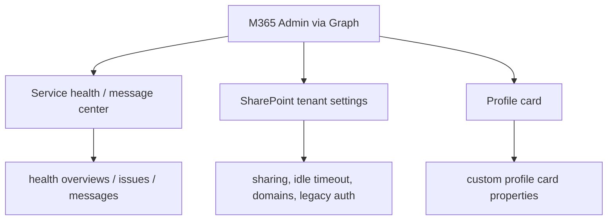

# Microsoft 365 Admin

Examples for common Microsoft 365 admin-center tasks via Graph —
service health / message center, SharePoint tenant settings, and
profile card customization.

---

## Prerequisites

| Permission | Description |
|---|---|
| `ServiceHealth.Read.All` | Read service health and message center |
| `SharePointTenantSettings.ReadWrite.All` | Read / update SharePoint tenant settings |
| `PeopleSettings.Read.All` | Read profile card properties |

---

## How it works



---

## Examples

| Scenario | File | Permission |
|---|---|---|
| Message Center + Service Health report | [`service_health_report.py`](./service_health_report.py) | `ServiceHealth.Read.All` |
| SharePoint / OneDrive tenant settings (+ opt-in updates) | [`sharepoint_settings.py`](./sharepoint_settings.py) | `SharePointTenantSettings.ReadWrite.All` |
| Custom profile card properties | [`profile_card.py`](./profile_card.py) | `PeopleSettings.Read.All` |

---

## Quick start

```python
from office365.graph_client import GraphClient

client = GraphClient(tenant="contoso.onmicrosoft.com").with_client_secret(
    "client_id", "client_secret"
)

health = client.admin.service_announcement.health_overviews.get().execute_query()
for item in health:
    print(f"  {item.properties.get('service')}  {item.properties.get('status')}")
```

---

## Not yet covered (need library additions)

- **Exchange message trace** (mail-flow diagnostics) — module exists, nav not wired
- **M365 apps update channel** — `AdminMicrosoft365Apps` empty
- **Admin report settings** — empty model

---

## Official docs

- [Admin API overview](https://learn.microsoft.com/en-us/graph/api/resources/admin-api-overview)
- [Service communications API](https://learn.microsoft.com/en-us/graph/api/resources/servicecommunication)
- [SharePoint settings API](https://learn.microsoft.com/en-us/graph/api/resources/sharepointsettings)
