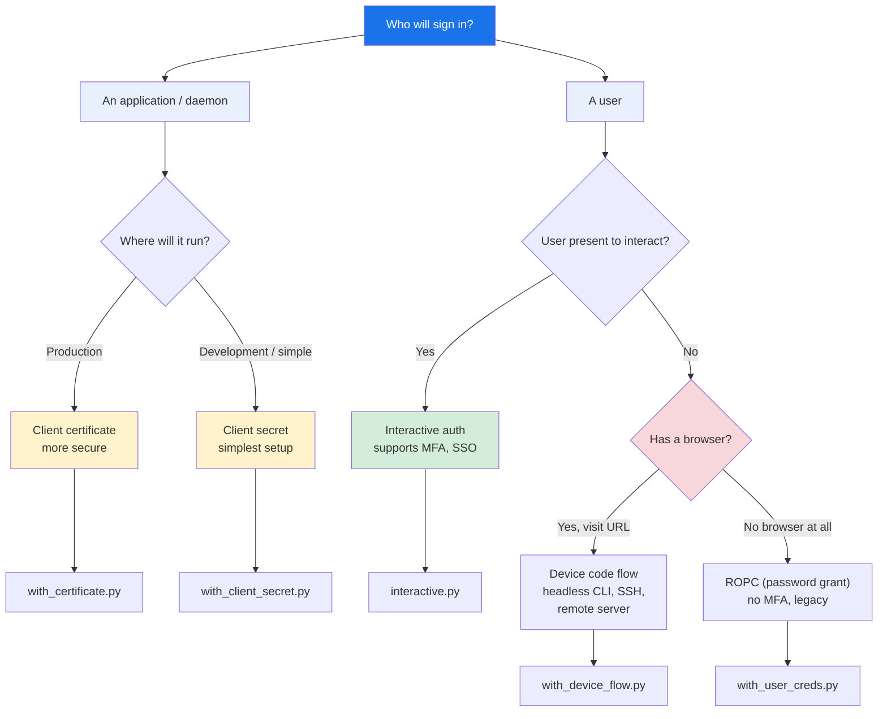

# Microsoft Graph Authentication

Picking the right authentication flow depends on **who your app runs as** and
**where it runs**. Use the chart below to decide, then jump to the example.

---

## Which flow should I use?



---

## Flow reference

| Flow | Method | Best for | MFA? | File |
|------|--------|----------|:----:|------|
| **Client secret** | `with_client_secret(client_id, secret)` | Daemons, cron jobs, CI/CD — app-only access | — | [`with_client_secret.py`](./with_client_secret.py) |
| **Client certificate** | `with_certificate(client_id, thumbprint, key)` | Production daemons — app-only, no shared secret | — | [`with_client_cert.py`](./with_client_cert.py) |
| **Interactive** | `with_token_interactive(client_id)` | Desktop apps, CLI tools — user signed-in | ✅ | [`interactive.py`](./interactive.py) |
| **Device code** | `with_device_flow(client_id)` | Headless CLI, SSH, remote servers — user visits a URL | ✅ | [`with_device_flow.py`](./with_device_flow.py) |
| **ROPC (password)** | `with_username_and_password(client_id, user, pass)` | Automated scripts — user context, no interactivity | ✗ | [`with_user_creds.py`](./with_user_creds.py) |
| **National cloud** | `AzureEnvironment.USGovernmentHigh` | GCC High, DoD, China — applies to any flow above | varies | [`gcc_high.py`](./gcc_high.py) |

---

## Quick start

```python
from office365.graph_client import GraphClient

# App-only (daemon / background job) — simplest
client = GraphClient(tenant="contoso.onmicrosoft.com").with_client_secret(
    client_id="your_client_id", client_secret=***
)

# User-authenticated (desktop app) — MFA compatible
client = GraphClient(tenant="contoso.onmicrosoft.com").with_token_interactive(
    client_id="your_client_id"
)
```

> **Note:** All examples use `tests/` module constants. Replace them with
> your own values from the [Azure Portal](https://portal.azure.com).
> App-only flows need admin consent granted in the portal.

---

## Official docs

- [Microsoft Graph authentication overview](https://learn.microsoft.com/en-us/graph/auth)
- [Microsoft identity platform auth flows](https://learn.microsoft.com/en-us/azure/active-directory/develop/msal-authentication-flows)
- [Choose an auth flow](https://learn.microsoft.com/en-us/azure/active-directory/develop/msal-authentication-flows#which-auth-flow-should-i-use)
