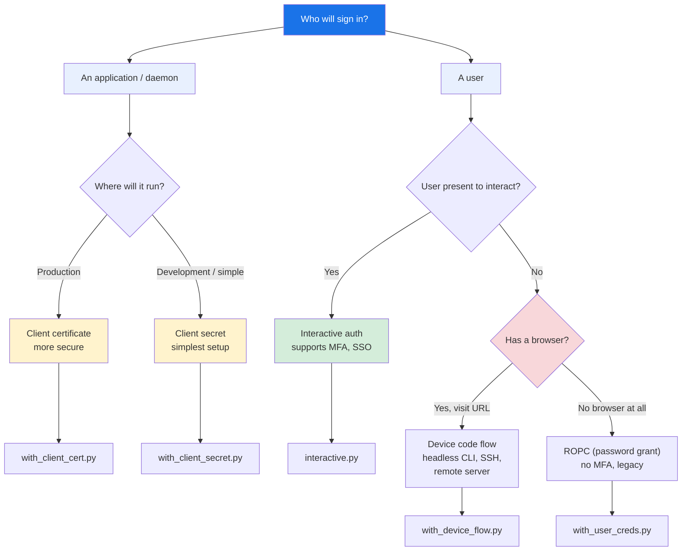

# Microsoft Graph Authentication

Authentication flows for the Graph client — pick the one that matches who your app
runs as and where it runs.

---

## Which flow should I use?


```mermaid
flowchart TD
    A[Who will sign in?] --> B[An application / daemon]
    A --> C[A user]

    B --> D{Where will it run?}
    D -->|Production| E[Client certificate
more secure]
    D -->|Development / simple| F[Client secret
simplest setup]

    C --> G{User present to interact?}
    G -->|Yes| H[Interactive auth
supports MFA, SSO]
    G -->|No| I{Has a browser?}
    I -->|Yes, visit URL| N[Device code flow
headless CLI, SSH,
remote server]
    I -->|No browser at all| O["ROPC (password grant)
no MFA, legacy"]

    E --> J[with_client_cert.py]
    F --> K[with_client_secret.py]
    H --> L[interactive.py]
    N --> P[with_device_flow.py]
    O --> M[with_user_creds.py]

    style A fill:#1a73e8,color:#fff
    style B fill:#e8f0fe
    style C fill:#e8f0fe
    style E fill:#fff3cd
    style F fill:#fff3cd
    style H fill:#d4edda
    style I fill:#f8d7da
```

---

## App-only (application permissions)

### [Client secret](with_client_secret.py)

App-only access for daemons, cron jobs, and CI/CD — simplest setup, no user involved.

```python
client = GraphClient(tenant="contoso.onmicrosoft.com").with_client_secret(
    client_id="<client_id>", client_secret="<client_secret>"
)
site = client.sites.root.get().execute_query()
print(site.web_url)
```


### [Client certificate](with_client_cert.py)

App-only access for production daemons — X.509 certificate instead of a shared secret.

```python
app = msal.ConfidentialClientApplication(
    client_id,
    authority="https://login.microsoftonline.com/contoso.onmicrosoft.com",
    client_credential={"thumbprint": cert_thumbprint, "private_key": open("cert.pem").read()},
)
token = app.acquire_token_for_client(scopes=["https://graph.microsoft.com/.default"])

client = GraphClient(token)
for drive in client.drives.get().top(10).execute_query():
    print(drive.web_url)
```


---

## User sign-in (delegated permissions)

### [Interactive](interactive.py)

User sign-in with a browser prompt — supports MFA, SSO, and consent.

```python
client = GraphClient(tenant="contoso.onmicrosoft.com").with_token_interactive(client_id="<client_id>")
me = client.me.get().execute_query()
print(f"Welcome, {me.given_name}!")
```


### [Device code flow](with_device_flow.py)

Headless CLI, SSH, and remote servers — the user visits a URL on another device.

```python
client = GraphClient(tenant="contoso.onmicrosoft.com").with_device_flow(client_id="<client_id>")
me = client.me.get().execute_query()
print(f"Authenticated as: {me.user_principal_name}")
```


### [Username & password (ROPC)](with_user_creds.py)

User context without interactivity — no MFA, legacy flow (Resource Owner Password Credentials).

```python
client = GraphClient(tenant="contoso.onmicrosoft.com").with_username_and_password(
    client_id="<client_id>", username="<user>", password="<password>"
)
me = client.me.get().execute_query()
print(me)
```


### [Custom token callback](with_token_callback.py)

Bring your own token acquisition — secrets vault, managed identity, or a custom identity provider.

```python
def acquire_token() -> dict:
    app = msal.ConfidentialClientApplication(
        client_id, client_credential=client_secret,
        authority="https://login.microsoftonline.com/contoso.onmicrosoft.com",
    )
    result = app.acquire_token_for_client(scopes=["https://graph.microsoft.com/.default"])
    if not result or "access_token" not in result:
        raise RuntimeError(f"Token acquisition failed: {result}")
    return result

client = GraphClient(tenant="contoso.onmicrosoft.com", token_callback=acquire_token)
org = client.organization.get().execute_query()
```


---

## Special environments

### [Microsoft Entra External ID (CIAM)](ciam.py)

Customer identity / External ID tenants — connect via the ciamlogin.com authority.

```python
authority = "https://contoso.ciamlogin.com"
client = GraphClient(tenant="contoso.onmicrosoft.com", authority=authority).with_client_secret(
    client_id="<client_id>", client_secret="<client_secret>"
)
org = client.organization.get().execute_query()
```


### [National clouds](gcc_high.py)

Sovereign clouds (GCC High, DoD, China) via AzureEnvironment — applies to any flow above.

```python
from office365.azure_env import AzureEnvironment

client = GraphClient(
    tenant="contoso.onmicrosoft.com", environment=AzureEnvironment.USGovernmentHigh
).with_client_secret(client_id="<client_id>", client_secret="<client_secret>")
org = client.organization.get().execute_query()
```


---

## National cloud environments

| Environment | `AzureEnvironment` |
|---|---|
| Global | `Global` |
| US Government GCC | `USGovernment` |
| US Government GCC High | `USGovernmentHigh` |
| US Government DoD | `USGovernmentDoD` |
| China | `China` |
| Germany (legacy) | `Germany` |

---

## Best practice: verify permissions upfront

Guard against missing permissions or licenses before making a call:

```python
client = (
    GraphClient(tenant="contoso.onmicrosoft.com")
    .with_client_secret(client_id="<client_id>", client_secret="<client_secret>")
    .require_application_permission("DeviceManagementConfiguration.Read.All")
    .require_delegated_permission("User.Read", "User.ReadWrite.All")
    .require_license("DEVELOPERPACK_E5")
)
```

---

## Official docs

- [Microsoft Graph authentication overview](https://learn.microsoft.com/en-us/graph/auth)
- [Microsoft identity platform auth flows](https://learn.microsoft.com/en-us/azure/active-directory/develop/msal-authentication-flows)
- [Choose an auth flow](https://learn.microsoft.com/en-us/azure/active-directory/develop/msal-authentication-flows#which-auth-flow-should-i-use)
