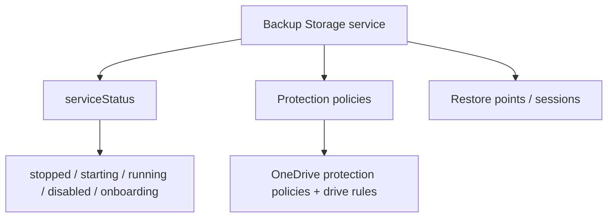

# Microsoft 365 Backup Storage

Manage the Microsoft 365 Backup Storage service — enable it, check its
status, and list protection policies.

## How it works



The **Microsoft 365 Backup Storage** service backs up OneDrive, SharePoint,
Exchange, and Microsoft 365 Groups. After enabling the service and creating
protection policies, protected data can be restored point-in-time via
restore points and restore sessions.

## Prerequisites

| Requirement | Description |
|---|---|
| `BackupRestore-Control.Read.All` | Read service status and protection policies |
| `BackupRestore-Control.ReadWrite.All` | Enable the Backup Storage service |
| **Microsoft 365 Backup Storage license** | M365 Backup Storage is a **paid add-on**. Without it, the `backupRestore` endpoint returns `UnknownError` |
| **Multi-tenant app** (for `enable`) | The `enable` operation must be performed by a multi-tenant app registered in another tenant that holds the Backup Storage permission |

> **Troubleshooting `UnknownError`**: the app already having `BackupRestore-Control.*` granted (application auth is supported) does **not** mean the service is usable — the tenant must also be **licensed** for Microsoft 365 Backup Storage.

## Examples

| Scenario | File | Permission |
|---|---|---|
| Check Backup Storage service status | [`service_status.py`](./service_status.py) | `BackupRestore-Control.Read.All` |
| Enable the Backup Storage service | [`enable_service.py`](./enable_service.py) | `BackupRestore-Control.ReadWrite.All` |
| List OneDrive protection policies + drive rules | [`protection_policies.py`](./protection_policies.py) | `BackupRestore-Control.Read.All` |

## Not yet covered (need library additions)

- **Restore points** (point-in-time restore) — enum-only models
- **Restore sessions** (create/activate, browse artifacts, restore) — enum-only models
- SharePoint / Exchange / Groups protection policies — only OneDrive policies wired

## Quick start

```python
from office365.graph_client import GraphClient

client = GraphClient(tenant="contoso.onmicrosoft.com").with_client_secret(
    "client_id", "client_secret"
)

status = client.solutions.backup_restore.service_status.get().execute_query()
print(f"Backup service status: {status.status}")
```

## Official docs

- [Microsoft 365 Backup Storage overview](https://learn.microsoft.com/en-us/graph/api/resources/backuprestore-overview)
