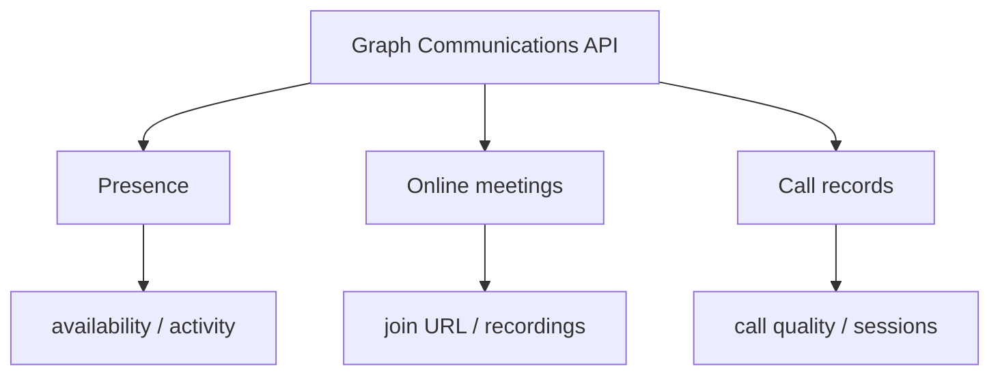

# Microsoft Teams — Communications

Examples for working with presence, online meetings, and call records
via the Microsoft Graph Communications API.

---

## Prerequisites

| Permission | Description |
|---|---|
| `Presence.Read` (delegated) | Read a user's presence |
| `Presence.Read.All` (application) | Read presence for all users |
| `Presence.ReadWrite` (delegated) | Set your own presence and status message |
| `OnlineMeetings.ReadWrite` (delegated) | Create and list online meetings |
| `CallRecords.Read.All` (application) | Read Teams call records |

---

## How communications works



Presence is delegated (a user's own or with consent); online meetings are
delegated; call records require **application** permission.

---

## Examples

| Scenario | File | Permission |
|---|---|---|
| Get presence for a user | [`get_presence.py`](./get_presence.py) | `Presence.Read` |
| Set presence and status message | [`set_presence.py`](./set_presence.py) | `Presence.ReadWrite` |
| Presence monitor with polling and routing | [`teams_presence_monitor.py`](./teams_presence_monitor.py) | `Presence.Read.All`, `Presence.ReadWrite` |
| Create a Teams meeting and list your meetings | [`online_meetings.py`](./online_meetings.py) | `OnlineMeetings.ReadWrite` |
| List Teams call records (call quality) | [`call_records.py`](./call_records.py) | `CallRecords.Read.All` |

---

## Quick start

```python
from office365.graph_client import GraphClient

client = GraphClient(tenant="contoso.onmicrosoft.com").with_username_and_password(
    "client_id", "user@contoso.com", "password"
)

presence = client.me.presence.get().execute_query()
print(f"{presence.availability}  {presence.activity}")
```

---

## Official docs

- [Presence API overview](https://learn.microsoft.com/en-us/graph/api/resources/presence)
- [Cloud communications API](https://learn.microsoft.com/en-us/graph/api/resources/communications-api-overview)
- [Call records API](https://learn.microsoft.com/en-us/graph/api/resources/callrecords-api-overview)
