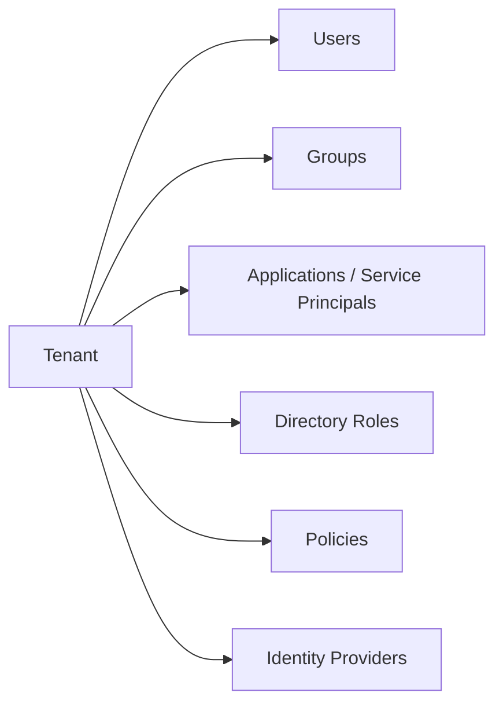

# Microsoft Entra ID

Examples for working with Microsoft Entra ID (formerly Azure AD) via the
Microsoft Graph API — users, groups, applications, service principals,
directory roles, and policies.

---

## Prerequisites

| Requirement | Description | Reference |
|---|---|---|
| `User.Read.All` | Read user profiles and directory data | [User permissions](https://learn.microsoft.com/en-us/graph/permissions-reference#user-permissions) |
| `User.ReadWrite.All` | Update users, reset passwords, manage licenses | [User permissions](https://learn.microsoft.com/en-us/graph/permissions-reference#user-permissions) |
| `Group.ReadWrite.All` | Create, list, and delete groups | [Group permissions](https://learn.microsoft.com/en-us/graph/permissions-reference#group-permissions) |
| `Application.ReadWrite.All` | Register and manage applications | [Application permissions](https://learn.microsoft.com/en-us/graph/permissions-reference#application-permissions) |
| `AppRoleAssignment.ReadWrite.All` | Grant and revoke API permissions | [AppRoleAssignment permissions](https://learn.microsoft.com/en-us/graph/permissions-reference#approleassignment-permissions) |
| `RoleManagement.ReadWrite.Directory` | Read and assign directory roles | [RoleManagement permissions](https://learn.microsoft.com/en-us/graph/permissions-reference#role-management-permissions) |
| `Policy.Read.All` | Read tenant policies | [Policy permissions](https://learn.microsoft.com/en-us/graph/permissions-reference#policy-permissions) |
| `IdentityProvider.Read.All` | Read identity providers (SAML, social) | [IdentityProvider permissions](https://learn.microsoft.com/en-us/graph/permissions-reference#identity-provider-permissions) |
| `User.Invite.All` | Invite guest users (B2B) | [User Invite permissions](https://learn.microsoft.com/en-us/graph/permissions-reference#user-permissions) |

Admin consent is required for most permissions above.

---

## How Entra ID is organized



The Entra ID Graph API covers identity and access management — users,
groups, app registrations, service principals, role assignments, and
tenant-level policies.

---

## Examples — Users

| Step | Operation | File | Required role | API reference |
|---|---|---|---|---|
| **1** | Import users from CSV | [`users/import.py`](./users/import.py) | `User.ReadWrite.All` | [create user](https://learn.microsoft.com/en-us/graph/api/user-post-users) |
| **2** | Get total user count | [`users/get_count.py`](./users/get_count.py) | `User.Read.All` | [get user](https://learn.microsoft.com/en-us/graph/api/user-get) |
| **3** | Get disabled user accounts | [`users/get_disabled.py`](./users/get_disabled.py) | `User.Read.All` | [list users](https://learn.microsoft.com/en-us/graph/api/user-list) |
| **4** | Get users with expired passwords | [`users/get_with_expired_password.py`](./users/get_with_expired_password.py) | `User.Read.All` | [list users](https://learn.microsoft.com/en-us/graph/api/user-list) |
| **5** | Get user's recent activities | [`users/get_my_activities.py`](./users/get_my_activities.py) | `User.Read.All` | [activities](https://learn.microsoft.com/en-us/graph/api/activity-list) |
| **6** | Update a user's profile | [`users/update.py`](./users/update.py) | `User.ReadWrite.All` | [update user](https://learn.microsoft.com/en-us/graph/api/user-update) |
| **7** | Update users in batch | [`users/update_batch.py`](./users/update_batch.py) | `User.ReadWrite.All` | [update user](https://learn.microsoft.com/en-us/graph/api/user-update) |
| **8** | Reset a user's password | [`users/reset_password.py`](./users/reset_password.py) | `User.ReadWrite.All` | [reset password](https://learn.microsoft.com/en-us/graph/api/user-resetpassword) |
| **9** | Assign a manager to a user | [`users/assign_manager.py`](./users/assign_manager.py) | `User.ReadWrite.All` | [update manager](https://learn.microsoft.com/en-us/graph/api/user-update-manager) |
| **10** | Disable MFA for a user | [`users/disable_mfa.py`](./users/disable_mfa.py) | `User.ReadWrite.All` | [update authentication](https://learn.microsoft.com/en-us/graph/api/authentication-update) |
| **11** | Get assigned licenses | [`users/get_licenses.py`](./users/get_licenses.py) | `User.Read.All` | [get license](https://learn.microsoft.com/en-us/graph/api/user-list-licensess) |
| **12** | Export users to file | [`users/export.py`](./users/export.py) | `User.Read.All` | [list users](https://learn.microsoft.com/en-us/graph/api/user-list) |
| **13** | Export personal data (GDPR) | [`users/export_personal_data.py`](./users/export_personal_data.py) | `User.Read.All` | [export data](https://learn.microsoft.com/en-us/graph/api/user-exportpersonaldata) |
| **14** | List app role assignments | [`users/list_app_role_assignments.py`](./users/list_app_role_assignments.py) | `User.Read.All` | [app role assignments](https://learn.microsoft.com/en-us/graph/api/user-list-approleassignments) |
| **15** | Create a user | [`users/create.py`](./users/create.py) | `User.ReadWrite.All` | [create user](https://learn.microsoft.com/en-us/graph/api/user-post-users) |
| **16** | Delete a user | [`users/delete.py`](./users/delete.py) | `User.ReadWrite.All` | [delete user](https://learn.microsoft.com/en-us/graph/api/user-delete) |
| **17** | Get user's group memberships | [`users/get_group_memberships.py`](./users/get_group_memberships.py) | `User.Read.All` | [memberOf](https://learn.microsoft.com/en-us/graph/api/user-list-memberof) |
| **18** | Invite a guest (B2B) user | [`users/invite_guest.py`](./users/invite_guest.py) | `User.Invite.All` | [invitation](https://learn.microsoft.com/en-us/graph/api/invitation-post) |

## Examples — Groups

| Step | Operation | File | Required role | API reference |
|---|---|---|---|---|
| **19** | Create a Microsoft 365 group | [`groups/create_m365.py`](./groups/create_m365.py) | `Group.ReadWrite.All` | [create group](https://learn.microsoft.com/en-us/graph/api/group-pre-create) |
| **20** | Create a group with a team | [`groups/create_with_team.py`](./groups/create_with_team.py) | `Group.ReadWrite.All` | [create group](https://learn.microsoft.com/en-us/graph/api/group-post-groups) |
| **21** | List all groups | [`groups/list.py`](./groups/list.py) | `Group.ReadWrite.All` | [list groups](https://learn.microsoft.com/en-us/graph/api/group-list) |
| **22** | Delete groups by name | [`groups/delete_groups.py`](./groups/delete_groups.py) | `Group.ReadWrite.All` | [delete group](https://learn.microsoft.com/en-us/graph/api/group-delete) |
| **23** | Delete groups in batch | [`groups/delete_batch.py`](./groups/delete_batch.py) | `Group.ReadWrite.All` | [delete group](https://learn.microsoft.com/en-us/graph/api/group-delete) |
| **24** | Add/remove group members | [`groups/add_member.py`](./groups/add_member.py) | `Group.ReadWrite.All` | [group members](https://learn.microsoft.com/en-us/graph/api/group-post-members) |

## Examples — Applications

| Step | Operation | File | Required role | API reference |
|---|---|---|---|---|
| **25** | Add a certificate to an app | [`applications/add_cert.py`](./applications/add_cert.py) | `Application.ReadWrite.All` | [add certificate](https://learn.microsoft.com/en-us/graph/api/application-post-certificates) |
| **26** | Add a client secret (password) | [`applications/app_password.py`](./applications/app_password.py) | `Application.ReadWrite.All` | [add password](https://learn.microsoft.com/en-us/graph/api/application-add-password) |
| **27** | Get an application by client ID | [`applications/get_by_app_id.py`](./applications/get_by_app_id.py) | `Application.ReadWrite.All` | [get application](https://learn.microsoft.com/en-us/graph/api/application-get) |
| **28** | Check application permissions | [`applications/has_application_perms.py`](./applications/has_application_perms.py) | `AppRoleAssignment.ReadWrite.All` | [app permissions](https://learn.microsoft.com/en-us/graph/api/application-list-approleassignments) |
| **29** | Check delegated permissions | [`applications/has_delegated_perms.py`](./applications/has_delegated_perms.py) | `AppRoleAssignment.ReadWrite.All` | [delegated perms](https://learn.microsoft.com/en-us/graph/api/serviceprincipal-list-delegatedpermissions) |
| **30** | List application permissions | [`applications/list_application_perms.py`](./applications/list_application_perms.py) | `AppRoleAssignment.ReadWrite.All` | [list app perms](https://learn.microsoft.com/en-us/graph/api/serviceprincipal-list-approleassignments) |
| **31** | List delegated permissions | [`applications/list_delegated_perms.py`](./applications/list_delegated_perms.py) | `AppRoleAssignment.ReadWrite.All` | [list delegated](https://learn.microsoft.com/en-us/graph/api/serviceprincipal-list-delegatedpermissions) |
| **32** | Grant application permissions | [`applications/grant_application_perms.py`](./applications/grant_application_perms.py) | `AppRoleAssignment.ReadWrite.All` | [grant](https://learn.microsoft.com/en-us/graph/api/serviceprincipal-post-approleassignments) |
| **33** | Grant delegated permissions | [`applications/grant_delegated_perms.py`](./applications/grant_delegated_perms.py) | `AppRoleAssignment.ReadWrite.All` | [grant](https://learn.microsoft.com/en-us/graph/api/serviceprincipal-post-delegatedpermissions) |
| **34** | Revoke application permissions | [`applications/revoke_application_perms.py`](./applications/revoke_application_perms.py) | `AppRoleAssignment.ReadWrite.All` | [revoke](https://learn.microsoft.com/en-us/graph/api/serviceprincipal-delete-approleassignments) |
| **35** | Revoke delegated permissions | [`applications/revoke_delegated_perms.py`](./applications/revoke_delegated_perms.py) | `AppRoleAssignment.ReadWrite.All` | [revoke](https://learn.microsoft.com/en-us/graph/api/serviceprincipal-delete-delegatedpermissions) |

## Examples — Roles, Policies & Identity

| Step | Operation | File | Required role | API reference |
|---|---|---|---|---|
| **36** | List directory roles | [`roles/list.py`](./roles/list.py) | `RoleManagement.ReadWrite.Directory` | [list roles](https://learn.microsoft.com/en-us/graph/api/directoryrole-list) |
| **37** | Get roles assigned to a user | [`roles/for_user.py`](./roles/for_user.py) | `RoleManagement.ReadWrite.Directory` | [user roles](https://learn.microsoft.com/en-us/graph/api/user-list-memberof) |
| **38** | Assign a role to a user | [`roles/assign_role.py`](./roles/assign_role.py) | `RoleManagement.ReadWrite.Directory` | [assign role](https://learn.microsoft.com/en-us/graph/api/directoryrole-post-members) |
| **39** | Get authentication policy | [`policies/get_auth_settings.py`](./policies/get_auth_settings.py) | `Policy.Read.All` | [auth policy](https://learn.microsoft.com/en-us/graph/api/authenticationpolicy-get) |
| **40** | List identity providers | [`identity/list_provider.py`](./identity/list_provider.py) | `IdentityProvider.Read.All` | [list providers](https://learn.microsoft.com/en-us/graph/api/identityprovider-list) |

---

## Quick start

```python
from office365.graph_client import GraphClient

client = GraphClient(tenant="contoso.onmicrosoft.com").with_client_secret(
    "client_id", "client_secret"
)

# List all users
users = client.users.top(10).get().execute_query()
for user in users:
    print(f"{user.user_principal_name:40s}  {user.display_name}")
```

---

## Official docs

- [Microsoft Entra ID](https://learn.microsoft.com/en-us/entra/identity)
- [Microsoft Graph users API](https://learn.microsoft.com/en-us/graph/api/resources/user)
- [Microsoft Graph groups API](https://learn.microsoft.com/en-us/graph/api/resources/group)
- [Microsoft Graph applications API](https://learn.microsoft.com/en-us/graph/api/resources/application)
- [Microsoft Graph permissions reference](https://learn.microsoft.com/en-us/graph/permissions-reference)
