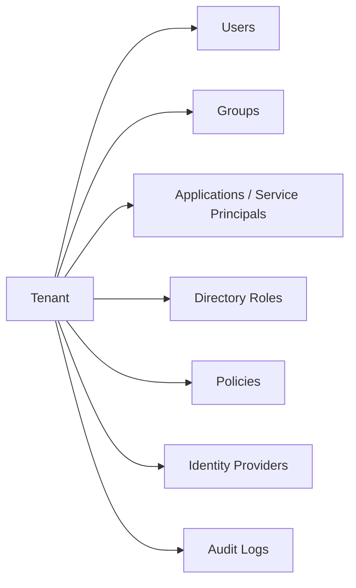

# Microsoft Entra ID

Examples for working with Microsoft Entra ID (formerly Azure AD) via the
Microsoft Graph API — users, groups, applications, service principals,
directory roles, policies, and audit logs.

---

## Prerequisites

| Requirement | Description | Reference |
|---|---|---|
| `User.Read.All` | Read user profiles and directory data | [User permissions](https://learn.microsoft.com/en-us/graph/permissions-reference#user-permissions) |
| `User.ReadWrite.All` | Update users, reset passwords, manage licenses | [User permissions](https://learn.microsoft.com/en-us/graph/permissions-reference#user-permissions) |
| `User.Invite.All` | Invite guest users (B2B) | [User Invite permissions](https://learn.microsoft.com/en-us/graph/permissions-reference#user-permissions) |
| `Group.Read.All` | Read group members and properties | [Group permissions](https://learn.microsoft.com/en-us/graph/permissions-reference#group-permissions) |
| `Group.ReadWrite.All` | Create, manage, and delete groups | [Group permissions](https://learn.microsoft.com/en-us/graph/permissions-reference#group-permissions) |
| `Application.Read.All` | Read app registrations | [Application permissions](https://learn.microsoft.com/en-us/graph/permissions-reference#application-permissions) |
| `Application.ReadWrite.All` | Register and manage applications | [Application permissions](https://learn.microsoft.com/en-us/graph/permissions-reference#application-permissions) |
| `AppRoleAssignment.ReadWrite.All` | Grant and revoke API permissions | [AppRoleAssignment permissions](https://learn.microsoft.com/en-us/graph/permissions-reference#approleassignment-permissions) |
| `RoleManagement.ReadWrite.Directory` | Read and assign directory roles | [RoleManagement permissions](https://learn.microsoft.com/en-us/graph/permissions-reference#role-management-permissions) |
| `Policy.Read.All` | Read tenant policies | [Policy permissions](https://learn.microsoft.com/en-us/graph/permissions-reference#policy-permissions) |
| `IdentityProvider.Read.All` | Read identity providers (SAML, social) | [IdentityProvider permissions](https://learn.microsoft.com/en-us/graph/permissions-reference#identity-provider-permissions) |
| `AuditLog.Read.All` | Read sign-in logs and audit logs | [AuditLog permissions](https://learn.microsoft.com/en-us/graph/permissions-reference#audit-log-permissions) |

Admin consent is required for most permissions above.

---

## How Entra ID is organized



The Entra ID Graph API covers identity and access management — users,
groups, app registrations, service principals, role assignments,
tenant-level policies, and audit logs.

---

## Examples — Users

| Operation | File | Required role | API reference |
|---|---|---|---|
| Import users from CSV | [`users/import.py`](./users/import.py) | `User.ReadWrite.All` | [create user](https://learn.microsoft.com/en-us/graph/api/user-post-users) |
| Get total user count | [`users/get_count.py`](./users/get_count.py) | `User.Read.All` | [get user](https://learn.microsoft.com/en-us/graph/api/user-get) |
| Get disabled user accounts | [`users/get_disabled.py`](./users/get_disabled.py) | `User.Read.All` | [list users](https://learn.microsoft.com/en-us/graph/api/user-list) |
| Get users with expired passwords | [`users/get_with_expired_password.py`](./users/get_with_expired_password.py) | `User.Read.All` | [list users](https://learn.microsoft.com/en-us/graph/api/user-list) |
| Get user's recent activities | [`users/get_my_activities.py`](./users/get_my_activities.py) | `User.Read.All` | [activities](https://learn.microsoft.com/en-us/graph/api/activity-list) |
| Update a user's profile | [`users/update.py`](./users/update.py) | `User.ReadWrite.All` | [update user](https://learn.microsoft.com/en-us/graph/api/user-update) |
| Update users in batch | [`users/update_batch.py`](./users/update_batch.py) | `User.ReadWrite.All` | [update user](https://learn.microsoft.com/en-us/graph/api/user-update) |
| Reset a user's password | [`users/reset_password.py`](./users/reset_password.py) | `User.ReadWrite.All` | [reset password](https://learn.microsoft.com/en-us/graph/api/user-resetpassword) |
| Assign a manager to a user | [`users/assign_manager.py`](./users/assign_manager.py) | `User.ReadWrite.All` | [update manager](https://learn.microsoft.com/en-us/graph/api/user-post-manager) |
| Get a user's manager | [`users/get_manager.py`](./users/get_manager.py) | `User.Read.All` | [get manager](https://learn.microsoft.com/en-us/graph/api/user-list-manager) |
| Disable MFA for a user | [`users/disable_mfa.py`](./users/disable_mfa.py) | `User.ReadWrite.All` | [update authentication](https://learn.microsoft.com/en-us/graph/api/authentication-update) |
| Get assigned licenses | [`users/get_licenses.py`](./users/get_licenses.py) | `User.Read.All` | [get license](https://learn.microsoft.com/en-us/graph/api/user-list-licensess) |
| Assign a license to a user | [`users/assign_license.py`](./users/assign_license.py) | `User.ReadWrite.All` | [assign license](https://learn.microsoft.com/en-us/graph/api/user-assignlicense) |
| Export users to file | [`users/export.py`](./users/export.py) | `User.Read.All` | [list users](https://learn.microsoft.com/en-us/graph/api/user-list) |
| Export personal data (GDPR) | [`users/export_personal_data.py`](./users/export_personal_data.py) | `User.Read.All` | [export data](https://learn.microsoft.com/en-us/graph/api/user-exportpersonaldata) |
| List app role assignments | [`users/list_app_role_assignments.py`](./users/list_app_role_assignments.py) | `User.Read.All` | [app role assignments](https://learn.microsoft.com/en-us/graph/api/user-list-approleassignments) |
| Create a user | [`users/create.py`](./users/create.py) | `User.ReadWrite.All` | [create user](https://learn.microsoft.com/en-us/graph/api/user-post-users) |
| Delete a user | [`users/delete.py`](./users/delete.py) | `User.ReadWrite.All` | [delete user](https://learn.microsoft.com/en-us/graph/api/user-delete) |
| Get user's group memberships | [`users/get_group_memberships.py`](./users/get_group_memberships.py) | `User.Read.All` | [memberOf](https://learn.microsoft.com/en-us/graph/api/user-list-memberof) |
| Invite a guest (B2B) user | [`users/invite_guest.py`](./users/invite_guest.py) | `User.Invite.All` | [invitation](https://learn.microsoft.com/en-us/graph/api/invitation-post) |
| User report — sign-in activity, inactive, no MFA | [`users/report.py`](./users/report.py) | `User.Read.All`, `AuditLog.Read.All` | [user list](https://learn.microsoft.com/en-us/graph/api/user-list) |
| MFA status report — users without strong auth registered | [`users/mfa_status_report.py`](./users/mfa_status_report.py) | `UserAuthenticationMethod.Read.All` | [auth methods](https://learn.microsoft.com/en-us/graph/api/resources/authenticationmethods-overview) |
| Last sign-in report — users without recent sign-in | [`users/last_signin_report.py`](./users/last_signin_report.py) | `User.Read.All`, `AuditLog.Read.All` | [signInActivity](https://learn.microsoft.com/en-us/graph/api/resources/signinactivity) |
| Find inactive guest accounts | [`users/find_inactive_guests.py`](./users/find_inactive_guests.py) | `User.Read.All`, `AuditLog.Read.All` | [user list](https://learn.microsoft.com/en-us/graph/api/user-list) |
| Break-glass account audit — CA exclusions, permanent Global Admins | [`users/break_glass_report.py`](./users/break_glass_report.py) | `Policy.Read.All`, `RoleManagement.Read.All` | [CA policies](https://learn.microsoft.com/en-us/graph/api/resources/conditionalaccesspolicy) |
| Bulk assign licenses from CSV | [`users/bulk_assign_license.py`](./users/bulk_assign_license.py) | `User.ReadWrite.All` | [assign license](https://learn.microsoft.com/en-us/graph/api/user-assignlicense) |

## Examples — Groups

| Operation | File | Required role | API reference |
|---|---|---|---|
| Create a Microsoft 365 group | [`groups/create_m365.py`](./groups/create_m365.py) | `Group.ReadWrite.All` | [create group](https://learn.microsoft.com/en-us/graph/api/group-post-groups) |
| Create a security group | [`groups/create_security.py`](./groups/create_security.py) | `Group.ReadWrite.All` | [create group](https://learn.microsoft.com/en-us/graph/api/group-post-groups) |
| Create a group with a team | [`groups/create_with_team.py`](./groups/create_with_team.py) | `Group.ReadWrite.All` | [create group](https://learn.microsoft.com/en-us/graph/api/group-post-groups) |
| List all groups | [`groups/list.py`](./groups/list.py) | `Group.ReadWrite.All` | [list groups](https://learn.microsoft.com/en-us/graph/api/group-list) |
| List group members | [`groups/list_members.py`](./groups/list_members.py) | `Group.Read.All` | [list members](https://learn.microsoft.com/en-us/graph/api/group-list-members) |
| Add/remove group members | [`groups/add_member.py`](./groups/add_member.py) | `Group.ReadWrite.All` | [group members](https://learn.microsoft.com/en-us/graph/api/group-post-members) |
| Delete groups by name | [`groups/delete_groups.py`](./groups/delete_groups.py) | `Group.ReadWrite.All` | [delete group](https://learn.microsoft.com/en-us/graph/api/group-delete) |
| Delete groups in batch | [`groups/delete_batch.py`](./groups/delete_batch.py) | `Group.ReadWrite.All` | [delete group](https://learn.microsoft.com/en-us/graph/api/group-delete) |
| Group lifecycle — owners, members, orphans | [`groups/manage.py`](./groups/manage.py) | `Group.Read.All`, `User.Read.All` | [group list](https://learn.microsoft.com/en-us/graph/api/group-list) |
| Find orphaned groups — no owners or members | [`groups/find_orphans.py`](./groups/find_orphans.py) | `Group.Read.All`, `User.Read.All` | [group list](https://learn.microsoft.com/en-us/graph/api/group-list) |
| Group membership changes audit — who was added/removed | [`audit/group_membership_changes.py`](./audit/group_membership_changes.py) | `AuditLog.Read.All` | [directory audit](https://learn.microsoft.com/en-us/graph/api/resources/directoryaudit) |

## Examples — Applications

| Operation | File | Required role | API reference |
|---|---|---|---|
| Register a new application | [`applications/create.py`](./applications/create.py) | `Application.ReadWrite.All` | [create app](https://learn.microsoft.com/en-us/graph/api/application-post-applications) |
| List all applications | [`applications/list.py`](./applications/list.py) | `Application.Read.All` | [list apps](https://learn.microsoft.com/en-us/graph/api/application-list) |
| Get an application by client ID | [`applications/get_by_app_id.py`](./applications/get_by_app_id.py) | `Application.ReadWrite.All` | [get application](https://learn.microsoft.com/en-us/graph/api/application-get) |
| Add a certificate to an app | [`applications/add_cert.py`](./applications/add_cert.py) | `Application.ReadWrite.All` | [add certificate](https://learn.microsoft.com/en-us/graph/api/application-post-certificates) |
| Add a client secret (password) | [`applications/app_password.py`](./applications/app_password.py) | `Application.ReadWrite.All` | [add password](https://learn.microsoft.com/en-us/graph/api/application-add-password) |
| Check application permissions | [`applications/has_application_perms.py`](./applications/has_application_perms.py) | `AppRoleAssignment.ReadWrite.All` | [app permissions](https://learn.microsoft.com/en-us/graph/api/application-list-approleassignments) |
| Check delegated permissions | [`applications/has_delegated_perms.py`](./applications/has_delegated_perms.py) | `AppRoleAssignment.ReadWrite.All` | [delegated perms](https://learn.microsoft.com/en-us/graph/api/serviceprincipal-list-delegatedpermissions) |
| List application permissions | [`applications/list_application_perms.py`](./applications/list_application_perms.py) | `AppRoleAssignment.ReadWrite.All` | [list app perms](https://learn.microsoft.com/en-us/graph/api/serviceprincipal-list-approleassignments) |
| List delegated permissions | [`applications/list_delegated_perms.py`](./applications/list_delegated_perms.py) | `AppRoleAssignment.ReadWrite.All` | [list delegated](https://learn.microsoft.com/en-us/graph/api/serviceprincipal-list-delegatedpermissions) |
| Grant application permissions | [`applications/grant_application_perms.py`](./applications/grant_application_perms.py) | `AppRoleAssignment.ReadWrite.All` | [grant](https://learn.microsoft.com/en-us/graph/api/serviceprincipal-post-approleassignments) |
| Grant delegated permissions | [`applications/grant_delegated_perms.py`](./applications/grant_delegated_perms.py) | `AppRoleAssignment.ReadWrite.All` | [grant](https://learn.microsoft.com/en-us/graph/api/serviceprincipal-post-delegatedpermissions) |
| Revoke application permissions | [`applications/revoke_application_perms.py`](./applications/revoke_application_perms.py) | `AppRoleAssignment.ReadWrite.All` | [revoke](https://learn.microsoft.com/en-us/graph/api/serviceprincipal-delete-approleassignments) |
| Revoke delegated permissions | [`applications/revoke_delegated_perms.py`](./applications/revoke_delegated_perms.py) | `AppRoleAssignment.ReadWrite.All` | [revoke](https://learn.microsoft.com/en-us/graph/api/serviceprincipal-delete-delegatedpermissions) |
| Service principal report — apps, perms, expiring secrets | [`applications/sp_report.py`](./applications/sp_report.py) | `Application.Read.All` | [SP list](https://learn.microsoft.com/en-us/graph/api/serviceprincipal-list) |
| App secret expiry report — certs/passwords expiring soon | [`applications/secret_expiry.py`](./applications/secret_expiry.py) | `Application.Read.All` | [app credentials](https://learn.microsoft.com/en-us/graph/api/resources/application) |
| OAuth consent grants — review delegated permissions per app | [`applications/consent_grants.py`](./applications/consent_grants.py) | `DelegatedPermissionGrant.Read.All` | [consent grants](https://learn.microsoft.com/en-us/graph/api/resources/oauth2permissiongrant) |
| Find orphaned apps — registrations/SPs without owners | [`applications/find_orphans.py`](./applications/find_orphans.py) | `Application.Read.All` | [app list](https://learn.microsoft.com/en-us/graph/api/application-list) |

## Examples — Roles & Identity

| Operation | File | Required role | API reference |
|---|---|---|---|
| List directory roles | [`roles/list.py`](./roles/list.py) | `RoleManagement.ReadWrite.Directory` | [list roles](https://learn.microsoft.com/en-us/graph/api/directoryrole-list) |
| Get roles assigned to a user | [`roles/for_user.py`](./roles/for_user.py) | `RoleManagement.ReadWrite.Directory` | [user roles](https://learn.microsoft.com/en-us/graph/api/user-list-memberof) |
| Assign a role to a user | [`roles/assign_role.py`](./roles/assign_role.py) | `RoleManagement.ReadWrite.Directory` | [assign role](https://learn.microsoft.com/en-us/graph/api/directoryrole-post-members) |
| List identity providers | [`identity/list_provider.py`](./identity/list_provider.py) | `IdentityProvider.Read.All` | [list providers](https://learn.microsoft.com/en-us/graph/api/identityprovider-list) |
| PIM report — privileged role assignments | [`roles/pim_report.py`](./roles/pim_report.py) | `RoleManagement.Read.All` | [role assignments](https://learn.microsoft.com/en-us/graph/api/privilegedroleassignment-list) |

## Examples — Policies

| Operation | File | Required role | API reference |
|---|---|---|---|
| Get authorization policy | [`policies/get_auth_settings.py`](./policies/get_auth_settings.py) | `Policy.Read.All` | [auth policy](https://learn.microsoft.com/en-us/graph/api/authorizationpolicy-get) |
| List Conditional Access policies | [`policies/conditional_access/list.py`](./policies/conditional_access/list.py) | `Policy.Read.All` | [list CA policies](https://learn.microsoft.com/en-us/graph/api/conditionalaccesspolicy-list) |
| Get authentication methods policy | [`policies/authentication_methods.py`](./policies/authentication_methods.py) | `Policy.Read.All` | [auth methods](https://learn.microsoft.com/en-us/graph/api/authenticationmethodspolicy-get) |
| Get admin consent request policy | [`policies/admin_consent_request.py`](./policies/admin_consent_request.py) | `Policy.Read.All` | [admin consent](https://learn.microsoft.com/en-us/graph/api/adminconsentrequestpolicy-get) |
| Get device registration policy | [`policies/device_registration.py`](./policies/device_registration.py) | `Policy.Read.All` | [device reg](https://learn.microsoft.com/en-us/graph/api/deviceregistrationpolicy-get) |
| Get cross-tenant access policy | [`policies/cross_tenant_access.py`](./policies/cross_tenant_access.py) | `Policy.Read.All` | [cross-tenant](https://learn.microsoft.com/en-us/graph/api/crosstenantaccesspolicy-get) |
| CA policy report — break-glass accounts, enforcement state | [`policies/ca_report.py`](./policies/ca_report.py) | `Policy.Read.All` | [CA policy list](https://learn.microsoft.com/en-us/graph/api/conditionalaccesspolicy-list) |
| Stale device report — devices without recent sign-in | [`devices/stale_report.py`](./devices/stale_report.py) | `Device.Read.All` | [device list](https://learn.microsoft.com/en-us/graph/api/device-list) |

## Examples — Audit Logs

| Operation | File | Required role | API reference |
|---|---|---|---|
| List user sign-in logs | [`audit/list_signins.py`](./audit/list_signins.py) | `AuditLog.Read.All` | [list signins](https://learn.microsoft.com/en-us/graph/api/signin-list) |

---

## Quick start

```python
from office365.graph_client import GraphClient

client = GraphClient(tenant="contoso.onmicrosoft.com").with_client_secret(
    "client_id", "client_secret"
)

# List all users
users = client.users.top(10).get().execute_query()
for user in users:
    print(f"{user.user_principal_name:40s}  {user.display_name}")
```

---

## Official docs

- [Microsoft Entra ID](https://learn.microsoft.com/en-us/entra/identity)
- [Microsoft Graph users API](https://learn.microsoft.com/en-us/graph/api/resources/user)
- [Microsoft Graph groups API](https://learn.microsoft.com/en-us/graph/api/resources/group)
- [Microsoft Graph applications API](https://learn.microsoft.com/en-us/graph/api/resources/application)
- [Microsoft Graph audit logs API](https://learn.microsoft.com/en-us/graph/api/resources/azure-ad-auditlog-overview)
- [Microsoft Graph permissions reference](https://learn.microsoft.com/en-us/graph/permissions-reference)
