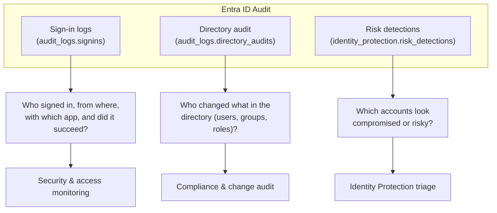

# Entra ID Audit Logs

Audit who signed in, what changed in the directory, and which accounts are
flagged as risky — using the Microsoft Graph audit logs and Identity
Protection signals.

---

## Prerequisites

| Permission | Description | Reference |
|---|---|---|
| `AuditLog.Read.All` | Sign-in and directory audit logs | [Audit log permissions](https://learn.microsoft.com/en-us/graph/permissions-reference#auditlog-permissions) |
| `IdentityRiskEvent.Read.All` | Identity Protection risk detections | [Risk permissions](https://learn.microsoft.com/en-us/graph/permissions-reference#risk-permissions) |

---

## How the audit sources fit together

**Which log to use:** sign-in logs answer *access* questions, directory audit
answers *change* questions, and risk detections answer *is this account
compromised* questions.

---

## Examples

| Operation | File | Permission | API |
|---|---|---|---|
| List recent sign-ins | [`list_signins.py`](./list_signins.py) | `AuditLog.Read.All` | [signIn list](https://learn.microsoft.com/en-us/graph/api/signin-list) |
| Sign-in history for one user | [`user_signins.py`](./user_signins.py) | `AuditLog.Read.All` | [signIn list](https://learn.microsoft.com/en-us/graph/api/signin-list) |
| Failed sign-ins | [`failed_signins.py`](./failed_signins.py) | `AuditLog.Read.All` | [signIn list](https://learn.microsoft.com/en-us/graph/api/signin-list) |
| Legacy-auth sign-ins | [`legacy_auth_signins.py`](./legacy_auth_signins.py) | `AuditLog.Read.All` | [signIn list](https://learn.microsoft.com/en-us/graph/api/signin-list) |
| Directory audit activity | [`directory_audit.py`](./directory_audit.py) | `AuditLog.Read.All` | [directoryAudit list](https://learn.microsoft.com/en-us/graph/api/directoryaudit-list) |
| Group membership changes | [`group_membership_changes.py`](./group_membership_changes.py) | `AuditLog.Read.All` | [directoryAudit list](https://learn.microsoft.com/en-us/graph/api/directoryaudit-list) |
| Identity risk detections | [`risk_detections.py`](./risk_detections.py) | `IdentityRiskEvent.Read.All` | [riskDetection list](https://learn.microsoft.com/en-us/graph/api/riskdetection-list) |

---

## API reference

- [Sign-in logs](https://learn.microsoft.com/en-us/graph/api/resources/signin)
- [Directory audit logs](https://learn.microsoft.com/en-us/graph/api/resources/directoryaudit)
- [Risk detection](https://learn.microsoft.com/en-us/graph/api/resources/riskdetection)
