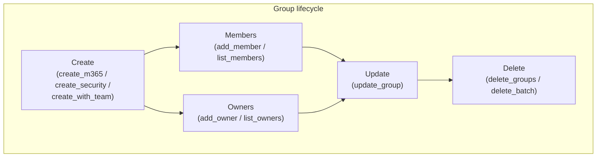

# Entra ID Groups

Create, list, update, and manage Microsoft 365, security, and dynamic groups —
including membership, owners, lifecycle policies, and cleanup.

---

## Prerequisites

| Permission | Description | Reference |
|---|---|---|
| `Group.Read.All` | Read groups, members, owners | [Group permissions](https://learn.microsoft.com/en-us/graph/permissions-reference#group-permissions) |
| `Group.ReadWrite.All` | Create, update, delete groups | [Group permissions](https://learn.microsoft.com/en-us/graph/permissions-reference#group-permissions) |
| `GroupLifecyclePolicy.ReadWrite.All` | Group expiration policies | [Group lifecycle policy](https://learn.microsoft.com/en-us/graph/api/resources/grouplifecyclepolicy) |

---

## How the group operations fit together

**Which operation to use:** use `create_m365` for collaboration groups with a
mailbox, `create_security` for access control, and `create_with_team` to get a
team alongside the group. Ownership is key to governance — groups without
owners cannot be administered (see `find_orphans`).

---

## Examples

| Operation | File | Permission | API |
|---|---|---|---|
| List groups | [`list.py`](./list.py) | `Group.ReadWrite.All` | [group list](https://learn.microsoft.com/en-us/graph/api/group-list) |
| Create a Microsoft 365 group | [`create_m365.py`](./create_m365.py) | `Group.ReadWrite.All` | [group create](https://learn.microsoft.com/en-us/graph/api/group-post-groups) |
| Create a security group | [`create_security.py`](./create_security.py) | `Group.ReadWrite.All` | [group create](https://learn.microsoft.com/en-us/graph/api/group-post-groups) |
| Create a group with a team | [`create_with_team.py`](./create_with_team.py) | `Group.ReadWrite.All` | [create group and team](https://learn.microsoft.com/en-us/graph/teams-create-group-and-team) |
| Update group properties | [`update_group.py`](./update_group.py) | `Group.ReadWrite.All` | [group update](https://learn.microsoft.com/en-us/graph/api/group-update) |
| Add/remove a member | [`add_member.py`](./add_member.py) | `Group.ReadWrite.All` | [member add](https://learn.microsoft.com/en-us/graph/api/group-post-members) |
| List members | [`list_members.py`](./list_members.py) | `Group.Read.All` | [members list](https://learn.microsoft.com/en-us/graph/api/group-list-members) |
| Add/remove an owner | [`add_owner.py`](./add_owner.py) | `Group.ReadWrite.All` | [owner add](https://learn.microsoft.com/en-us/graph/api/group-post-owners) |
| List owners | [`list_owners.py`](./list_owners.py) | `Group.Read.All` | [owners list](https://learn.microsoft.com/en-us/graph/api/group-list-owners) |
| Delete groups | [`delete_groups.py`](./delete_groups.py) | `Group.ReadWrite.All` | [group delete](https://learn.microsoft.com/en-us/graph/api/group-delete) |
| Delete groups in batch | [`delete_batch.py`](./delete_batch.py) | `Group.ReadWrite.All` | [group delete](https://learn.microsoft.com/en-us/graph/api/group-delete) |
| Export groups to CSV | [`export_csv.py`](./export_csv.py) | `Group.Read.All` | [group list](https://learn.microsoft.com/en-us/graph/api/group-list) |
| Find orphaned groups | [`find_orphans.py`](./find_orphans.py) | `Group.Read.All` | [group list](https://learn.microsoft.com/en-us/graph/api/group-list) |
| Inspect groups & orphans | [`manage.py`](./manage.py) | `Group.ReadWrite.All` | [group list](https://learn.microsoft.com/en-us/graph/api/group-list) |
| Group lifecycle policies | [`lifecycle_policies.py`](./lifecycle_policies.py) | `GroupLifecyclePolicy.ReadWrite.All` | [lifecycle policy](https://learn.microsoft.com/en-us/graph/api/resources/grouplifecyclepolicy) |

---

## API reference

- [Group resource](https://learn.microsoft.com/en-us/graph/api/resources/group)
- [Group lifecycle policy](https://learn.microsoft.com/en-us/graph/api/resources/grouplifecyclepolicy)
