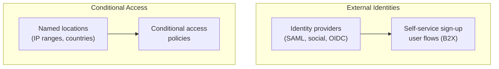

# Entra ID Identity

External Identities and Conditional Access — identity providers, named
locations, conditional access policies, and self-service sign-up user flows.

---

## Prerequisites

| Permission | Description | Reference |
|---|---|---|
| `IdentityProvider.Read.All` | Read identity providers and supported types | [IdentityProvider permissions](https://learn.microsoft.com/en-us/graph/permissions-reference#identity-provider-permissions) |
| `Policy.Read.All` | Read conditional access policies and named locations | [Policy permissions](https://learn.microsoft.com/en-us/graph/permissions-reference#policy-permissions) |
| `IdentityUserFlow.Read.All` | Read self-service sign-up user flows | [UserFlow permissions](https://learn.microsoft.com/en-us/graph/permissions-reference#user-flow-permissions) |

---

## How the identity pieces fit together

**Which endpoint to use:** `identity.identity_providers` for the federated
identity providers a tenant trusts, `identity.conditional_access.named_locations`
for trusted network locations, `identity.conditional_access.policies` for the
access rules, and `identity.b2x_user_flows` for self-service sign-up
experiences.

---

## Examples

| Operation | File | Permission | API |
|---|---|---|---|
| List identity providers | [`list_provider.py`](./list_provider.py) | `IdentityProvider.Read.All` | [identityProviderBase list](https://learn.microsoft.com/en-us/graph/api/identitycontainer-list-identityproviders) |
| List named locations | [`list_named_locations.py`](./list_named_locations.py) | `Policy.Read.All` | [namedLocation list](https://learn.microsoft.com/en-us/graph/api/conditionalaccessroot-list-namedlocations) |
| List conditional access policies | [`list_conditional_access_policies.py`](./list_conditional_access_policies.py) | `Policy.Read.All` | [conditionalAccessPolicy list](https://learn.microsoft.com/en-us/graph/api/conditionalaccessroot-list-policies) |
| List self-service sign-up user flows | [`list_user_flows.py`](./list_user_flows.py) | `IdentityUserFlow.Read.All` | [b2xUserFlows list](https://learn.microsoft.com/en-us/graph/api/identitycontainer-list-b2xuserflows) |

---

## API reference

- [IdentityProviderBase resource](https://learn.microsoft.com/en-us/graph/api/resources/identityproviderbase)
- [NamedLocation resource](https://learn.microsoft.com/en-us/graph/api/resources/namedlocation)
- [ConditionalAccessPolicy resource](https://learn.microsoft.com/en-us/graph/api/resources/conditionalaccesspolicy)
- [B2XIdentityUserFlow resource](https://learn.microsoft.com/en-us/graph/api/resources/b2xidentityuserflow)
