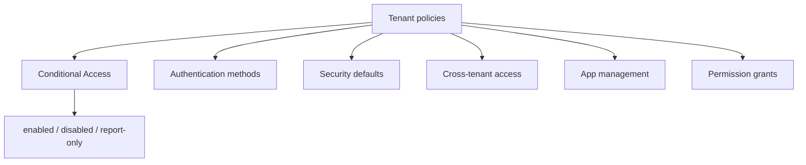

# Entra ID Policies

Manage Microsoft Entra ID tenant policies — conditional access, authentication
methods, security defaults, cross-tenant access, app management, and more.

---

## Prerequisites

| Permission | Description |
|---|---|
| `Policy.Read.All` | Read most tenant policies (CA, auth methods, authorization, etc.) |
| `Policy.ReadWrite.ConditionalAccess` | Create / update Conditional Access policies |
| `Policy.Read.PermissionGrant` | Read permission grant policies |
| `Policy.Read.ApplicationConfiguration` | Read app management policies |
| `Policy.Read.AuthenticationMethod` | Read authentication method / strength policies |

---

## How policies work

Policies are **tenant-wide or scoped rules** that control how users, apps, and
devices interact with the directory:



| Policy type | Controls | States |
|---|---|---|
| **Conditional Access** | When access is allowed (users/apps/conditions) | `enabled`, `disabled`, `reportOnly` |
| **Authentication methods** | Which MFA / passwordless methods users can use | — |
| **Authentication strength** | Phishing-resistant MFA levels (e.g. FIDO2) | — |
| **Security defaults** | Baseline security for new tenants | `isEnabled` |
| **Cross-tenant access** | Inbound/outbound access to external tenants | — |
| **App management** | App secret / certificate restrictions | — |
| **Permission grants** | Admin/user consent posture | — |

---

## Examples

| Scenario | File | Permission |
|---|---|---|
| List Conditional Access policies (+ state summary) | [`conditional_access/list.py`](./conditional_access/list.py) | `Policy.Read.All` |
| Create a Conditional Access policy (dry-run by default) | [`conditional_access/create.py`](./conditional_access/create.py) | `Policy.ReadWrite.ConditionalAccess` |
| Authentication methods policy | [`authentication_methods.py`](./authentication_methods.py) | `Policy.Read.All` |
| Authentication strength policies (phishing-resistant MFA) | [`authentication_strength.py`](./authentication_strength.py) | `Policy.Read.All` |
| Security defaults policy | [`security_defaults.py`](./security_defaults.py) | `Policy.Read.All` |
| Authorization policy settings | [`get_auth_settings.py`](./get_auth_settings.py) | `Policy.Read.All` |
| Admin consent request policy | [`admin_consent_request.py`](./admin_consent_request.py) | `Policy.Read.All` |
| Cross-tenant access policy | [`cross_tenant_access.py`](./cross_tenant_access.py) | `Policy.Read.All` |
| Device registration policy | [`device_registration.py`](./device_registration.py) | `Policy.Read.All` |
| Permission grant policies (consent posture) | [`permission_grants.py`](./permission_grants.py) | `Policy.Read.PermissionGrant` |
| App management policies + default policy | [`app_management.py`](./app_management.py) | `Policy.Read.ApplicationConfiguration` |

---

## Quick start

```python
from office365.graph_client import GraphClient

client = GraphClient(tenant="contoso.onmicrosoft.com").with_client_secret(
    "client_id", "client_secret"
)

# List Conditional Access policies
policies = client.policies.conditional_access_policies.get().execute_query()
for p in policies:
    props = p.properties
    print(f"  {props.get('displayName')}  [{props.get('state')}]")

# Security defaults
defaults = client.policies.identity_security_defaults_enforcement_policy.get().execute_query()
print(f"Security defaults enabled: {defaults.is_enabled}")
```

---

## Official docs

- [Policy overview](https://learn.microsoft.com/en-us/graph/api/resources/policy-overview)
- [Conditional Access API](https://learn.microsoft.com/en-us/graph/api/resources/conditionalaccesspolicy)
