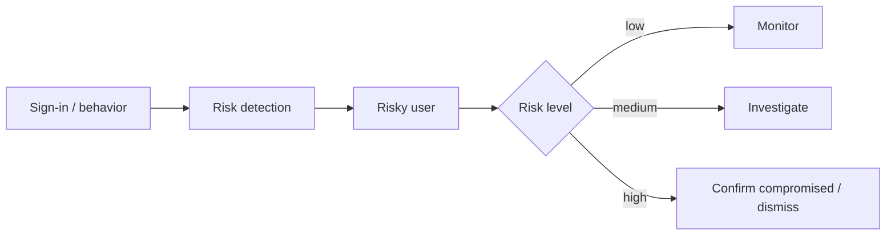

# Identity Protection

Microsoft Entra ID Identity Protection detects identity risks and helps you
remediate them — risky users, risk detections, and threat assessments.

---

## Prerequisites

| Permission | Description |
|---|---|
| `IdentityRiskyUser.Read.All` | Read risky users and their risk history |
| `IdentityRiskDetection.Read.All` | Read risk detections |
| `IdentityRiskyUser.ReadWrite.All` | Dismiss risk / confirm compromised users |
| `ThreatAssessment.ReadWrite.All` | Submit and list threat assessments |

---

## How Identity Protection works



Identity Protection analyzes sign-ins and user behavior, and raises **risk
detections** that aggregate into a **risk level** per user:

| Risk level | Meaning |
|---|---|
| `none` | No risk detected |
| `low` | Low likelihood of compromise |
| `medium` | Elevated likelihood |
| `high` | Strong likelihood of compromise |

**Risk states** track remediation: `none`, `confirmedSafe`, `remediated`,
`dismissed`, `atRisk`, `confirmedCompromised`.

Remediation actions:
- **Dismiss** — set a user's risk to `none` (e.g. a false positive).
- **Confirm compromised** — set risk to `high` (e.g. you determined a real breach).

**Threat assessments** let security teams submit files / email / URLs to be
checked against threat categories (spam, phishing, malware).

---

## Examples

| Scenario | File | Permission |
|---|---|---|
| Risky users report + history + dismiss/confirm | [`risky_users.py`](./risky_users.py) | `IdentityRiskyUser.Read.All` (+`ReadWrite.All` for actions) |
| Risk detections report (filter by window / risk level) | [`risk_detections.py`](./risk_detections.py) | `IdentityRiskDetection.Read.All` |
| Submit / list threat assessments (file, email-file) | [`threat_assessment.py`](./threat_assessment.py) | `ThreatAssessment.ReadWrite.All` |

---

## Quick start

```python
from office365.graph_client import GraphClient

client = GraphClient(tenant="contoso.onmicrosoft.com").with_client_secret(
    "client_id", "client_secret"
)

# Risky users report
risky = client.identity_protection.risky_users.get().execute_query()
for u in risky:
    print(f"  {u.user_principal_name}  level={u.risk_level}  state={u.risk_state}")

# Risk detections
detections = client.identity_protection.risk_detections.get().execute_query()
for d in detections:
    print(f"  {d.detected_date_time}  {d.user_principal_name}  {d.risk_level}")
```

---

## Official docs

- [Identity Protection API overview](https://learn.microsoft.com/en-us/graph/api/resources/identityprotection-overview)
- [Threat assessment API](https://learn.microsoft.com/en-us/graph/api/resources/threatassessment-api-overview)
