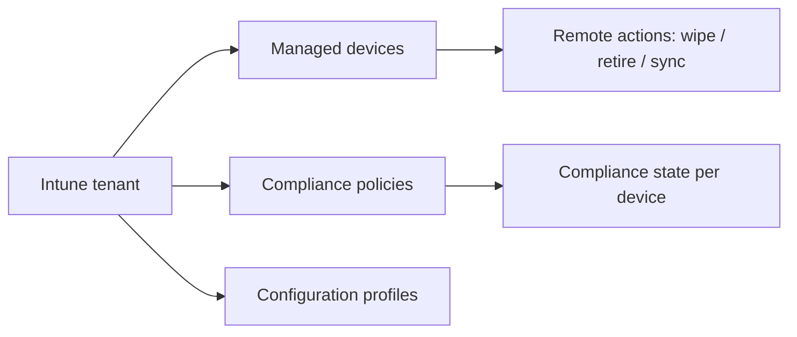

# Microsoft Intune

Examples for working with Microsoft Intune via the Microsoft Graph API —
managed devices, compliance policies, configuration profiles, remote
actions, and organization settings.

---

## Prerequisites

| Requirement | Description | Reference |
|---|---|---|
| `Device.Read.All` | List Entra ID registered devices | [Device permissions](https://learn.microsoft.com/en-us/graph/permissions-reference#device-permissions) |
| `DeviceManagementManagedDevices.Read.All` | List and read managed devices | [Intune permissions](https://learn.microsoft.com/en-us/graph/permissions-reference#device-management-permissions) |
| `DeviceManagementManagedDevices.PrivilegedOperations.All` | Wipe, retire, sync devices | [Intune permissions](https://learn.microsoft.com/en-us/graph/permissions-reference#device-management-permissions) |
| `DeviceManagementConfiguration.Read.All` | Read compliance policies and config profiles | [Intune permissions](https://learn.microsoft.com/en-us/graph/permissions-reference#device-management-permissions) |
| `Organization.Read.All` | Read tenant organization profile | [Organization permissions](https://learn.microsoft.com/en-us/graph/permissions-reference#organization-permissions) |

Admin consent is required for all Intune permissions.

---

## How Intune works



Intune manages devices, enforces compliance policies, pushes configuration
profiles, and allows remote actions (wipe, retire, sync) on managed devices.

---

## Examples

### Entra ID Devices

| Step | Operation | File | Required role | API reference |
|---|---|---|---|---|
| **1** | List all Entra ID registered devices | [`list_devices.py`](./list_devices.py) | `Device.Read.All` | [list devices](https://learn.microsoft.com/en-us/graph/api/device-list) |

### Managed Devices

| Step | Operation | File | Required role | API reference |
|---|---|---|---|---|
| **2** | List all Intune-managed devices | [`managed_devices/list.py`](./managed_devices/list.py) | `DeviceManagementManagedDevices.Read.All` | [list managed devices](https://learn.microsoft.com/en-us/graph/api/intune-devices-manageddevice-list) |
| **3** | Get device details and compliance state | [`managed_devices/get_details.py`](./managed_devices/get_details.py) | `DeviceManagementManagedDevices.Read.All` | [get managed device](https://learn.microsoft.com/en-us/graph/api/intune-devices-manageddevice-get) |
| **4** | Wipe a device (factory reset) | [`managed_devices/wipe.py`](./managed_devices/wipe.py) | `DeviceManagementManagedDevices.PrivilegedOperations.All` | [wipe](https://learn.microsoft.com/en-us/graph/api/intune-devices-manageddevice-wipe) |
| **5** | Retire a device (remove company data) | [`managed_devices/retire.py`](./managed_devices/retire.py) | `DeviceManagementManagedDevices.PrivilegedOperations.All` | [retire](https://learn.microsoft.com/en-us/graph/api/intune-devices-manageddevice-retire) |
| **6** | Force a device to sync with Intune | [`managed_devices/sync.py`](./managed_devices/sync.py) | `DeviceManagementManagedDevices.PrivilegedOperations.All` | [sync](https://learn.microsoft.com/en-us/graph/api/intune-devices-manageddevice-syncdevice) |

### Policies & Configuration

| Step | Operation | File | Required role | API reference |
|---|---|---|---|---|
| **7** | List device compliance policies | [`policies/list_compliance.py`](./policies/list_compliance.py) | `DeviceManagementConfiguration.Read.All` | [list compliance](https://learn.microsoft.com/en-us/graph/api/intune-deviceconfig-devicecompliancepolicy-list) |
| **8** | List device configuration profiles | [`policies/list_configurations.py`](./policies/list_configurations.py) | `DeviceManagementConfiguration.Read.All` | [list configs](https://learn.microsoft.com/en-us/graph/api/intune-deviceconfig-deviceconfiguration-list) |

### Organization

| Step | Operation | File | Required role | API reference |
|---|---|---|---|---|
| **9** | Get tenant organization profile | [`get_organization.py`](./get_organization.py) | `Organization.Read.All` | [get org](https://learn.microsoft.com/en-us/graph/api/organization-get) |
| **10** | List terms and conditions | [`terms_and_conditions.py`](./terms_and_conditions.py) | `DeviceManagementConfiguration.Read.All` | [list T&C](https://learn.microsoft.com/en-us/graph/api/intune-companyterms-termsandconditions-list) |

---

## Quick start

```python
from office365.graph_client import GraphClient

client = GraphClient(tenant="contoso.onmicrosoft.com").with_client_secret(
    "client_id", "client_secret"
)

devices = client.device_management.managed_devices.get().execute_query()
for d in devices:
    print(f"{d.device_name:35s}  [{d.compliance_state}]")
```

---

## Official docs

- [Microsoft Intune](https://learn.microsoft.com/en-us/mem/intune)
- [Intune Graph API overview](https://learn.microsoft.com/en-us/graph/api/resources/intune-graph-overview)
- [Intune permissions](https://learn.microsoft.com/en-us/graph/permissions-reference#device-management-permissions)
