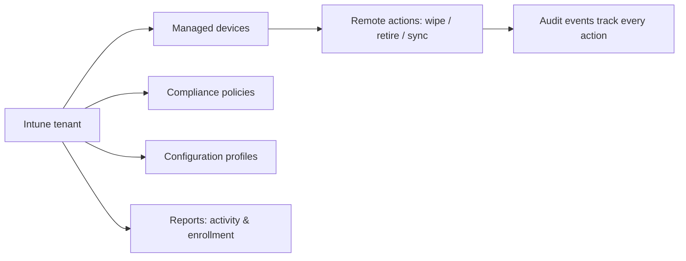

# Microsoft Intune

Examples for working with Microsoft Intune via the Graph API —
managed device inventory, remote actions, audit, and reporting.

---

## Prerequisites

| Permission | Description | Reference |
|---|---|---|
| `DeviceManagementManagedDevices.Read.All` | List and read managed devices | [Intune permissions](https://learn.microsoft.com/en-us/graph/permissions-reference#device-management-permissions) |
| `DeviceManagementManagedDevices.PrivilegedOperations.All` | Wipe, retire, sync devices | [Intune permissions](https://learn.microsoft.com/en-us/graph/permissions-reference#device-management-permissions) |
| `DeviceManagementServiceConfig.Read.All` | Read device management settings, audit events, categories | [Intune permissions](https://learn.microsoft.com/en-us/graph/permissions-reference#device-management-permissions) |
| `DeviceManagementConfiguration.Read.All` | Read device configuration and compliance policies | [Intune permissions](https://learn.microsoft.com/en-us/graph/permissions-reference#device-management-permissions) |

Admin consent is required for all Intune permissions.

---

## How Intune works



Intune manages devices, enforces compliance, and tracks all
admin actions via audit events.

---

## Patterns

| Category | Scenario | File | Permission |
|---|---|---|---|
| **Device management** | Enriched device inventory with compliance state, OS, last sync | [`managed_devices/inventory.py`](./managed_devices/inventory.py) | `DeviceManagementManagedDevices.Read.All` |
| **Device management** | Remote actions: wipe (factory reset), retire (remove company data), force sync | [`managed_devices/remote_actions.py`](./managed_devices/remote_actions.py) | `DeviceManagementManagedDevices.PrivilegedOperations.All` |
| **Audit** | List audit events (admin action trail) and device categories | [`audit/device_audit.py`](./audit/device_audit.py) | `DeviceManagementServiceConfig.Read.All` |
| **Reporting** | Device configuration activity and enrollment failure reports | [`reports/device_activity.py`](./reports/device_activity.py) | `DeviceManagementConfiguration.Read.All` |

---

## Quick start

```python
from office365.graph_client import GraphClient

client = GraphClient(tenant="contoso.onmicrosoft.com").with_client_secret(
    "client_id", "client_secret"
)

devices = client.device_management.managed_devices.get().execute_query()
for d in devices:
    print(f"{d.device_name:35s}  [{d.compliance_state}]")
```

---

## Official docs

- [Microsoft Intune](https://learn.microsoft.com/en-us/mem/intune)
- [Intune Graph API overview](https://learn.microsoft.com/en-us/graph/api/resources/intune-graph-overview)
- [Intune permissions](https://learn.microsoft.com/en-us/graph/permissions-reference#device-management-permissions)
