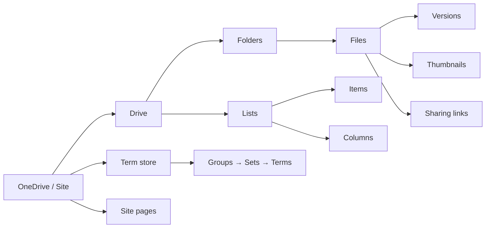

# OneDrive & SharePoint (Files)

Examples for working with OneDrive and SharePoint files via the Graph API —
files, folders, sharing, sites, lists, pages, term store, and Excel.

---

## Prerequisites

| Permission | Description | Reference |
|---|---|---|
| `Files.ReadWrite` | Upload, download, copy, move files and folders | [Files permissions](https://learn.microsoft.com/en-us/graph/permissions-reference#files-permissions) |
| `Sites.ReadWrite.All` | Create and manage sites, lists, pages, term store | [Sites permissions](https://learn.microsoft.com/en-us/graph/permissions-reference#sites-permissions) |
| `Analytics.Read` | Read file activity stats and analytics | [Analytics permissions](https://learn.microsoft.com/en-us/graph/permissions-reference#analytics-permissions) |

---

## How OneDrive works



---

## Basic usage

| Scenario | File | Permission |
|---|---|---|
| Upload and download a file | [`files/upload_download.py`](./files/upload_download.py) | `Files.ReadWrite` |

---

## Patterns

| Category | Scenario | File | Permission |
|---|---|---|---|
| **Files** | Upload large files via resumable upload session | [`files/upload_large.py`](./files/upload_large.py) | `Files.ReadWrite` |
| **Files** | Copy, rename, list versions | [`files/manage.py`](./files/manage.py) | `Files.ReadWrite` |
| **Files** | Create sharing links, invite users, list permissions | [`files/sharing.py`](./files/sharing.py) | `Files.ReadWrite` |
| **Files** | Search files by keyword | [`files/search.py`](./files/search.py) | `Files.Read` |
| **Folders** | Create folders, navigate hierarchy, upload to folder | [`folders/manage.py`](./folders/manage.py) | `Files.ReadWrite` |
| **Drives** | Recent files, shared with me, followed sites | [`drives/explore.py`](./drives/explore.py) | `Files.Read`, `Sites.Read.All` |
| **Drives** | Search drive by keyword | [`drives/search.py`](./drives/search.py) | `Files.Read` |
| **Sites** | Get site by URL, root site | [`sites/get_site.py`](./sites/get_site.py) | `Sites.Read.All` |
| **Sites** | Search sites, follow/unfollow | [`sites/search_and_follow.py`](./sites/search_and_follow.py) | `Sites.ReadWrite.All` |
| **Lists** | Create document library with columns and items | [`lists/manage.py`](./lists/manage.py) | `Sites.ReadWrite.All` |
| **Site pages** | Create and publish modern site pages | [`sitepages/manage.py`](./sitepages/manage.py) | `Sites.ReadWrite.All` |
| **Term store** | Export groups/sets, import new terms | [`termstore/export_import.py`](termstore/basic_usage.py) | `Sites.ReadWrite.All` |
| **Excel** | Read tables and ranges with workbook sessions | [`excel/read_table.py`](./excel/read_table.py) | `Files.ReadWrite` |
| **Files** | Document lifecycle — checkout, upload edits, checkin with comment | [`files/lifecycle.py`](./files/lifecycle.py) | `Files.ReadWrite` |
| **Files** | Delta query — track changes since last sync | [`files/delta_query.py`](./files/delta_query.py) | `Files.Read` |
| **Files** | Recycle bin — list deleted items, restore, permanent delete | [`files/recycle_bin.py`](./files/recycle_bin.py) | `Files.ReadWrite.All` |
| **Files** | Analytics — file activity stats, views/downloads over time | [`files/analytics.py`](./files/analytics.py) | `Files.Read`, `Analytics.Read` |

---

## Quick start

```python
from office365.graph_client import GraphClient

client = GraphClient(tenant="contoso.onmicrosoft.com").with_client_secret(
    "client_id", "client_secret"
)

uploaded = client.me.drive.root.upload("hello.txt", b"Hello!").execute_query()
print(f"Uploaded: {uploaded.name}")
```

---

## Official docs

- [OneDrive API overview](https://learn.microsoft.com/en-us/graph/api/resources/onedrive)
- [SharePoint API overview](https://learn.microsoft.com/en-us/graph/api/resources/sharepoint)
- [SharePoint list API](https://learn.microsoft.com/en-us/graph/api/resources/list)
- [Term store API](https://learn.microsoft.com/en-us/graph/api/resources/termstore-store)
- [Excel workbook API](https://learn.microsoft.com/en-us/graph/api/resources/excel)
