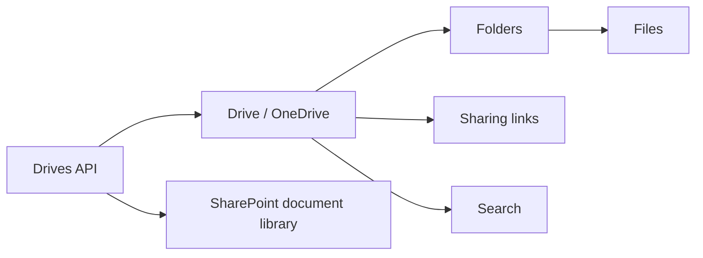

# Microsoft OneDrive

Examples for working with OneDrive and SharePoint v2 (Graph API) — files,
folders, drives, sharing, search, and more.

---

## Prerequisites

| Requirement | Description | Reference |
|---|---|---|
| `Files.ReadWrite.All` (delegated) | Read and write files and folders | [Files permissions](https://learn.microsoft.com/en-us/graph/permissions-reference#files-permissions) |
| `Sites.ReadWrite.All` (delegated) | Read and write SharePoint sites, lists, columns | [Sites permissions](https://learn.microsoft.com/en-us/graph/permissions-reference#sites-permissions) |
| `TermStore.Read.All` (delegated) | Read term store and term sets | [Term store permissions](https://learn.microsoft.com/en-us/graph/permissions-reference#term-store-permissions) |

Admin consent is required for higher-level permissions.

---

## How OneDrive works



The OneDrive API also covers SharePoint document libraries (SharePoint v2),
site pages, lists and columns, Excel workbooks, and term store.

---

## Examples — Files

| Operation | File | Required role | API reference |
|---|---|---|---|
| Upload a small file | [`files/upload.py`](./files/upload.py) | `Files.ReadWrite.All` | [upload](https://learn.microsoft.com/en-us/graph/api/driveitem-put-content) |
| Upload a large file (resumable session) | [`files/upload_large.py`](./files/upload_large.py) | `Files.ReadWrite.All` | [upload session](https://learn.microsoft.com/en-us/graph/api/driveitem-createuploadsession) |
| Download a file | [`files/download.py`](./files/download.py) | `Files.Read.All` | [download](https://learn.microsoft.com/en-us/graph/api/driveitem-get-content) |
| Download a large file (streaming) | [`files/download_large.py`](./files/download_large.py) | `Files.Read.All` | [download](https://learn.microsoft.com/en-us/graph/api/driveitem-get-content) |
| Copy a file to a new location | [`files/copy_file.py`](./files/copy_file.py) | `Files.ReadWrite.All` | [copy](https://learn.microsoft.com/en-us/graph/api/driveitem-copy) |
| Move a file to a new folder | [`files/move_file.py`](./files/move_file.py) | `Files.ReadWrite.All` | [update](https://learn.microsoft.com/en-us/graph/api/driveitem-update) |
| Search files in a drive | [`files/search.py`](./files/search.py) | `Files.Read.All` | [search](https://learn.microsoft.com/en-us/graph/api/driveitem-search) |
| Get file metadata and properties | [`files/get_details.py`](./files/get_details.py) | `Files.Read.All` | [get](https://learn.microsoft.com/en-us/graph/api/driveitem-get) |
| Get file by absolute URL | [`files/get_by_abs_url.py`](./files/get_by_abs_url.py) | `Files.Read.All` | [get](https://learn.microsoft.com/en-us/graph/api/driveitem-get) |
| Rename a file | [`files/rename.py`](./files/rename.py) | `Files.ReadWrite.All` | [update](https://learn.microsoft.com/en-us/graph/api/driveitem-update) |
| Delete a file | [`files/delete.py`](./files/delete.py) | `Files.ReadWrite.All` | [delete](https://learn.microsoft.com/en-us/graph/api/driveitem-delete) |
| List file versions | [`files/list_versions.py`](./files/list_versions.py) | `Files.Read.All` | [versions](https://learn.microsoft.com/en-us/graph/api/driveitem-list-versions) |
| Get file permissions | [`files/get_permissions.py`](./files/get_permissions.py) | `Files.Read.All` | [permissions](https://learn.microsoft.com/en-us/graph/api/driveitem-list-permissions) |
| Get file thumbnails | [`files/get_thumbnails.py`](./files/get_thumbnails.py) | `Files.Read.All` | [thumbnails](https://learn.microsoft.com/en-us/graph/api/driveitem-list-thumbnails) |
| Create a sharing link | [`files/create_sharing_link.py`](./files/create_sharing_link.py) | `Files.ReadWrite.All` | [sharing link](https://learn.microsoft.com/en-us/graph/api/driveitem-createlink) |
| Send a sharing invitation | [`files/send_sharing_invitation.py`](./files/send_sharing_invitation.py) | `Files.ReadWrite.All` | [invitation](https://learn.microsoft.com/en-us/graph/api/driveitem-invite) |

## Examples — Folders

| Operation | File | Required role | API reference |
|---|---|---|---|
| Create a folder | [`folders/create.py`](./folders/create.py) | `Files.ReadWrite.All` | [create folder](https://learn.microsoft.com/en-us/graph/api/driveitem-post-children) |
| Get folder by path | [`folders/get_by_path.py`](./folders/get_by_path.py) | `Files.Read.All` | [get folder](https://learn.microsoft.com/en-us/graph/api/driveitem-get) |
| List files in a folder | [`folders/list_files.py`](./folders/list_files.py) | `Files.Read.All` | [list children](https://learn.microsoft.com/en-us/graph/api/driveitem-list-children) |
| List folders in a folder | [`folders/list_folders.py`](./folders/list_folders.py) | `Files.Read.All` | [list children](https://learn.microsoft.com/en-us/graph/api/driveitem-list-children) |
| List files and folders together | [`folders/list_with_files.py`](./folders/list_with_files.py) | `Files.Read.All` | [list children](https://learn.microsoft.com/en-us/graph/api/driveitem-list-children) |
| Download a folder as zip | [`folders/download.py`](./folders/download.py) | `Files.Read.All` | [download](https://learn.microsoft.com/en-us/graph/api/driveitem-get-content) |
| Download folder with custom format | [`folders/download_custom.py`](./folders/download_custom.py) | `Files.Read.All` | [download](https://learn.microsoft.com/en-us/graph/api/driveitem-get-content) |
| Upload into a folder | [`folders/upload.py`](./folders/upload.py) | `Files.ReadWrite.All` | [upload](https://learn.microsoft.com/en-us/graph/api/driveitem-put-content) |
| Upload via custom request | [`folders/upload_custom.py`](./folders/upload_custom.py) | `Files.ReadWrite.All` | [upload](https://learn.microsoft.com/en-us/graph/api/driveitem-put-content) |
| Export a folder | [`folders/export.py`](./folders/export.py) | `Files.ReadWrite.All` | [export](https://learn.microsoft.com/en-us/graph/api/driveitem-export) |

## Examples — Drives

| Operation | File | Required role | API reference |
|---|---|---|---|
| List drives for the signed-in user | [`drives/list.py`](./drives/list.py) | `Files.Read.All` | [list drives](https://learn.microsoft.com/en-us/graph/api/user-list-drives) |
| Get drive for a user | [`drives/get_for_user.py`](./drives/get_for_user.py) | `Files.Read.All` | [get drive](https://learn.microsoft.com/en-us/graph/api/drive-get) |
| Get drive by path | [`drives/get_by_path.py`](./drives/get_by_path.py) | `Files.Read.All` | [get drive](https://learn.microsoft.com/en-us/graph/api/drive-get) |
| List recent files | [`drives/list_recent_files.py`](./drives/list_recent_files.py) | `Files.Read.All` | [recent](https://learn.microsoft.com/en-us/graph/api/drive-list-recent) |
| List files shared with the user | [`drives/list_shared_with_me.py`](./drives/list_shared_with_me.py) | `Files.Read.All` | [shared](https://learn.microsoft.com/en-us/graph/api/drive-list-sharedwithme) |
| List followed items | [`drives/list_followed_items.py`](./drives/list_followed_items.py) | `Files.Read.All` | [followed](https://learn.microsoft.com/en-us/graph/api/drive-list-following) |
| Get library items (SharePoint document library) | [`driveitems/get_library_items.py`](./driveitems/get_library_items.py) | `Sites.Read.All` | [list items](https://learn.microsoft.com/en-us/graph/api/listitem-list) |

## Examples — Sites

| Operation | File | Required role | API reference |
|---|---|---|---|
| Get all sites in the tenant | [`sites/get_all.py`](./sites/get_all.py) | `Sites.Read.All` | [list sites](https://learn.microsoft.com/en-us/graph/api/site-list) |
| List subsites | [`sites/list_sites.py`](./sites/list_sites.py) | `Sites.Read.All` | [list subsites](https://learn.microsoft.com/en-us/graph/api/site-list-subsites) |
| Get site by URL | [`sites/get_by_url.py`](./sites/get_by_url.py) | `Sites.Read.All` | [get site](https://learn.microsoft.com/en-us/graph/api/site-get) |
| Search sites | [`sites/search.py`](./sites/search.py) | `Sites.Read.All` | [search](https://learn.microsoft.com/en-us/graph/api/site-search) |
| Grant permission on a site | [`sites/grant_permission.py`](./sites/grant_permission.py) | `Sites.ReadWrite.All` | [grant](https://learn.microsoft.com/en-us/graph/api/site-post-permissions) |
| Revoke permission on a site | [`sites/revoke_permission.py`](./sites/revoke_permission.py) | `Sites.ReadWrite.All` | [revoke](https://learn.microsoft.com/en-us/graph/api/site-delete-permissions) |
| List site permissions | [`sites/list_permissions.py`](./sites/list_permissions.py) | `Sites.Read.All` | [list permissions](https://learn.microsoft.com/en-us/graph/api/site-list-permissions) |
| List permissions (direct API) | [`list_permissions_api.py`](./list_permissions_api.py) | `Sites.Read.All` | [list permissions](https://learn.microsoft.com/en-us/graph/api/site-list-permissions) |
| Delete a site | [`sites/delete_site.py`](./sites/delete_site.py) | `Sites.FullControl.All` | [delete](https://learn.microsoft.com/en-us/graph/api/site-delete) |

## Examples — Lists & Columns

| Operation | File | Required role | API reference |
|---|---|---|---|
| Create a text list column | [`columns/create_text.py`](./columns/create_text.py) | `Sites.ReadWrite.All` | [create column](https://learn.microsoft.com/en-us/graph/api/columndefinition-post-columns) |
| Create a lookup column | [`columns/create_lookup.py`](./columns/create_lookup.py) | `Sites.ReadWrite.All` | [create column](https://learn.microsoft.com/en-us/graph/api/columndefinition-post-columns) |
| List site columns | [`columns/list_site.py`](./columns/list_site.py) | `Sites.Read.All` | [list columns](https://learn.microsoft.com/en-us/graph/api/columndefinition-list) |
| Create a SharePoint list | [`lists/create_list.py`](./lists/create_list.py) | `Sites.ReadWrite.All` | [create list](https://learn.microsoft.com/en-us/graph/api/list-create) |
| Get list properties | [`lists/get_props.py`](./lists/get_props.py) | `Sites.Read.All` | [get list](https://learn.microsoft.com/en-us/graph/api/list-get) |
| List lists in a site | [`lists/list_in_site.py`](./lists/list_in_site.py) | `Sites.Read.All` | [list lists](https://learn.microsoft.com/en-us/graph/api/list-list) |

## Examples — Site Pages

| Operation | File | Required role | API reference |
|---|---|---|---|
| Create a site page | [`sitepages/create.py`](./sitepages/create.py) | `Sites.ReadWrite.All` | [create page](https://learn.microsoft.com/en-us/graph/api/sitepage-create) |
| List site pages | [`sitepages/list.py`](./sitepages/list.py) | `Sites.Read.All` | [list pages](https://learn.microsoft.com/en-us/graph/api/sitepage-list) |

## Examples — Excel & Office

| Operation | File | Required role | API reference |
|---|---|---|---|
| Read an Excel range | [`excel/read_range.py`](./excel/read_range.py) | `Files.Read.All` | [read range](https://learn.microsoft.com/en-us/graph/api/range-get) |
| Read an Excel table | [`excel/read_table.py`](./excel/read_table.py) | `Files.Read.All` | [read table](https://learn.microsoft.com/en-us/graph/api/table-get) |
| Get a specific cell | [`excel/get_cell.py`](./excel/get_cell.py) | `Files.Read.All` | [get cell](https://learn.microsoft.com/en-us/graph/api/range-get) |
| List worksheets in a workbook | [`excel/list_worksheets.py`](./excel/list_worksheets.py) | `Files.Read.All` | [list worksheets](https://learn.microsoft.com/en-us/graph/api/workbook-list-worksheets) |
| Read a workbook | [`workbook/read_workbook.py`](./workbook/read_workbook.py) | `Files.Read.All` | [workbook](https://learn.microsoft.com/en-us/graph/api/resources/workbook) |
| Populate a workbook template | [`workbook/populate_template.py`](./workbook/populate_template.py) | `Files.ReadWrite.All` | [workbook](https://learn.microsoft.com/en-us/graph/api/resources/workbook) |
| Work with Excel (create and edit) | [`workbook/work_with_excel.py`](./workbook/work_with_excel.py) | `Files.ReadWrite.All` | [workbook](https://learn.microsoft.com/en-us/graph/api/resources/workbook) |
| Create a PowerPoint presentation | [`powerpoint/create.py`](./powerpoint/create.py) | `Files.ReadWrite.All` | [PowerPoint](https://learn.microsoft.com/en-us/graph/api/resources/powerpoint) |

## Examples — Term Store & File Storage

| Operation | File | Required role | API reference |
|---|---|---|---|
| Export term store | [`termstore/export_term_store.py`](./termstore/export_term_store.py) | `TermStore.Read.All` | [term store](https://learn.microsoft.com/en-us/graph/api/resources/termstore) |
| Get term sets | [`termstore/get_sets.py`](./termstore/get_sets.py) | `TermStore.Read.All` | [get sets](https://learn.microsoft.com/en-us/graph/api/termstore-list-sets) |
| Create a container type (SharePoint Embedded) | [`filestorage/create_container_type.py`](./filestorage/create_container_type.py) | `FileStorageContainerType.Manage.All` | [container type](https://learn.microsoft.com/en-us/graph/api/filestorage-post-containertypes) |

---

## Quick start

```python
from office365.graph_client import GraphClient

client = GraphClient(tenant="contoso.onmicrosoft.com").with_client_secret(
    "client_id", "client_secret"
)

# List recent files
files = client.me.drive.recent().execute_query()
for f in files:
    print(f"{f.name:50s}  {f.lastModifiedDateTime}")
```

---

## Official docs

- [OneDrive API overview](https://learn.microsoft.com/en-us/graph/api/resources/drive)
- [SharePoint v2 (Graph) API](https://learn.microsoft.com/en.com/graph/api/resources/sharepoint)
- [Excel workbook API](https://learn.microsoft.com/en-us/graph/api/resources/workbook)
- [Term store API](https://learn.microsoft.com/en-us/graph/api/resources/termstore)
