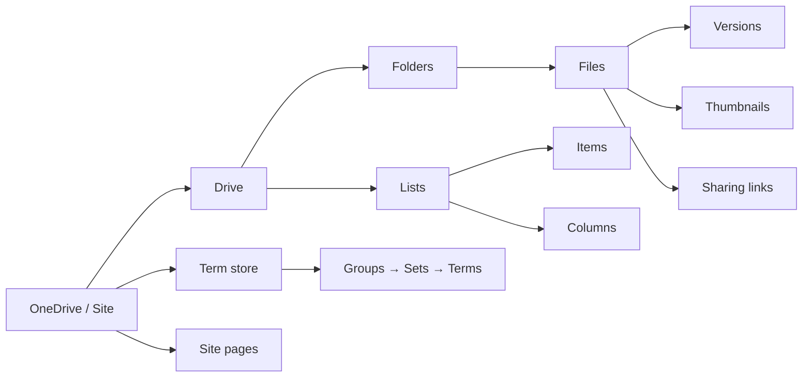

# OneDrive & SharePoint (Files)

Examples for working with OneDrive and SharePoint files via the Graph API —
files, folders, sharing, sites, lists, pages, term store, and Excel.

---

## Prerequisites

| Permission | Description | Reference |
|---|---|---|
| `Files.ReadWrite` | Upload, download, copy, move files and folders | [Files permissions](https://learn.microsoft.com/en-us/graph/permissions-reference#files-permissions) |
| `Sites.ReadWrite.All` | Create and manage sites, lists, pages, term store | [Sites permissions](https://learn.microsoft.com/en-us/graph/permissions-reference#sites-permissions) |
| `Analytics.Read` | Read file activity stats and analytics | [Analytics permissions](https://learn.microsoft.com/en-us/graph/permissions-reference#analytics-permissions) |

---

## How OneDrive works


```mermaid
flowchart LR
    A[OneDrive / Site] --> B[Drive]
    B --> C[Folders]
    C --> D[Files]
    D --> E[Versions]
    D --> F[Thumbnails]
    D --> G[Sharing links]
    B --> H[Lists]
    H --> I[Items]
    H --> J[Columns]
    A --> K[Term store]
    K --> L[Groups → Sets → Terms]
    A --> M[Site pages]
```

---

## Basic usage

| Scenario | File | Permission |
|---|---|---|
| Upload and download a file | [`files/upload_download.py`](./files/upload_download.py) | `Files.ReadWrite` |

> See [`files/README.md`](./files/README.md) for the full set of file examples
> (upload, download, manage, lifecycle, recycle bin, sharing, search, delta,
> analytics).

---

## Patterns

### Files

| Scenario | File | Permission |
|---|---|---|
| Upload and download a file (round-trip) | [`files/upload_download.py`](./files/upload_download.py) | `Files.ReadWrite` |
| Upload a large file (resumable session) | [`files/upload_large.py`](./files/upload_large.py) | `Files.ReadWrite` |
| Download and read a JSON file | [`files/download_json.py`](./files/download_json.py) | `Files.ReadWrite` |
| Copy, rename, move, versions, delete | [`files/manage.py`](./files/manage.py) | `Files.ReadWrite` |
| Check out, edit, check in (versioning) | [`files/lifecycle.py`](./files/lifecycle.py) | `Files.ReadWrite` |
| Sharing links and invitations | [`files/sharing.py`](./files/sharing.py) | `Files.ReadWrite` |
| Recycle bin — restore and purge | [`files/recycle_bin.py`](./files/recycle_bin.py) | `Files.ReadWrite.All` |
| Search files by keyword | [`files/search.py`](./files/search.py) | `Files.Read` |
| Delta query with resume token | [`files/delta_query.py`](./files/delta_query.py) | `Files.Read` |
| Largest files report | [`files/largest_files.py`](./files/largest_files.py) | `Files.Read` |
| Sharing audit — files with links | [`files/find_shared.py`](./files/find_shared.py) | `Files.Read.All` |
| File analytics and activity | [`files/analytics.py`](./files/analytics.py) | `Files.Read`, `Analytics.Read` |

### Folders

| Scenario | File | Permission |
|---|---|---|
| Create folders, navigate hierarchy | [`folders/manage.py`](./folders/manage.py) | `Files.ReadWrite` |
| Create a nested folder structure | [`folders/create_nested.py`](./folders/create_nested.py) | `Files.ReadWrite` |
| Recursively list all files/folders | [`folders/list_recursive.py`](./folders/list_recursive.py) | `Files.Read` |
| Upload a local folder tree | [`folders/upload_folder.py`](./folders/upload_folder.py) | `Files.ReadWrite` |
| Download a folder as a zip | [`folders/download_folder.py`](./folders/download_folder.py) | `Files.ReadWrite` |
| Rename, move, delete folders | [`folders/move_delete.py`](./folders/move_delete.py) | `Files.ReadWrite` |

### Drives

| Scenario | File | Permission |
|---|---|---|
| Recent items, shared with me, followed sites | [`drives/explore.py`](./drives/explore.py) | `Files.Read`, `Sites.Read.All` |
| Search a keyword across all drives | [`drives/search_all.py`](./drives/search_all.py) | `Files.Read.All`, `Sites.Read.All` |
| Tenant-wide storage report (quota) | [`drives/storage_report.py`](./drives/storage_report.py) | `Files.Read.All`, `Sites.Read.All` |
| A user's drive and quota | [`drives/user_drive.py`](./drives/user_drive.py) | `Files.Read.All`, `Sites.Read.All` |

### Sites — administration, governance, reporting

| Scenario | File | Permission |
|---|---|---|
| Get site by URL / root site | [`sites/get_site.py`](./sites/get_site.py) | `Sites.Read.All` |
| Get site by server-relative path | [`sites/get_site_by_path.py`](./sites/get_site_by_path.py) | `Sites.Read.All` |
| List all sites (paged) | [`sites/list_all.py`](./sites/list_all.py) | `Sites.Read.All` |
| List subsites of a site collection | [`sites/subsites.py`](./sites/subsites.py) | `Sites.Read.All` |
| Search sites, follow/unfollow | [`sites/search_and_follow.py`](./sites/search_and_follow.py) | `Sites.ReadWrite.All` |
| Storage report per site | [`sites/storage_report.py`](./sites/storage_report.py) | `Sites.Read.All` |
| Site analytics — most active sites | [`sites/analytics_report.py`](./sites/analytics_report.py) | `Sites.Read.All` |
| Site activities over a window | [`sites/site_activities.py`](./sites/site_activities.py) | `Sites.Read.All` |
| Find stale sites (no activity) | [`sites/find_stale.py`](./sites/find_stale.py) | `Sites.Read.All` |
| Export sites to CSV | [`sites/export_csv.py`](./sites/export_csv.py) | `Sites.Read.All` |
| Site permissions — who has access | [`sites/site_permissions.py`](./sites/site_permissions.py) | `Sites.Read.All` |
| Grant / revoke site access | [`sites/grant_permission.py`](./sites/grant_permission.py), [`sites/revoke_permission.py`](./sites/revoke_permission.py) | `Sites.ReadWrite.All` |
| Add / remove site owner | [`sites/add_admin.py`](./sites/add_admin.py), [`sites/remove_admin.py`](./sites/remove_admin.py) | `Sites.ReadWrite.All` |
| Sharing link for a site | [`sites/share_site_link.py`](./sites/share_site_link.py) | `Sites.ReadWrite.All` |
| External sharing audit | [`sites/external_sharing.py`](./sites/external_sharing.py) | `Sites.Read.All` |
| Site content types & columns inventory | [`sites/site_governance.py`](./sites/site_governance.py) | `Sites.Read.All` |
| Stale site lifecycle (owners → delete) | [`sites/stale_lifecycle.py`](./sites/stale_lifecycle.py) | `Sites.ReadWrite.All` |
| Unfollow a site | [`sites/unfollow_site.py`](./sites/unfollow_site.py) | `Sites.ReadWrite.All` |

### Lists

| Scenario | File | Permission |
|---|---|---|
| Create list with custom columns | [`lists/create_list.py`](./lists/create_list.py) | `Sites.ReadWrite.All` |
| Manage list items (CRUD) | [`lists/manage_items.py`](./lists/manage_items.py) | `Sites.ReadWrite.All` |
| Query items (filter/select/order) | [`lists/query_items.py`](./lists/query_items.py) | `Sites.Read.All` |
| Document library as a drive | [`lists/library.py`](./lists/library.py) | `Sites.ReadWrite.All` |
| Bulk import / export items | [`lists/import_export.py`](./lists/import_export.py) | `Sites.ReadWrite.All` |
| Manage columns (incl. lookup) | [`lists/columns.py`](./lists/columns.py) | `Sites.ReadWrite.All` |

### Site pages

| Scenario | File | Permission |
|---|---|---|
| Page lifecycle (create/update/publish/delete) | [`sitepages/manage.py`](./sitepages/manage.py) | `Sites.ReadWrite.All` |
| List pages with publishing state | [`sitepages/list_pages.py`](./sitepages/list_pages.py) | `Sites.Read.All` |
| Check in and publish workflow | [`sitepages/publish_flow.py`](./sitepages/publish_flow.py) | `Sites.ReadWrite.All` |
| Inspect web parts and positions | [`sitepages/webparts.py`](./sitepages/webparts.py) | `Sites.Read.All` |

### Term store

| Scenario | File | Permission |
|---|---|---|
| Create groups, sets, terms | [`termstore/create_terms.py`](./termstore/create_terms.py) | `Sites.ReadWrite.All` |
| Search the store by term label | [`termstore/search_term.py`](./termstore/search_term.py) | `Sites.ReadWrite.All` |
| Export the full hierarchy | [`termstore/export_store.py`](./termstore/export_store.py) | `TermStore.Read.All` |
| Import a hierarchy from JSON | [`termstore/import_store.py`](./termstore/import_store.py) | `TermStore.ReadWrite.All` |
| Delete groups (clean up taxonomy) | [`termstore/clear_store.py`](./termstore/clear_store.py) | `Sites.ReadWrite.All` |

### Excel (workbooks)

| Scenario | File | Permission |
|---|---|---|
| Read workbook tables and data | [`excel/read_table.py`](./excel/read_table.py) | `Files.ReadWrite` |
| Workbook sessions (create/refresh/close) | [`excel/workbook_sessions.py`](./excel/workbook_sessions.py) | `Files.ReadWrite` |
| Manage tables (add, rows, sort) | [`excel/tables.py`](./excel/tables.py) | `Files.ReadWrite` |
| Worksheets (add, protect, delete) | [`excel/worksheets.py`](./excel/worksheets.py) | `Files.ReadWrite` |
| Ranges and named items | [`excel/ranges.py`](./excel/ranges.py) | `Files.ReadWrite` |
| Excel functions (ABS, POWER, DAYS) | [`excel/formulas.py`](./excel/formulas.py) | `Files.ReadWrite` |

> Each folder has its own README with prerequisites, a flow diagram, and API
> references: [`files/`](./files/README.md), [`folders/`](./folders/README.md),
> [`drives/`](./drives/README.md), [`sites/`](./sites/README.md),
> [`lists/`](./lists/README.md), [`sitepages/`](./sitepages/README.md),
> [`termstore/`](./termstore/README.md), [`excel/`](./excel/README.md).

---

## Quick start

```python
from office365.graph_client import GraphClient

client = GraphClient(tenant="contoso.onmicrosoft.com").with_client_secret(
    "client_id", "client_secret"
)

uploaded = client.me.drive.root.upload("hello.txt", b"Hello!").execute_query()
print(f"Uploaded: {uploaded.name}")
```

---

## Official docs

- [OneDrive API overview](https://learn.microsoft.com/en-us/graph/api/resources/onedrive)
- [SharePoint API overview](https://learn.microsoft.com/en-us/graph/api/resources/sharepoint)
- [SharePoint list API](https://learn.microsoft.com/en-us/graph/api/resources/list)
- [Term store API](https://learn.microsoft.com/en-us/graph/api/resources/termstore-store)
- [Excel workbook API](https://learn.microsoft.com/en-us/graph/api/resources/excel)
