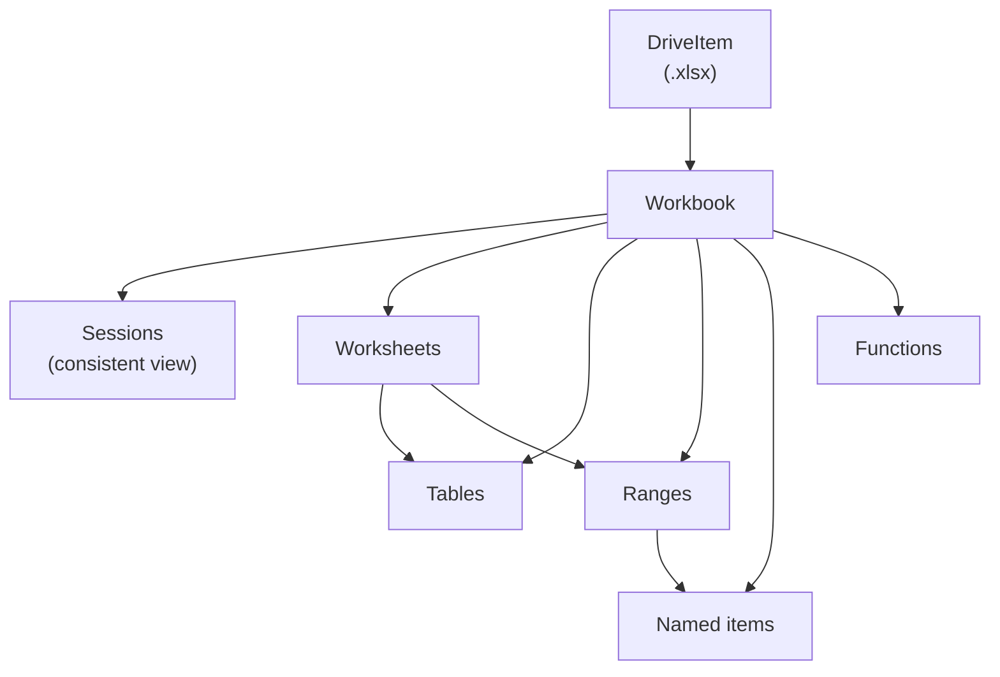

# Excel (Workbooks)

Read, write, and analyze Excel workbooks in OneDrive / SharePoint via the Graph
workbook API — tables, worksheets, ranges, named items, formulas, and sessions.
Every example uploads the bundled sample workbook and cleans up afterwards, so
it is safe to re-run.

---

## Prerequisites

| Permission | Description | Reference |
|---|---|---|
| `Files.ReadWrite` | All workbook operations (sessions, tables, ranges, formulas) | [Files permissions](https://learn.microsoft.com/en-us/graph/permissions-reference#files-permissions) |

All examples authenticate with username/password (`client_id`, `username`,
`password` from `tests.settings`) and default to the sample workbook at
`examples/data/Financial Sample.xlsx`.

---

## How the workbook API fits together

**Which example to use:** start a session for any multi-step automation
(`workbook_sessions.py`), read tables and data (`read_table.py`), manage
tables (`tables.py`), work with worksheets (`worksheets.py`), read/write cell
ranges and named items (`ranges.py`), or compute with Excel formulas
(`formulas.py`).

---

## Examples

| Operation | File | API |
|---|---|---|
| Read workbook tables and data | [`read_table.py`](./read_table.py) | [table list](https://learn.microsoft.com/en-us/graph/api/workbook-list-tables) |
| Workbook sessions (create/refresh/close) | [`workbook_sessions.py`](./workbook_sessions.py) | [create session](https://learn.microsoft.com/en-us/graph/api/workbook-createsession) |
| Manage tables (add, rows, sort) | [`tables.py`](./tables.py) | [table add](https://learn.microsoft.com/en-us/graph/api/workbook-table-add) |
| Worksheets (add, protect, delete) | [`worksheets.py`](./worksheets.py) | [worksheet list](https://learn.microsoft.com/en-us/graph/api/worksheet-list) |
| Ranges and named items | [`ranges.py`](./ranges.py) | [range update](https://learn.microsoft.com/en-us/graph/api/range-update) |
| Excel functions (ABS, POWER, DAYS) | [`formulas.py`](./formulas.py) | [functions resource](https://learn.microsoft.com/en-us/graph/api/resources/functions) |

---

## API reference

- [Excel resource types](https://learn.microsoft.com/en-us/graph/api/resources/excel)
- [Workbook resource](https://learn.microsoft.com/en-us/graph/api/resources/workbook)
- [WorkbookRange](https://learn.microsoft.com/en-us/graph/api/resources/range)
- [WorkbookTable](https://learn.microsoft.com/en-us/graph/api/resources/table)
