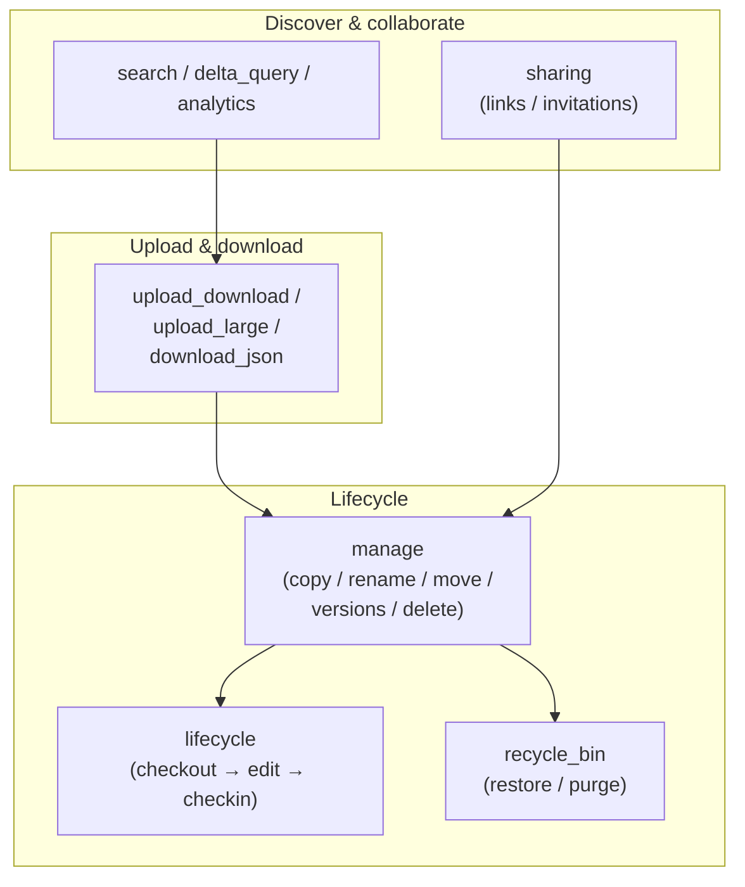

# OneDrive Files

Upload, download, share, manage, and track files in OneDrive for Business — the
most common file operations, shown end-to-end on throwaway files so each example
is safe to re-run.

---

## Prerequisites

| Permission | Description | Reference |
|---|---|---|
| `Files.Read` | Read files, search, delta, analytics | [Files permissions](https://learn.microsoft.com/en-us/graph/permissions-reference#files-permissions) |
| `Files.ReadWrite` | Upload, download, manage, share files | [Files permissions](https://learn.microsoft.com/en-us/graph/permissions-reference#files-permissions) |
| `Files.ReadWrite.All` | Recycle bin access | [Files permissions](https://learn.microsoft.com/en-us/graph/permissions-reference#files-permissions) |
| `Analytics.Read` | File analytics | [Analytics permissions](https://learn.microsoft.com/en-us/graph/permissions-reference#analytics-permissions) |

Most examples authenticate with username/password (`client_id`, `username`,
`password` from `tests.settings`); a few use client secret.

---

## How the file operations fit together

**Which example to use:** upload a file the first time (`upload_download.py`),
large files via resumable sessions (`upload_large.py`), reading structured data
back (`download_json.py`), then manage it (`manage.py`), publish versions with
check-out/check-in (`lifecycle.py`), recover deletions (`recycle_bin.py`),
share it (`sharing.py`), and keep a local cache in sync (`delta_query.py`).

---

## Examples

| Operation | File | Permission | API |
|---|---|---|---|
| Upload and download a file (round-trip) | [`upload_download.py`](./upload_download.py) | `Files.ReadWrite` | [put content](https://learn.microsoft.com/en-us/graph/api/driveitem-put-content) |
| Download and read a JSON file | [`download_json.py`](./download_json.py) | `Files.ReadWrite` | [get content](https://learn.microsoft.com/en-us/graph/api/driveitem-get-content) |
| Upload a large file (resumable session) | [`upload_large.py`](./upload_large.py) | `Files.ReadWrite` | [create upload session](https://learn.microsoft.com/en-us/graph/api/driveitem-createuploadsession) |
| Copy, rename, move, versions, delete | [`manage.py`](./manage.py) | `Files.ReadWrite` | [copy](https://learn.microsoft.com/en-us/graph/api/driveitem-copy) |
| Check out, edit, check in (versioning) | [`lifecycle.py`](./lifecycle.py) | `Files.ReadWrite` | [checkout](https://learn.microsoft.com/en-us/graph/api/driveitem-checkout) |
| Recycle bin — restore and purge | [`recycle_bin.py`](./recycle_bin.py) | `Files.ReadWrite.All` | [recycleBin](https://learn.microsoft.com/en-us/graph/api/resources/recyclebin) |
| Sharing links and invitations | [`sharing.py`](./sharing.py) | `Files.ReadWrite` | [create link](https://learn.microsoft.com/en-us/graph/api/driveitem-createlink) |
| Search files by keyword | [`search.py`](./search.py) | `Files.Read` | [search](https://learn.microsoft.com/en-us/graph/api/driveitem-search) |
| Delta query with resume token | [`delta_query.py`](./delta_query.py) | `Files.Read` | [delta](https://learn.microsoft.com/en-us/graph/api/driveitem-delta) |
| Largest files report | [`largest_files.py`](./largest_files.py) | `Files.Read` | [list children](https://learn.microsoft.com/en-us/graph/api/driveitem-list-children) |
| Sharing audit — files with links | [`find_shared.py`](./find_shared.py) | `Files.Read.All` | [permission list](https://learn.microsoft.com/en-us/graph/api/permission-list) |
| File analytics and activity | [`analytics.py`](./analytics.py) | `Files.Read`, `Analytics.Read` | [analytics](https://learn.microsoft.com/en-us/graph/api/driveitem-get-analytics) |

---

## API reference

- [DriveItem resource](https://learn.microsoft.com/en-us/graph/api/resources/driveitem)
- [RecycleBin resource](https://learn.microsoft.com/en-us/graph/api/resources/recyclebin)
- [ItemAnalytics resource](https://learn.microsoft.com/en-us/graph/api/resources/itemanalytics)
