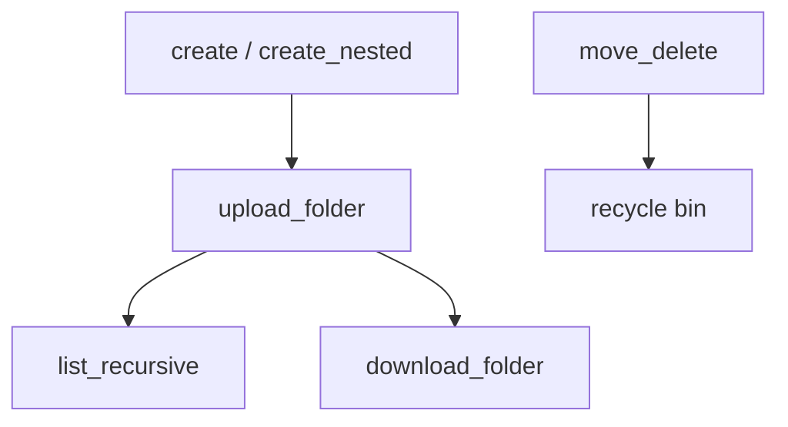

# OneDrive & SharePoint Folders

Create and organize folder trees — nested structures, recursive inventory,
upload/download of whole trees, and move/rename/delete. Each example uses
throwaway folders and cleans up, so it is safe to re-run.

---

## Prerequisites

| Permission | Description | Reference |
|---|---|---|
| `Files.Read` | List folders and files recursively | [Files permissions](https://learn.microsoft.com/en-us/graph/permissions-reference#files-permissions) |
| `Files.ReadWrite` | Create, move, rename, delete folders; upload/download | [Files permissions](https://learn.microsoft.com/en-us/graph/permissions-reference#files-permissions) |

All examples authenticate with username/password (`client_id`, `username`,
`password` from `tests.settings`).

---

## How the folder operations fit together

**Which example to use:** basic folder create + list (`manage.py`), build a
deep structure (`create_nested.py`), inventory the whole drive
(`list_recursive.py`), mirror a local folder up (`upload_folder.py`), pull a
tree down as a zip (`download_folder.py`), or reorganize and clean up
(`move_delete.py`).

---

## Examples

| Operation | File | Permission | API |
|---|---|---|---|
| Create folders and list contents | [`manage.py`](./manage.py) | `Files.ReadWrite` | [create children](https://learn.microsoft.com/en-us/graph/api/driveitem-post-children) |
| Create a nested folder structure | [`create_nested.py`](./create_nested.py) | `Files.ReadWrite` | [create children](https://learn.microsoft.com/en-us/graph/api/driveitem-post-children) |
| Recursively list all files/folders | [`list_recursive.py`](./list_recursive.py) | `Files.Read` | [list children](https://learn.microsoft.com/en-us/graph/api/driveitem-list-children) |
| Upload a local folder tree | [`upload_folder.py`](./upload_folder.py) | `Files.ReadWrite` | [put content](https://learn.microsoft.com/en-us/graph/api/driveitem-put-content) |
| Download a folder as a zip | [`download_folder.py`](./download_folder.py) | `Files.ReadWrite` | [get content](https://learn.microsoft.com/en-us/graph/api/driveitem-get-content) |
| Rename, move, delete folders | [`move_delete.py`](./move_delete.py) | `Files.ReadWrite` | [update](https://learn.microsoft.com/en-us/graph/api/driveitem-update) |

---

## API reference

- [DriveItem resource](https://learn.microsoft.com/en-us/graph/api/resources/driveitem)
- [Folder facet](https://learn.microsoft.com/en-us/graph/api/resources/folder)
