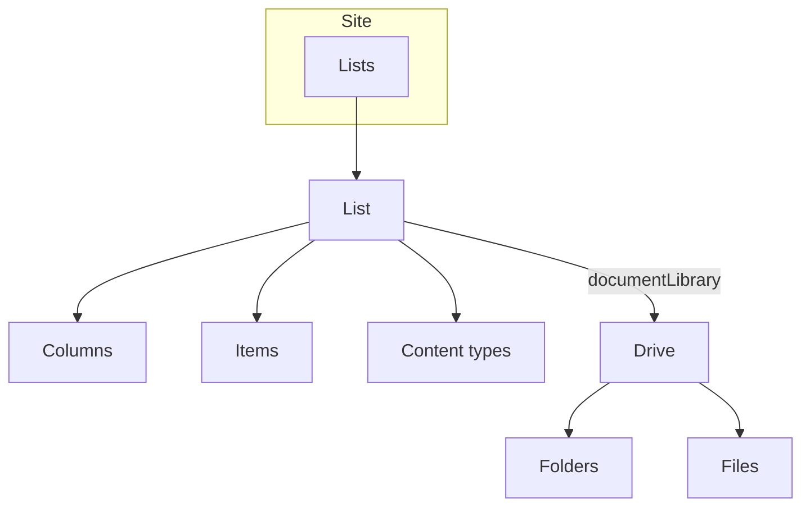

# OneDrive & SharePoint Lists

Create and manage SharePoint lists, columns, and items — plus document
libraries as drives. The most common list automation scenarios, run against
throwaway resources so each example is safe to re-run.

---

## Prerequisites

| Permission | Description | Reference |
|---|---|---|
| `Sites.Read.All` | Read lists, columns, items | [Sites permissions](https://learn.microsoft.com/en-us/graph/permissions-reference#sites-permissions) |
| `Sites.ReadWrite.All` | Create/update/delete lists, columns, items | [Sites permissions](https://learn.microsoft.com/en-us/graph/permissions-reference#sites-permissions) |

All examples authenticate with client secret (`client_id`, `client_secret`,
`tenant` from `tests.settings`).

---

## How lists and libraries fit together

**Which example to use:** create a list and its schema (`create_list.py`),
manage the data inside it (`manage_items.py`), query it efficiently
(`query_items.py`), bulk load/export (`import_export.py`), maintain the schema
(`columns.py`), or work with a document library as a drive (`library.py`).

---

## Examples

| Operation | File | Permission | API |
|---|---|---|---|
| Create a list with custom columns | [`create_list.py`](./create_list.py) | `Sites.ReadWrite.All` | [list create](https://learn.microsoft.com/en-us/graph/api/list-create) |
| Manage list items (CRUD) | [`manage_items.py`](./manage_items.py) | `Sites.ReadWrite.All` | [listItem create](https://learn.microsoft.com/en-us/graph/api/listitem-create) |
| Query items (filter/select/order/top) | [`query_items.py`](./query_items.py) | `Sites.Read.All` | [listItem list](https://learn.microsoft.com/en-us/graph/api/listitem-list) |
| Document library as a drive | [`library.py`](./library.py) | `Sites.ReadWrite.All` | [driveItem put content](https://learn.microsoft.com/en-us/graph/api/driveitem-put-content) |
| Bulk import / export items | [`import_export.py`](./import_export.py) | `Sites.ReadWrite.All` | [listItem create](https://learn.microsoft.com/en-us/graph/api/listitem-create) |
| Manage columns (incl. lookup) | [`columns.py`](./columns.py) | `Sites.ReadWrite.All` | [columnDefinition create](https://learn.microsoft.com/en-us/graph/api/columndefinition-create) |

---

## API reference

- [List resource](https://learn.microsoft.com/en-us/graph/api/resources/list)
- [ListItem resource](https://learn.microsoft.com/en-us/graph/api/resources/listitem)
- [ColumnDefinition resource](https://learn.microsoft.com/en-us/graph/api/resources/columndefinition)
- [DriveItem resource](https://learn.microsoft.com/en-us/graph/api/resources/driveitem)
