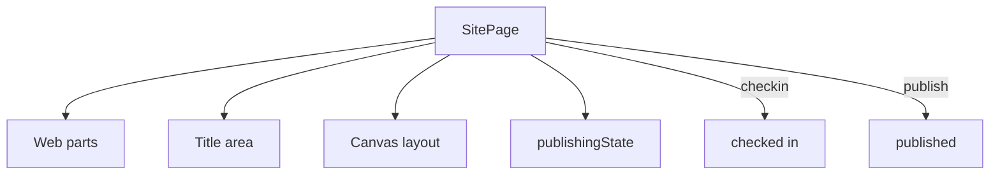

# OneDrive & SharePoint Site Pages

Create, list, publish, and inspect modern site pages in a SharePoint site —
the page lifecycle and the web part model. Every example cleans up after
itself (unless you pass `--keep`), so it is safe to re-run.

---

## Prerequisites

| Permission | Description | Reference |
|---|---|---|
| `Sites.Read.All` | List pages, read web parts and publishing state | [Sites permissions](https://learn.microsoft.com/en-us/graph/permissions-reference#sites-permissions) |
| `Sites.ReadWrite.All` | Create, update, publish, delete pages | [Sites permissions](https://learn.microsoft.com/en-us/graph/permissions-reference#sites-permissions) |

All examples authenticate with client secret (`client_id`, `client_secret`,
`tenant` from `tests.settings`) and target the root site by default (override
with `--site-url`).

---

## How site pages work

**Which example to use:** the full page lifecycle (`manage.py`), a
governance view of every page and its publishing state (`list_pages.py`), the
check-in → publish workflow with verification (`publish_flow.py`), or
inspecting the web parts on a page (`webparts.py`).

---

## Examples

| Operation | File | Permission | API |
|---|---|---|---|
| Page lifecycle (create/update/publish/delete) | [`manage.py`](./manage.py) | `Sites.ReadWrite.All` | [sitePage create](https://learn.microsoft.com/en-us/graph/api/sitepage-create) |
| List pages with publishing state | [`list_pages.py`](./list_pages.py) | `Sites.Read.All` | [sitePage list](https://learn.microsoft.com/en-us/graph/api/sitepage-list) |
| Check in and publish workflow | [`publish_flow.py`](./publish_flow.py) | `Sites.ReadWrite.All` | [sitePage publish](https://learn.microsoft.com/en-us/graph/api/sitepage-publish) |
| Inspect web parts and positions | [`webparts.py`](./webparts.py) | `Sites.Read.All` | [webPart list](https://learn.microsoft.com/en-us/graph/api/sitepage-get-webparts) |

---

## API reference

- [SitePage resource](https://learn.microsoft.com/en-us/graph/api/resources/sitepage)
- [WebPart resource](https://learn.microsoft.com/en-us/graph/api/resources/webpart)
- [PublicationFacet](https://learn.microsoft.com/en-us/graph/api/resources/publicationfacet)
