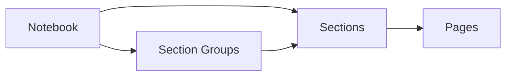

# Microsoft OneNote

Examples for working with OneNote via the Microsoft Graph API — notebooks,
sections, section groups, and pages.

---

## Prerequisites

| Requirement | Description | Reference |
|---|---|---|
| `Notes.Read` | Read notebooks, sections, and pages | [Microsoft Graph permissions](https://learn.microsoft.com/en-us/graph/permissions-reference#notes-permissions) |
| `Notes.ReadWrite` | Create and manage notebooks, sections, and pages | [Microsoft Graph permissions](https://learn.microsoft.com/en-us/graph/permissions-reference#notes-permissions) |

---

## How OneNote works



OneNote content is organized hierarchically. **Notebooks** contain **sections**
and **section groups**. Sections contain **pages**. Each page has HTML content
and can include embedded images, files, and attachments.

---

## Examples

| Step | Operation | File | Required role | API reference |
|---|---|---|---|---|
| **1** | List all notebooks | [`list_notebooks.py`](./list_notebooks.py) | `Notes.Read` | [list notebooks](https://learn.microsoft.com/en-us/graph/api/onenote-list-notebooks) |
| **2** | List recently accessed notebooks | [`list_recent_notebooks.py`](./list_recent_notebooks.py) | `Notes.Read` | [recent notebooks](https://learn.microsoft.com/en-us/graph/api/onenote-list-recentnotebooks) |
| **3** | Create a new notebook | [`create_notebook.py`](./create_notebook.py) | `Notes.ReadWrite` | [create notebook](https://learn.microsoft.com/en-us/graph/api/onenote-post-notebooks) |
| **4** | Delete a notebook by name | [`delete_notebook.py`](./delete_notebook.py) | `Notes.ReadWrite` | [delete notebook](https://learn.microsoft.com/en-us/graph/api/onenote-delete-notebook) |
| **5** | List sections in a notebook | [`list_sections.py`](./list_sections.py) | `Notes.Read` | [list sections](https://learn.microsoft.com/en-us/graph/api/onenote-list-sections) |
| **6** | Create a section in a notebook | [`create_section.py`](./create_section.py) | `Notes.ReadWrite` | [create section](https://learn.microsoft.com/en-us/graph/api/onenote-post-sections) |
| **7** | List section groups in a notebook | [`list_section_groups.py`](./list_section_groups.py) | `Notes.Read` | [list section groups](https://learn.microsoft.com/en-us/graph/api/onenote-list-sectiongroups) |
| **8** | List pages in a section | [`list_pages.py`](./list_pages.py) | `Notes.Read` | [list pages](https://learn.microsoft.com/en-us/graph/api/onenote-list-pages) |
| **9** | Get page HTML content | [`get_page_content.py`](./get_page_content.py) | `Notes.Read` | [get page](https://learn.microsoft.com/en-us/graph/api/page-get) |
| **10** | Create a page with attachments | [`create_page.py`](./create_page.py) | `Notes.ReadWrite` | [create page](https://learn.microsoft.com/en-us/graph/onenote-create-page) |

---

## Quick start

```python
from office365.graph_client import GraphClient

client = GraphClient(tenant="contoso.onmicrosoft.com").with_username_and_password(
    "client_id", "user@contoso.com", "password"
)

notebooks = client.me.onenote.notebooks.get().execute_query()
for nb in notebooks:
    print(f"  {nb.display_name}")
```

---

## Official docs

- [OneNote API overview](https://learn.microsoft.com/en-us/graph/api/resources/onenote)
- [OneNote permissions](https://learn.microsoft.com/en-us/graph/permissions-reference#notes-permissions)
