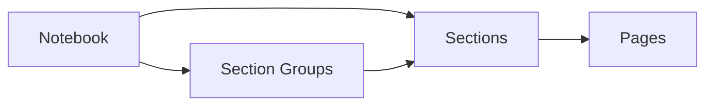

# Microsoft OneNote

Examples for working with OneNote via the Microsoft Graph API —
creating rich content, navigating the hierarchy, and provisioning
standardized notebooks.

---

## Prerequisites

| Permission | Description | Reference |
|---|---|---|
| `Notes.Read` | Read notebooks, sections, and pages | [Microsoft Graph permissions](https://learn.microsoft.com/en-us/graph/permissions-reference#notes-permissions) |
| `Notes.ReadWrite` | Create and manage notebooks, sections, and pages | [Microsoft Graph permissions](https://learn.microsoft.com/en-us/graph/permissions-reference#notes-permissions) |

---

## How OneNote works



OneNote content is organized hierarchically. **Notebooks** contain **sections**
and **section groups**. Sections contain **pages**. Each page has HTML content
and can include embedded images, files, tables, and attachments.

**Group notebooks** are also accessible via the API at
``/groups/{id}/onenote/``.

---

## Basic usage

| Scenario | File | Permission | API reference |
|---|---|---|---|
| Create a new notebook | [`create_notebook.py`](./create_notebook.py) | `Notes.ReadWrite` | [create notebook](https://learn.microsoft.com/en-us/graph/api/onenote-post-notebooks) |

---

## Patterns

| Scenario | File | Why it's useful |
|---|---|---|
| **Rich page creation** — tables, lists, styled text, inline images all as input HTML | [`pages/create_rich_page.py`](./pages/create_rich_page.py) | Shows the input HTML patterns that OneNote supports — far beyond plain text |
| **Page with attachments** — embed images and files from disk | [`create_page.py`](./create_page.py) | Multipart request pattern: HTML + binary attachments (images, PDFs, Word docs) |
| **Download page HTML** — get the full rendered content of a page | [`get_page_content.py`](./get_page_content.py) | Essential for export, backup, or integration with external tools |
| **Export full notebook hierarchy** — walk all notebooks, section groups, sections, and pages with metadata | [`audit_notebook_structure.py`](./audit_notebook_structure.py) | Content discovery and inventory — the #1 admin scenario for OneNote |
| **Provision a notebook from template** — create notebook with predefined sections and starter pages | [`notebooks/provision.py`](./notebooks/provision.py) | Standardized notebook onboarding for teams, projects, or training |

---
---

## Quick start

```python
from office365.graph_client import GraphClient

client = GraphClient(tenant="contoso.onmicrosoft.com").with_username_and_password(
    "client_id", "user@contoso.com", "password"
)

notebooks = client.me.onenote.notebooks.get().execute_query()
for nb in notebooks:
    print(f"  {nb.display_name}")
```

---

## Official docs

- [OneNote API overview](https://learn.microsoft.com/en-us/graph/api/resources/onenote-api-overview)
- [OneNote permissions](https://learn.microsoft.com/en-us/graph/permissions-reference#notes-permissions)
- [Create OneNote pages](https://learn.microsoft.com/en-us/graph/onenote-create-page)
- [Get OneNote content](https://learn.microsoft.com/en-us/graph/onenote-get-content)
- [Input and output HTML](https://learn.microsoft.com/en-us/graph/onenote-input-output-html)
