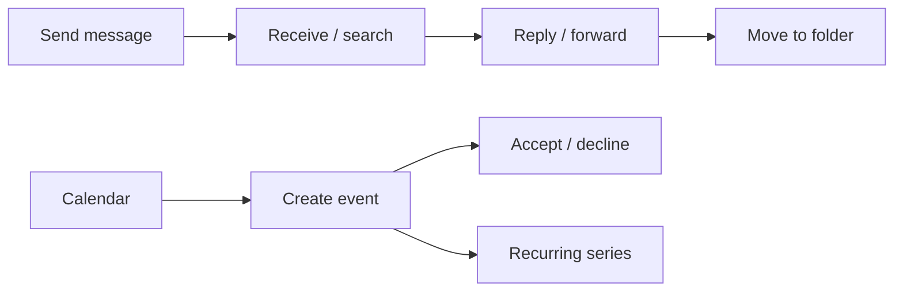

# Outlook — Mail, Calendar & Events

Examples for working with Outlook mail, calendar, and events via
Microsoft Graph.

---

## Prerequisites

| Permission | Description | Reference |
|---|---|---|
| `Mail.ReadWrite` (delegated) | Read, send, and manage messages | [Mail permissions](https://learn.microsoft.com/en-us/graph/permissions-reference#mail-permissions) |
| `Mail.Send` (delegated) | Send mail on behalf of the signed-in user | [Mail permissions](https://learn.microsoft.com/en-us/graph/permissions-reference#mail-permissions) |
| `Calendars.ReadWrite` (delegated) | Create, read, update, delete events and calendars | [Calendar permissions](https://learn.microsoft.com/en-us/graph/permissions-reference#calendars-permissions) |
| `MailboxSettings.ReadWrite` (delegated) | Read and update automatic replies, rules | [Mail permissions](https://learn.microsoft.com/en-us/graph/permissions-reference#mail-permissions) |
| `Mail.Read` (delegated) | Read mail tips and message properties | [Mail permissions](https://learn.microsoft.com/en-us/graph/permissions-reference#mail-permissions) |
| `Reports.Read.All` (delegated) | Access email and mailbox usage reports | [Reports permissions](https://learn.microsoft.com/en-us/graph/permissions-reference#reports-permissions) |
| `User.Read.All` (delegated or app) | Read user properties for mailbox audit, shared mailboxes, forwarding detection | [User permissions](https://learn.microsoft.com/en-us/graph/permissions-reference#user-permissions) |

---

## How Outlook works



---

## Basic usage

| Scenario | File | Permission | API reference |
|---|---|---|---|
| Send a message | [`messages/send.py`](./messages/send.py) | `Mail.Send` | [sendMail](https://learn.microsoft.com/en-us/graph/api/user-sendmail) |
| Create a calendar event | [`events/create.py`](./events/create.py) | `Calendars.ReadWrite` | [create event](https://learn.microsoft.com/en-us/graph/api/user-post-events) |

---

## Patterns

| Scenario | File | Why it's useful |
|---|---|---|
| **Send with large attachment** — upload session for files >3 MB | [`messages/send_with_large_attachment.py`](./messages/send_with_large_attachment.py) | Upload session pattern required for large file attachments |
| **Email search** — Microsoft Search query with pagination | [`messages/search.py`](./messages/search.py) | Targeted search across mailbox with filters |
| **Export MIME** — download message as .eml | [`messages/export_mime.py`](./messages/export_mime.py) | Backup, eDiscovery, or migration use cases |
| **Inbox rules + categories** — automate message handling and visual organization | [`messages/inbox_rules.py`](./messages/inbox_rules.py) | Combine rules (forward/flag) with category management |
| **Mailbox settings** — enable scheduled automatic replies (OOF) | [`messages/mailbox_settings.py`](./messages/mailbox_settings.py) | Out-of-office configuration via API |
| **Find meeting times & get schedule** — availability lookup and free/busy | [`calendars/availability.py`](./calendars/availability.py) | Scheduler assistant pattern — find slots and view user availability |
| **Share calendar** — grant read access to another user | [`calendars/share.py`](./calendars/share.py) | Calendar visibility control — share free/busy level |
| **Delegate calendar** — grant editor/delegate access to manage events on your behalf | [`calendars/delegate.py`](./calendars/delegate.py) | Delegate access for assistants or team members to manage your calendar |
| **Recurring event** — weekly pattern with limited occurrences | [`events/recurring.py`](./events/recurring.py) | Recurrence pattern setup — meetings, standups, reminders |
| **Meeting response** — accept, decline, or cancel an event | [`events/respond.py`](./events/respond.py) | Attendee and organizer response workflows |
| **Email usage report** — activity counts, mailbox storage across D7/D30/D90 | [`reports/email_usage.py`](./reports/email_usage.py) | Adoption tracking, storage planning, and audit reporting |
| **Mail tips** — check recipient status before sending (OOF, moderation, size limits) | [`messages/mail_tips.py`](./messages/mail_tips.py) | Pre-flight check for senders — prevents bounced or blocked messages |
| **Mailbox audit** — auto-replies, mailbox settings report | [`mailboxes/report.py`](./mailboxes/report.py) | Bulk audit of user mailbox configurations |
| **Shared mailboxes** — list and check configuration | [`shared_mailboxes/report.py`](./shared_mailboxes/report.py) | Discover and validate shared mailbox setup |
| **Mail flow audit** — detect external forwarding | [`mail_flow/forwarding_report.py`](./mail_flow/forwarding_report.py) | Security audit — identify users forwarding mail externally |

---

## Quick start

```python
from office365.graph_client import GraphClient

client = GraphClient(tenant="contoso.onmicrosoft.com").with_username_and_password(
    "client_id", "user@contoso.com", "password"
)

# Send a quick message
client.me.send_mail(
    subject="Hello",
    body="This is a test.",
    to_recipients=["recipient@contoso.com"],
).execute_query()
```

All examples use `GraphClient` with `with_username_and_password` (MSAL ROPC) by default.
You can replace with any supported auth flow — see [`examples/auth/`](/examples/auth) for all options.

---

## Official docs

- [Outlook mail API overview](https://learn.microsoft.com/en-us/graph/api/resources/message)
- [Outlook calendar API overview](https://learn.microsoft.com/en-us/graph/api/resources/event)
- [Microsoft Graph permissions reference](https://learn.microsoft.com/en-us/graph/permissions-reference)
