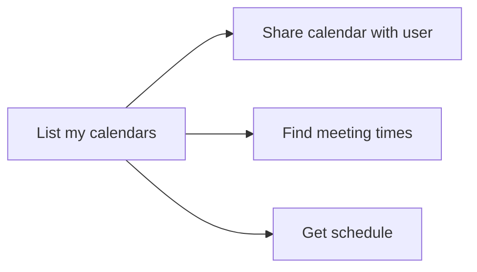

# Calendars — List, Share, and Find Meeting Times

Examples for working with Outlook calendars via Microsoft Graph — listing
calendars, sharing them with other users, finding meeting times, and getting
availability schedules.

---

## Prerequisites

| Requirement | Description | Reference |
|---|---|---|
| `Calendars.ReadWrite` (delegated) | List calendars, create/update calendar permissions, find meeting times | [Microsoft Graph permissions](https://learn.microsoft.com/en-us/graph/permissions-reference#calendars-permissions) |
| `Calendars.Read` (delegated) | Read calendar list | [Microsoft Graph permissions](https://learn.microsoft.com/en-us/graph/permissions-reference#calendars-permissions) |
| `User.Read.All` or `Directory.Read.All` (delegated) | Get schedule info for other users | [Microsoft Graph permissions](https://learn.microsoft.com/en-us/graph/permissions-reference#user-permissions) |

---

## How calendars work



Each user has a **default calendar** and can own additional calendars.
Calendars can be **shared** with other users at different access levels (read,
write, delegate).

---

## Examples

| Step | Operation | File | Required role | API reference |
|---|---|---|---|---|
| **1** | List all calendars for the signed-in user | [`list_my.py`](./list_my.py) | `Calendars.Read` | [list calendars](https://learn.microsoft.com/en-us/graph/api/user-list-calendars) |
| **2** | Find suggested meeting times based on availability | [`find_meeting_times.py`](./find_meeting_times.py) | `Calendars.ReadWrite`, `User.Read.All` | [find meeting times](https://learn.microsoft.com/en-us/graph/api/user-findmeetingtimes) |
| **3** | Get the free/busy schedule for a user | [`get_schedule.py`](./get_schedule.py) | `Calendars.ReadWrite`, `User.Read.All` | [get schedule](https://learn.microsoft.com/en-us/graph/api/calendar-getschedule) |
| **4** | Share a calendar with another user | [`share_with.py`](./share_with.py) | `Calendars.ReadWrite` | [create calendarPermission](https://learn.microsoft.com/en-us/graph/api/calendar-post-calendarpermissions) |
| **5** | Create a new calendar | [`create.py`](./create.py) | `Calendars.ReadWrite` | [create calendar](https://learn.microsoft.com/en-us/graph/api/user-post-calendars) |
| **6** | Delete a calendar (not the default) | [`delete.py`](./delete.py) | `Calendars.ReadWrite` | [delete calendar](https://learn.microsoft.com/en-us/graph/api/calendar-delete) |
| **7** | Get calendar view for a date range | [`view.py`](./view.py) | `Calendars.Read` | [calendar view](https://learn.microsoft.com/en-us/graph/api/calendar-list-calendarview) |

---

## Quick start

```python
from office365.graph_client import GraphClient

client = GraphClient(tenant="contoso.onmicrosoft.com").with_username_and_password(
    "client_id", "user@contoso.com", "password"
)

# List the first 10 calendars
calendars = client.me.calendars.top(10).get().execute_query()
for cal in calendars:
    print(f"{cal.name}  ({cal.owner.name})")
```

---

## Official docs

- [Outlook calendar API overview](https://learn.microsoft.com/en-us/graph/api/resources/calendar)
- [List calendars](https://learn.microsoft.com/en-us/graph/api/user-list-calendars)
- [Find meeting times](https://learn.microsoft.com/en-us/graph/api/user-findmeetingtimes)
- [Get schedule](https://learn.microsoft.com/en-us/graph/api/calendar-getschedule)
- [Create calendarPermission](https://learn.microsoft.com/en-us/graph/api/calendar-post-calendarpermissions)
- [Microsoft Graph Calendar permissions](https://learn.microsoft.com/en-us/graph/permissions-reference#calendars-permissions)
