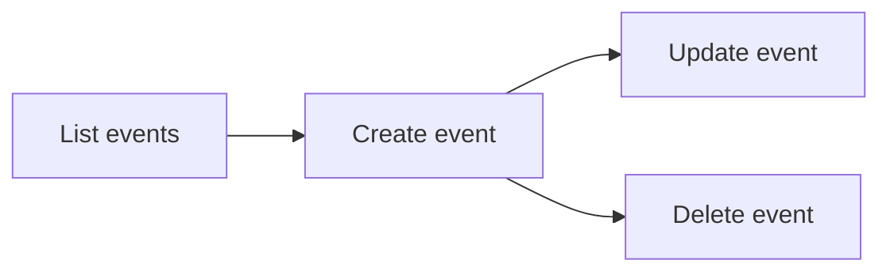

# Events — Create, Read, and Delete Calendar Events

Examples for working with Outlook calendar events via Microsoft Graph.

---

## Prerequisites

| Requirement | Description | Reference |
|---|---|---|
| `Calendars.ReadWrite` (delegated) | Create, read, update, and delete events | [Microsoft Graph permissions](https://learn.microsoft.com/en-us/graph/permissions-reference#calendars-permissions) |
| `Calendars.Read` (delegated) | Read events without write access | [Microsoft Graph permissions](https://learn.microsoft.com/en-us/graph/permissions-reference#calendars-permissions) |

---

## How events work



Events live on a **calendar** (default or specific). Each event has a subject,
start/end time, body, attendees, location, and more.

---

## Examples

| Step | Operation | File | Required role | API reference |
|---|---|---|---|---|
| **1** | Create an event in the default calendar | [`create.py`](./create.py) | `Calendars.ReadWrite` | [create event](https://learn.microsoft.com/en-us/graph/api/user-post-events) |
| **2** | List upcoming events | [`list.py`](./list.py) | `Calendars.Read` | [list events](https://learn.microsoft.com/en-us/graph/api/user-list-events) |
| **3** | Update an event (reschedule, change subject) | [`update.py`](./update.py) | `Calendars.ReadWrite` | [update event](https://learn.microsoft.com/en-us/graph/api/event-update) |
| **4** | Accept a meeting event | [`accept.py`](./accept.py) | `Calendars.ReadWrite` | [accept event](https://learn.microsoft.com/en-us/graph/api/event-accept) |
| **5** | Decline a meeting event | [`decline.py`](./decline.py) | `Calendars.ReadWrite` | [decline event](https://learn.microsoft.com/en-us/graph/api/event-decline) |
| **6** | Tentatively accept a meeting event | [`tentatively_accept.py`](./tentatively_accept.py) | `Calendars.ReadWrite` | [tentatively accept](https://learn.microsoft.com/en-us/graph/api/event-tentativelyaccept) |
| **7** | Create a recurring event (weekly, 4 occurrences) | [`recurring.py`](./recurring.py) | `Calendars.ReadWrite` | [recurring event](https://learn.microsoft.com/en-us/graph/api/user-post-events) |
| **8** | Cancel a meeting and notify attendees | [`cancel.py`](./cancel.py) | `Calendars.ReadWrite` | [cancel event](https://learn.microsoft.com/en-us/graph/api/event-cancel) |

---

## Quick start

```python
from datetime import datetime, timedelta
from office365.graph_client import GraphClient

client = GraphClient(tenant="contoso.onmicrosoft.com").with_username_and_password(
    "client_id", "user@contoso.com", "password"
)

when = datetime.utcnow() + timedelta(days=1)
new_event = client.me.calendar.events.add(
    subject="Team Lunch",
    body="Let's grab lunch together.",
    start=when,
    end=when + timedelta(hours=1),
    attendees=["colleague@contoso.com"],
).execute_query()
print(f"Created event: {new_event.subject}")
```

---

## Official docs

- [Outlook events API overview](https://learn.microsoft.com/en-us/graph/api/resources/event)
- [List events](https://learn.microsoft.com/en-us/graph/api/user-list-events)
- [Create event](https://learn.microsoft.com/en-us/graph/api/user-post-events)
- [Delete event](https://learn.microsoft.com/en-us/graph/api/event-delete)
- [Microsoft Graph Calendar permissions](https://learn.microsoft.com/en-us/graph/permissions-reference#calendars-permissions)
