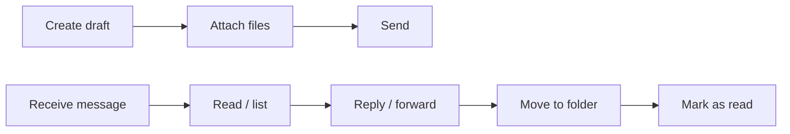

# Messages — Send, Read, and Manage Mail

Examples for working with Outlook Mail via Microsoft Graph — sending, drafting,
searching, moving, replying, managing attachments, and more.

---

## Prerequisites

| Requirement | Description | Reference |
|---|---|---|
| `Mail.ReadWrite` (delegated) | Read, update, delete messages; list attachments | [Microsoft Graph permissions](https://learn.microsoft.com/en-us/graph/permissions-reference#mail-permissions) |
| `Mail.Send` (delegated) | Send messages on behalf of the user | [Microsoft Graph permissions](https://learn.microsoft.com/en-us/graph/permissions-reference#mail-permissions) |
| `Mail.ReadWrite.Shared` (delegated) | Access messages in shared mailboxes or other users' folders | [Microsoft Graph permissions](https://learn.microsoft.com/en-us/graph/permissions-reference#mail-permissions) |

---

## Common patterns



Most examples follow the same auth setup. Replace `with_username_and_password` with
your preferred flow.

---

## Examples — Send & Draft

| Step | Operation | File | Required role | API reference |
|---|---|---|---|---|
| **1** | Send a plain-text message | [`send/send.py`](./send/send.py) | `Mail.Send` | [sendMail](https://learn.microsoft.com/en-us/graph/api/user-sendmail) |
| **2** | Send an HTML-formatted message | [`send/send_html.py`](./send/send_html.py) | `Mail.Send` | [sendMail](https://learn.microsoft.com/en-us/graph/api/user-sendmail) |
| **3** | Send a message with a file attachment | [`send/send_with_attachment.py`](./send/send_with_attachment.py) | `Mail.Send` | [sendMail + attachment](https://learn.microsoft.com/en-us/graph/api/user-sendmail) |
| **4** | Send with large attachment (upload session) | [`send/send_with_large_attachment.py`](./send/send_with_large_attachment.py) | `Mail.Send`, `Mail.ReadWrite` | [upload session](https://learn.microsoft.com/en-us/graph/api/attachment-createuploadsession) |
| **5** | Create a draft message | [`create_draft.py`](./create_draft.py) | `Mail.ReadWrite` | [create draft](https://learn.microsoft.com/en-us/graph/api/user-post-messages) |
| **6** | Create a draft with attachments | [`create_draft_with_attachments.py`](./create_draft_with_attachments.py) | `Mail.ReadWrite` | [create draft + attachment](https://learn.microsoft.com/en-us/graph/api/user-post-messages) |

## Examples — Read & List

| Step | Operation | File | Required role | API reference |
|---|---|---|---|---|
| **7** | List all messages in the mailbox | [`list_all.py`](./list_all.py) | `Mail.ReadWrite` | [list messages](https://learn.microsoft.com/en-us/graph/api/user-list-messages) |
| **8** | List new/unread messages (delta query) | [`list_new.py`](./list_new.py) | `Mail.ReadWrite` | [message delta](https://learn.microsoft.com/en-us/graph/api/message-delta) |
| **9** | Get basic properties (subject, from, datetime) | [`get_basic_props.py`](./get_basic_props.py) | `Mail.ReadWrite` | [get message](https://learn.microsoft.com/en-us/graph/api/message-get) |
| **10** | Get the full message body | [`get_with_body.py`](./get_with_body.py) | `Mail.Read` | [get message](https://learn.microsoft.com/en-us/graph/api/message-get) |
| **11** | List attachments on a message | [`list_attachments.py`](./list_attachments.py) | `Mail.ReadWrite` | [list attachments](https://learn.microsoft.com/en-us/graph/api/message-list-attachments) |
| **12** | Download MIME representation of a message | [`download.py`](./download.py) | `Mail.ReadWrite` | [get MIME](https://learn.microsoft.com/en-us/graph/outlook-get-mime-message) |
| **13** | Download all attachments from messages | [`download_with_attachments.py`](./download_with_attachments.py) | `Mail.ReadWrite` | [get attachment](https://learn.microsoft.com/en-us/graph/api/attachment-get) |

## Examples — Manage

| Step | Operation | File | Required role | API reference |
|---|---|---|---|---|
| **14** | Move a message to another folder | [`move.py`](./move.py) | `Mail.ReadWrite` | [move message](https://learn.microsoft.com/en-us/graph/api/message-move) |
| **15** | Reply to the sender of a message | [`reply.py`](./reply.py) | `Mail.Send` | [reply](https://learn.microsoft.com/en-us/graph/api/message-reply) |
| **16** | Forward a message to additional recipients | [`forward.py`](./forward.py) | `Mail.ReadWrite`, `Mail.Send` | [forward](https://learn.microsoft.com/en-us/graph/api/message-forward) |
| **16** | Update message properties | [`update.py`](./update.py) | `Mail.ReadWrite` | [update message](https://learn.microsoft.com/en-us/graph/api/message-update) |
| **17** | Mark a single message as read | [`mark_as_read.py`](./mark_as_read.py) | `Mail.ReadWrite` | [update message](https://learn.microsoft.com/en-us/graph/api/message-update) |
| **18** | Mark all messages in a folder as read | [`mark_all_as_read.py`](./mark_all_as_read.py) | `Mail.ReadWrite` | [update message](https://learn.microsoft.com/en-us/graph/api/message-update) |
| **19** | Empty a mail folder (delete all messages) | [`empty_folder.py`](./empty_folder.py) | `Mail.ReadWrite` | [delete message](https://learn.microsoft.com/en-us/graph/api/message-delete) |

## Examples — Search & Subscriptions

| Step | Operation | File | Required role | API reference |
|---|---|---|---|---|
| **20** | Search messages using Microsoft Search | [`search/search.py`](./search/search.py) | `Mail.ReadWrite` | [search messages](https://learn.microsoft.com/en-us/graph/search-concept-messages) |
| **21** | Custom search with filters and sort | [`search/search_custom.py`](./search/search_custom.py) | `Mail.ReadWrite` | [search messages](https://learn.microsoft.com/en-us/graph/search-concept-messages) |
| **22** | Create a subscription (change notification on new mail) | [`create_subscription.py`](./create_subscription.py) | `Mail.ReadWrite` | [create subscription](https://learn.microsoft.com/en-us/graph/api/subscription-post-subscriptions) |
| **23** | Create a custom extended property on a message | [`create_property.py`](./create_property.py) | `Mail.ReadWrite` | [extended property](https://learn.microsoft.com/en-us/graph/api/singlevaluelegacyextendedproperty-post-singlevalueextendedproperties) |

## Examples — Mail Folders

| Step | Operation | File | Required role | API reference |
|---|---|---|---|---|
| **24** | Create a new mail folder under the Inbox | [`folders/create.py`](./folders/create.py) | `Mail.ReadWrite` | [create folder](https://learn.microsoft.com/en-us/graph/api/user-post-mailfolders) |
| **25** | List all mail folders with item counts | [`folders/list.py`](./folders/list.py) | `Mail.ReadWrite` | [list folders](https://learn.microsoft.com/en-us/graph/api/user-list-mailfolders) |
| **26** | Rename a mail folder | [`folders/rename.py`](./folders/rename.py) | `Mail.ReadWrite` | [update folder](https://learn.microsoft.com/en-us/graph/api/mailfolder-update) |
| **27** | Delete a mail folder and its contents | [`folders/delete.py`](./folders/delete.py) | `Mail.ReadWrite` | [delete folder](https://learn.microsoft.com/en-us/graph/api/mailfolder-delete) |

---

## Quick start

```python
from office365.graph_client import GraphClient

client = GraphClient(tenant="contoso.onmicrosoft.com").with_username_and_password(
    "client_id", "user@contoso.com", "password"
)

# Send a quick message
client.me.send_mail(
    subject="Hello",
    body="This is a test.",
    to_recipients=["recipient@contoso.com"],
).execute_query()
```

---

## Official docs

- [Outlook messages API overview](https://learn.microsoft.com/en-us/graph/api/resources/message)
- [Microsoft Graph Mail permissions](https://learn.microsoft.com/en-us/graph/permissions-reference#mail-permissions)
