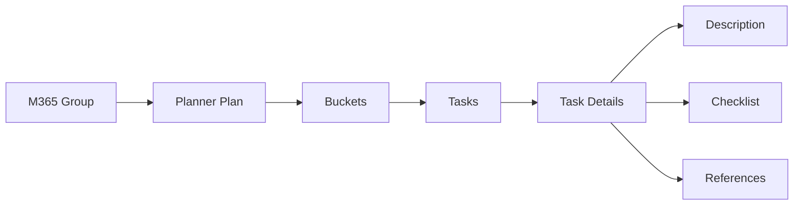

# Planner

Examples for working with Microsoft Graph Planner API — creating and
managing plans, buckets, and tasks.

---

## Prerequisites

| Requirement | Description | Reference |
|---|---|---|
| `Group.ReadWrite.All` (delegated) | Create, read, update, and delete plans, buckets, and tasks | [Microsoft Graph permissions](https://learn.microsoft.com/en-us/graph/permissions-reference#group-permissions) |
| `Tasks.ReadWrite.All` (delegated) | Alternative scope focused on tasks | [Microsoft Graph permissions](https://learn.microsoft.com/en-us/graph/permissions-reference#tasks-permissions) |

Admin consent is required for both permissions.

---

## How Planner works



A **plan** is owned by a Microsoft 365 group. Plans contain **buckets**
(todo / in progress / done) that group **tasks**. Each task has **details**
(description, checklist, references, due date, priority, assignees).

---

## Examples

| Step | Operation | File | Required role | API reference |
|---|---|---|---|---|
| **1** | Create a planner plan owned by a group | [`create_plan.py`](./create_plan.py) | `Group.ReadWrite.All` | [create plan](https://learn.microsoft.com/en-us/graph/api/planner-post-plans) |
| **2** | List all plans for a group | [`list_plans.py`](./list_plans.py) | `Group.ReadWrite.All` | [list plans](https://learn.microsoft.com/en-us/graph/api/planner-list-plans) |
| **3** | Delete a plan by title | [`delete_plan.py`](./delete_plan.py) | `Group.ReadWrite.All` | [delete plan](https://learn.microsoft.com/en-us/graph/api/planner-delete-plans) |
| **4** | Create a bucket (task category) in a plan | [`create_bucket.py`](./create_bucket.py) | `Group.ReadWrite.All` | [create bucket](https://learn.microsoft.com/en-us/graph/api/planner-post-buckets) |
| **5** | List all buckets in a plan | [`list_buckets.py`](./list_buckets.py) | `Group.ReadWrite.All` | [list buckets](https://learn.microsoft.com/en-us/graph/api/planner-list-buckets) |
| **6** | Create a task in a plan and bucket | [`create_task.py`](./create_task.py) | `Group.ReadWrite.All` | [create task](https://learn.microsoft.com/en-us/graph/api/planner-post-tasks) |
| **7** | List tasks in a plan (with progress and priority) | [`list_tasks.py`](./list_tasks.py) | `Group.ReadWrite.All` | [list tasks](https://learn.microsoft.com/en-us/graph/api/planner-list-tasks) |
| **8** | Update a task (title, due date, priority, progress) | [`update_task.py`](./update_task.py) | `Group.ReadWrite.All` | [update task](https://learn.microsoft.com/en-us/graph/api/planner-update-tasks) |
| **9** | Delete a task by title | [`delete_task.py`](./delete_task.py) | `Group.ReadWrite.All` | [delete task](https://learn.microsoft.com/en-us/graph/api/planner-delete-tasks) |
| **10** | Assign a task to a user | [`assign_task.py`](./assign_task.py) | `Group.ReadWrite.All` | [assign task](https://learn.microsoft.com/en-us/graph/api/planner-update-tasks) |
| **11** | Get task details (description, checklist) | [`get_task_details.py`](./get_task_details.py) | `Group.ReadWrite.All` | [task details](https://learn.microsoft.com/en-us/graph/api/planner-get-taskdetails) |
| **12** | Update plan details (category descriptions) | [`update_plan_details.py`](./update_plan_details.py) | `Group.ReadWrite.All` | [plan details](https://learn.microsoft.com/en-us/graph/api/planner-update-plandetails) |

---

## Quick start

```python
from office365.graph_client import GraphClient

client = GraphClient(tenant="contoso.onmicrosoft.com").with_client_secret(
    "client_id", "client_secret"
)

group = client.groups.get_by_name("My Team").get().execute_query()
plan = client.planner.plans.add("My Plan", group).execute_query()
bucket = plan.buckets.add("To do").execute_query()
task = client.planner.tasks.add("Write docs", plan.id, bucket.id).execute_query()
print(f"Task created: {task.title}")
```

---

## Official docs

- [Planner API overview](https://learn.microsoft.com/en-us/graph/api/resources/planner)
- [Planner plans](https://learn.microsoft.com/en-us/graph/api/resources/plannerplan)
- [Planner tasks](https://learn.microsoft.com/en-us/graph/api/resources/plannertask)
- [Planner buckets](https://learn.microsoft.com/en-us/graph/api/resources/plannerbucket)
