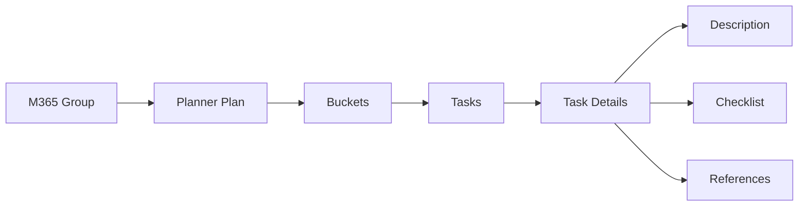

# Planner

Examples for working with Microsoft Graph Planner API — creating plans,
organizing tasks with buckets, assignments, and tracking progress.

---

## Prerequisites

| Permission | Description | Reference |
|---|---|---|
| `Group.ReadWrite.All` (delegated) | Create, read, update, and delete plans, buckets, and tasks | [Microsoft Graph permissions](https://learn.microsoft.com/en-us/graph/permissions-reference#group-permissions) |
| `Tasks.ReadWrite.All` (delegated) | Alternative scope focused on tasks | [Microsoft Graph permissions](https://learn.microsoft.com/en-us/graph/permissions-reference#tasks-permissions) |

Admin consent is required for both permissions.

---

## How Planner works



A **plan** is owned by a Microsoft 365 group. Plans contain **buckets**
(todo / in progress / done) that group **tasks**. Each task has **details**
(description, checklist, references), a **priority** (1-10), a **progress**
(percent complete), and **assignments** (users responsible).

---

## Basic usage

| Scenario | File | Permission | API reference |
|---|---|---|---|
| Create a planner plan for a group | [`create_plan.py`](./create_plan.py) | `Group.ReadWrite.All` | [create plan](https://learn.microsoft.com/en-us/graph/api/planner-post-plans) |

---

## Patterns

| Scenario | File | Why it's useful |
|---|---|---|
| **Full plan provisioning** — plan + category labels + buckets + tasks + assignments in one flow | [`plans/provision.py`](./plans/provision.py) | The "sprint setup" pattern: templates with categories, buckets, and pre-assigned tasks |
| **Progress dashboard** — scan all tasks across plans with status, priority, and assignee breakdown | [`tasks/progress_report.py`](./tasks/progress_report.py) | Adoption tracking, workload visibility, and status reporting across the org |
| Create a task in a plan (with optional bucket) | [`create_task.py`](./create_task.py) | Resolve plan and bucket by name, then create a task with references |
| Update a task (title, due date, priority, progress) | [`update_task.py`](./update_task.py) | Rich update with multiple property changes at once |
| Assign a task to a user by email | [`assign_task.py`](./assign_task.py) | User resolution + ``plannerAssignment`` object pattern |
| Get task details (description, checklist, references) | [`get_task_details.py`](./get_task_details.py) | Reading the full task details blob — essential for integrations |
| Update plan details (category color labels) | [`update_plan_details.py`](./update_plan_details.py) | Custom label categories (Urgent, Client, Internal) for consistent task tagging |

---

## Quick start

```python
from office365.graph_client import GraphClient

client = GraphClient(tenant="contoso.onmicrosoft.com").with_client_secret(
    "client_id", "client_secret"
)

group = client.groups.get_by_name("My Team").get().execute_query()
plan = client.planner.plans.add("My Plan", group).execute_query()
bucket = plan.buckets.add("To do").execute_query()
task = client.planner.tasks.add("Write docs", plan.id, bucket.id).execute_query()
print(f"Task created: {task.title}")
```

---

## Official docs

- [Planner API overview](https://learn.microsoft.com/en-us/graph/api/resources/planner-overview)
- [Planner plans](https://learn.microsoft.com/en-us/graph/api/resources/plannerplan)
- [Planner tasks](https://learn.microsoft.com/en-us/graph/api/resources/plannertask)
- [Planner buckets](https://learn.microsoft.com/en-us/graph/api/resources/plannerbucket)
