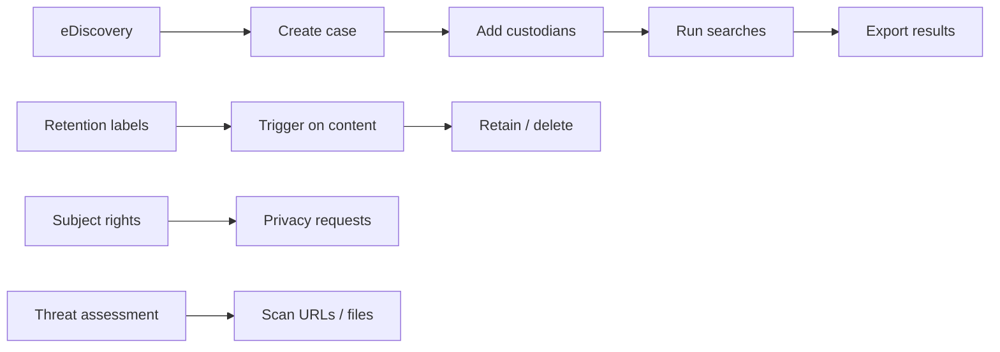

# Microsoft Purview (Compliance)

Examples for working with Microsoft Purview via the Graph Security API —
eDiscovery, records management, privacy (GDPR/CCPA), and threat assessment.

---

## Prerequisites

| Permission | Description | Reference |
|---|---|---|
| `eDiscovery.ReadWrite.All` | Create and manage eDiscovery cases, custodians, searches | [eDiscovery permissions](https://learn.microsoft.com/en-us/graph/permissions-reference#ediscovery-permissions) |
| `RecordsManagement.ReadWrite.All` | Create retention labels with behaviors and triggers | [Records management permissions](https://learn.microsoft.com/en-us/graph/permissions-reference#records-management-permissions) |
| `SubjectRightsRequest.ReadWrite.All` | Create and manage GDPR/CCPA subject rights requests | [SRR permissions](https://learn.microsoft.com/en-us/graph/permissions-reference#subject-rights-request-permissions) |
| `ThreatAssessment.ReadWrite.All` | Submit URLs and files for threat assessment | [Threat assessment permissions](https://learn.microsoft.com/en-us/graph/permissions-reference#threat-assessment-permissions) |

Admin consent is required for all permissions above.

---

## How Purview works



---

## Patterns

| Category | Scenario | File | Permission |
|---|---|---|---|
| **Compliance** | eDiscovery case workflow: create case → add custodian → run search → close | [`ediscovery/create_and_search.py`](./ediscovery/create_and_search.py) | `eDiscovery.ReadWrite.All` |
| **Records management** | Create retention label with 365-day retention, record behavior, delete disposition | [`records/retention_label.py`](./records/retention_label.py) | `RecordsManagement.ReadWrite.All` |
| **Privacy / GDPR** | Create a subject rights request for data export under GDPR Article 15 | [`subject_rights/create_request.py`](./subject_rights/create_request.py) | `SubjectRightsRequest.ReadWrite.All` |
| **Security** | Submit URL and file for phishing/malware threat assessment | [`threat_assessment/scan_url.py`](./threat_assessment/scan_url.py) | `ThreatAssessment.ReadWrite.All` |
| **Information protection** | List and audit sensitivity labels | [`sensitivity_labels/apply.py`](./sensitivity_labels/apply.py) | `InformationProtectionPolicy.Read.All` |

---

## Quick start

```python
from office365.graph_client import GraphClient

client = GraphClient(tenant="contoso.onmicrosoft.com").with_client_secret(
    "client_id", "client_secret"
)

# List eDiscovery cases
cases = client.security.cases.ediscovery_cases.get().execute_query()
for case in cases:
    print(f"{case.display_name}  status: {case.status}")
```

---

## Official docs

- [Microsoft Purview overview](https://learn.microsoft.com/en-us/purview)
- [eDiscovery API](https://learn.microsoft.com/en-us/graph/api/resources/security-ediscoverycase)
- [Retention labels API](https://learn.microsoft.com/en-us/graph/api/resources/security-retentionlabel)
- [Subject Rights Request API](https://learn.microsoft.com/en-us/graph/api/resources/security-subjectrightsrequest)
- [Threat assessment API](https://learn.microsoft.com/en-us/graph/api/resources/threatassessmentrequest)
