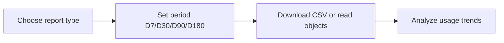

# Reports

Examples for working with Microsoft Graph Reports API — tenant-level
usage, activity, and adoption reports across Microsoft 365 services.

Reports are downloaded as CSV files (most reports) or returned as objects
(activations, MFA status).

---

## Prerequisites

| Requirement | Description | Reference |
|---|---|---|
| `Reports.Read.All` (delegated) | Read all tenant-level usage and activity reports | [Microsoft Graph permissions](https://learn.microsoft.com/en-us/graph/permissions-reference#reports-permissions) |
| `AuditLog.Read.All` (delegated) | Read authentication method registration details | [Microsoft Graph permissions](https://learn.microsoft.com/en-us/graph/permissions-reference#audit-log-permissions) |

Admin consent is required for both permissions.

---

## How reports work



Most reports use a **period** parameter (D7, D30, D90, D180 days).
Activations and MFA reports don't require a period.

---

## Examples

| Step | Operation | File | Required role | API reference |
|---|---|---|---|---|
| **1** | Active users per M365 app (Outlook, Word, Excel, Teams, …) | [`get_app_user_counts.py`](./get_app_user_counts.py) | `Reports.Read.All` | [M365 app counts](https://learn.microsoft.com/en-us/graph/api/reportroot-getm365appusercounts) |
| **2** | Per-user M365 app usage detail | [`get_m365_app_user_detail.py`](./get_m365_app_user_detail.py) | `Reports.Read.All` | [M365 app detail](https://learn.microsoft.com/en-us/graph/api/reportroot-getm365appuserdetail) |
| **3** | Email activity (send, receive, read) trend | [`email_activity_counts.py`](./email_activity_counts.py) | `Reports.Read.All` | [email activity](https://learn.microsoft.com/en-us/graph/api/reportroot-getemailactivitycounts) |
| **4** | Mailbox storage usage across tenant | [`mailbox_usage_storage.py`](./mailbox_usage_storage.py) | `Reports.Read.All` | [mailbox storage](https://learn.microsoft.com/en-us/graph/api/reportroot-getmailboxusagestorage) |
| **5** | Mailbox quota status counts (under/warning/exceeded) | [`mailbox_usage_quota.py`](./mailbox_usage_quota.py) | `Reports.Read.All` | [mailbox quota](https://learn.microsoft.com/en-us/graph/api/reportroot-getmailboxusagequotastatusmailboxcounts) |
| **6** | OneDrive storage usage | [`onedrive_usage_storage.py`](./onedrive_usage_storage.py) | `Reports.Read.All` | [OneDrive storage](https://learn.microsoft.com/en-us/graph/api/reportroot-getonedriveusagestorage) |
| **7** | OneDrive active user trend | [`onedrive_activity.py`](./onedrive_activity.py) | `Reports.Read.All` | [OneDrive activity](https://learn.microsoft.com/en-us/graph/api/reportroot-getonedriveactivityusercounts) |
| **8** | SharePoint site usage detail | [`sharepoint_site_usage.py`](./sharepoint_site_usage.py) | `Reports.Read.All` | [SP site usage](https://learn.microsoft.com/en-us/graph/api/reportroot-getsharepointsiteusagedetail) |
| **9** | SharePoint active user trend | [`sharepoint_activity.py`](./sharepoint_activity.py) | `Reports.Read.All` | [SP activity](https://learn.microsoft.com/en-us/graph/api/reportroot-getsharepointactivityusercounts) |
| **10** | Teams user activity (active users by device) | [`teams_user_activity.py`](./teams_user_activity.py) | `Reports.Read.All` | [Teams activity](https://learn.microsoft.com/en-us/graph/api/reportroot-getteamsuseractivityusercounts) |
| **11** | Teams team counts over time | [`teams_team_counts.py`](./teams_team_counts.py) | `Reports.Read.All` | [Teams counts](https://learn.microsoft.com/en-us/graph/api/reportroot-getteamsteamcounts) |
| **12** | Office activation counts (ProPlus, Visio, Project, …) | [`office_activations.py`](./office_activations.py) | `Reports.Read.All` | [activations](https://learn.microsoft.com/en-us/graph/api/reportroot-getoffice365activationcounts) |
| **13** | MFA registration status per user | [`users/get_mfa_status.py`](./users/get_mfa_status.py) | `AuditLog.Read.All` | [MFA details](https://learn.microsoft.com/en-us/graph/api/authenticationmethods-list-userregistrationdetails) |

---

## Quick start

```python
from office365.graph_client import GraphClient

client = GraphClient(tenant="contoso.onmicrosoft.com").with_client_secret(
    "client_id", "client_secret"
)

# Get M365 app user counts for the last 90 days
result = client.reports.get_m365_app_user_counts("D90").execute_query()
with open("m365_usage.csv", "wb") as f:
    f.write(result.value)
```

All examples use app-only auth (`with_client_secret`). Reports typically
require app-only access with admin consent.

---

## Official docs

- [Microsoft Graph Reports API overview](https://learn.microsoft.com/en-us/graph/api/resources/report)
- [Microsoft Graph Reports permissions](https://learn.microsoft.com/en-us/graph/permissions-reference#reports-permissions)
