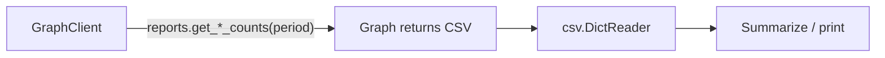

# Microsoft 365 Reports

Usage and adoption reports across the Microsoft 365 workloads — email, mailbox storage, OneDrive,
SharePoint, Teams, Microsoft 365 apps, Office activations, MFA coverage, and Copilot.

Every report comes from the Microsoft Graph **reports API**, which returns **CSV files** the scripts
download, parse, and summarize.

---

## How every script works


```mermaid
flowchart LR
    C[GraphClient] -->|"reports.get_*_counts(period)"| R["Graph returns CSV"]
    R --> P["csv.DictReader"]
    P --> S["Summarize / print"]
```

One call, one CSV. This is the whole pattern — the sections below each wrap it around a specific report:

```python
def _parse_csv(result):
    value = result.value
    text = value.content.decode("utf-8") if hasattr(value, "content") else value.decode("utf-8")
    return list(csv.DictReader(io.StringIO(text)))

data = client.reports.get_email_activity_counts("D30").execute_query()
for row in _parse_csv(data):
    print(f"{row['Report Date'][:10]}  sent={row['Send']}  read={row['Read']}")
```

---

## Email & mailbox

### [Email activity](email_activity.py)

Sent, received, and read counts per day — spot usage trends and plan mail licensing.

```python
data = client.reports.get_email_activity_counts("D30").execute_query()
for row in _parse_csv(data):
    print(f"{row['Report Date'][:10]}  sent={row['Send']}  received={row['Receive']}  read={row['Read']}")
```


### [Mailbox storage](mailbox_storage.py)

Tenant mailbox storage trend, so you can set quotas before users hit their limits.

```python
data = client.reports.get_mailbox_usage_storage("D30").execute_query()
for row in _parse_csv(data):
    gib = int(row["Storage Used (Byte)"]) / 1024**3
    print(f"{row['Report Date'][:10]}  {gib:.1f} GiB")
```


---

## Files: OneDrive & SharePoint

### [OneDrive activity](onedrive_usage.py)

Daily active users, files, synced users, and internal vs external sharing.

```python
data = client.reports.get_onedrive_activity_user_counts("D30").execute_query()
for row in _parse_csv(data):
    print(f"{row['Report Date'][:10]}  active={row['Active Users']}  files={row['Files']}  synced={row['Synced Users']}")
```


### [SharePoint site usage](sharepoint_usage.py)

Storage per site — the basis for SharePoint storage governance and cleanup.

```python
data = client.reports.get_sharepoint_site_usage_site_counts("D90").execute_query()
rows = sorted(_parse_csv(data), key=lambda r: float(r.get("Storage Used (Byte)") or 0), reverse=True)
for row in rows[:15]:
    print(f"{row['Site Url']:55s}  {float(row['Storage Used (Byte)']) / 1024**3:.1f} GiB")
```


---

## Collaboration: Teams

### [Teams user activity](teams_usage.py)

Per-user Teams activity — channel and chat posts, calls, and meetings.

```python
data = client.reports.get_teams_user_activity_user_counts("D7").execute_query()
rows = _parse_csv(data)
posts = sum(int(r.get("Team Chat Message Count") or 0) for r in rows)
print(f"{len(rows)} active users, {posts} channel posts")
```


---

## Apps & adoption

### [Microsoft 365 apps usage](m365_apps_usage.py)

Daily active users per Microsoft 365 app, including Copilot.

```python
data = client.reports.get_m365_app_user_counts("D7").execute_query()
for row in _parse_csv(data):
    print(row)  # one row per app, with active-user counts
```


### [Office activations](activations.py)

Activated Office installs per product, across desktop, mobile, and web.

```python
data = client.reports.get_office365_activation_counts().execute_query()
for row in _parse_csv(data):
    print(f"{row['Product']:20s}  total={row['Total']}  activated={row['Is Activated']}")
```


---

## Security: MFA coverage

### [MFA registration status](get_mfa_status.py)

Who has MFA registered, which methods they use, and the tenant-wide coverage percentage.

```python
result = client.reports.authentication_methods.user_registration_details.get().execute_query()
registered = sum(1 for d in result if d.is_mfa_registered)
print(f"{registered} of {len(result)} users registered ({registered / max(len(result), 1) * 100:.1f}%)")
for details in result:
    print(f"{details.user_principal_name}  mfa={details.is_mfa_registered}  methods={details.properties.get('methods')}")
```


---

## Copilot

### [License adoption](copilot/license_report.py)

Which Copilot SKUs are subscribed, and how many licenses are consumed vs enabled.

```python
skus = client.subscribed_skus.get().execute_query()
for sku in skus:
    if "COPILOT" in (sku.sku_part_number or "").upper():
        enabled = sku.prepaid_units.enabled if sku.prepaid_units else 0
        print(f"{sku.sku_part_number:40s}  consumed={sku.consumed_units} / enabled={enabled}")
```


### [Usage](copilot/usage_report.py)

Copilot activity, surfaced through the Microsoft 365 apps usage report.

```python
data = client.reports.get_m365_app_user_counts("D7").execute_query()
for row in _parse_csv(data):
    print(row)  # Copilot appears alongside the other apps
```


### [Underused licenses](copilot/underused_licenses.py)

Users holding a Copilot license with no recent sign-in — candidates for license reclamation.

```python
# 1. Collect Copilot SKU ids
sku_ids = {str(s.sku_id) for s in client.subscribed_skus.get().execute_query()
           if "COPILOT" in (s.sku_part_number or "").upper()}

# 2. Users with a Copilot license who never signed in
users = client.users.select(["displayName", "userPrincipalName", "assignedLicenses", "signInActivity"]).get().execute_query()
for user in users:
    licenses = {str(l.get("skuId")) for l in (user.properties.get("assignedLicenses") or [])}
    if licenses & sku_ids and not user.properties.get("signInActivity"):
        print(f"{user.user_principal_name}  — Copilot license, no sign-in")
```


---

## Download any report

### [Generic CSV downloader](usage_reports.py)

One script that can fetch any report on this page — pass `--report <name> --period <D7|D30|D90>`.

```python
data = client.reports.get_teams_user_activity_user_counts("D7").execute_query()
rows = _parse_csv(data)
for row in rows[:10]:
    print(dict(row))
```


---

## Official docs

- [Microsoft Graph reports API overview](https://learn.microsoft.com/en-us/graph/api/resources/report)
- [MFA registration details API](https://learn.microsoft.com/en-us/graph/api/authenticationmethods-list-userregistrationdetails)
