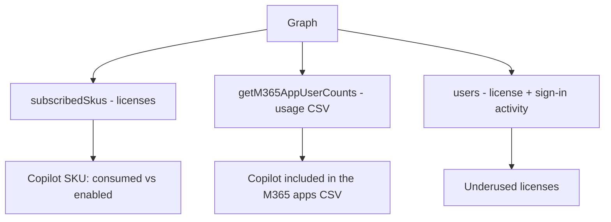

# Microsoft 365 Copilot

Copilot admin reporting: license adoption, usage, and license reclamation.

---

## How Copilot shows up in Graph



---

### [License adoption](license_report.py)

Which Copilot SKUs are subscribed, and how many licenses are consumed vs enabled.

```python
skus = client.subscribed_skus.get().execute_query()
for sku in skus:
    if "COPILOT" in (sku.sku_part_number or "").upper():
        enabled = sku.prepaid_units.enabled if sku.prepaid_units else 0
        print(f"{sku.sku_part_number:40s}  consumed={sku.consumed_units} / enabled={enabled}")
```

---

### [Usage](usage_report.py)

Copilot activity from the Microsoft 365 apps usage report (the CSV includes Copilot alongside the other apps).

```python
data = client.reports.get_m365_app_user_counts("D7").execute_query()
for row in _parse_csv(data):
    print(row)
```

---

### [Underused licenses](underused_licenses.py)

Users holding a Copilot license with no recent sign-in — candidates for license reclamation.

```python
sku_ids = {str(s.sku_id) for s in client.subscribed_skus.get().execute_query()
           if "COPILOT" in (s.sku_part_number or "").upper()}
users = client.users.select(["displayName", "userPrincipalName", "assignedLicenses", "signInActivity"]).get().execute_query()
for user in users:
    licenses = {str(l.get("skuId")) for l in (user.properties.get("assignedLicenses") or [])}
    if licenses & sku_ids and not user.properties.get("signInActivity"):
        print(f"{user.user_principal_name}  — Copilot license, no sign-in")
```

---

Not yet covered by the library: Copilot admin settings and the AI-interaction audit log are exposed by Graph
but have no SDK models yet.
