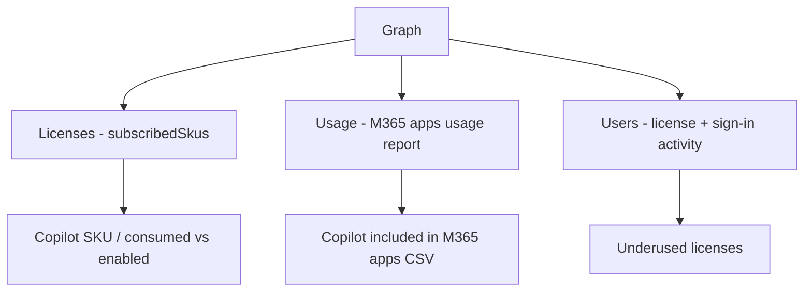

# Microsoft 365 Copilot

Reports for Copilot license adoption and usage via Microsoft Graph.

## How Copilot admin works via Graph



| Area | Graph API | Covered |
|---|---|---|
| License adoption | `subscribedSkus` | ✅ [`license_report.py`](./license_report.py) |
| Usage | `getM365AppUserCounts` / `getM365AppUserDetail` | ✅ [`usage_report.py`](./usage_report.py) |
| Underused licenses | `users` (assignedLicenses + signInActivity) | ✅ [`underused_licenses.py`](./underused_licenses.py) |
| Copilot admin settings | `admin`/`copilot` | ❌ library gap (empty models) |
| AI interaction audit | `aiInteraction` (beta) | ❌ library gap (models unwired) |

## Examples

| Scenario | File | Permission |
|---|---|---|
| Copilot license adoption (SKUs, consumed/enabled) | [`license_report.py`](./license_report.py) | `Organization.Read.All` |
| Copilot usage from the M365 apps report | [`usage_report.py`](./usage_report.py) | `Reports.Read.All` |
| Find users with Copilot licenses but no recent sign-in | [`underused_licenses.py`](./underused_licenses.py) | `Organization.Read.All`, `User.Read.All` |

## Quick start

```python
from office365.graph_client import GraphClient

client = GraphClient(tenant="contoso.onmicrosoft.com").with_client_secret(
    "client_id", "client_secret"
)

skus = client.subscribed_skus.get().execute_query()
for s in skus:
    if "COPILOT" in (s.sku_part_number or "").upper():
        print(f"{s.sku_part_number}  consumed: {s.consumed_units}/{s.prepaid_units.enabled}")
```

## Official docs

- [Subscribed SKU API](https://learn.microsoft.com/en-us/graph/api/resources/subscribedsku)
- [Microsoft 365 usage reports](https://learn.microsoft.com/en-us/graph/api/resources/report)
