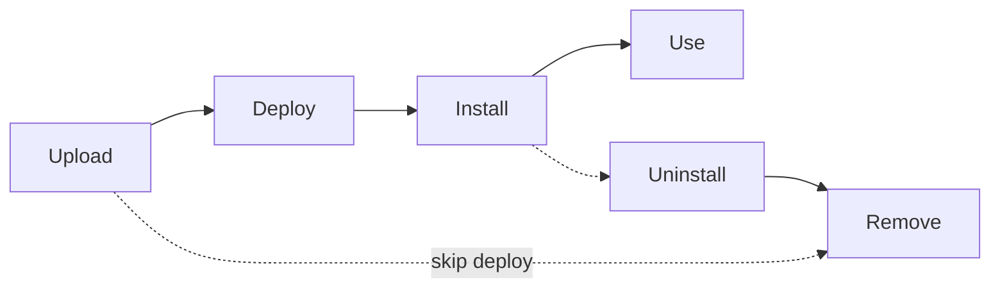

# App Catalog — Application Lifecycle Management (ALM)

Manage SharePoint Framework (SPFx) solutions and SharePoint Add-ins through the
tenant or site collection app catalog.

All operations target the **tenant app catalog** (`admin.web.tenant_app_catalog`).
Install/uninstall also affect a **target site**.

---

## Prerequisites

| Requirement | Description | Reference |
|---|---|---|
| **Tenant App Catalog** | A site collection app catalog must exist in the tenant. | [Use App Catalog](https://learn.microsoft.com/en-us/sharepoint/use-app-catalog) |
| **SharePoint Administrator** or **Site Owner** role (on the target site) | Required to upload, deploy, install, and uninstall apps. | [SharePoint admin role](https://learn.microsoft.com/en-us/sharepoint/sharepoint-admin-role) |
| **.sppkg or .app file** | A packaged SPFx solution or SharePoint Add-in. | |

---

## Lifecycle



---

## Examples

| Step | Operation | File | Required role | API reference |
|---|---|---|---|---|
| **1** | Upload — add `.sppkg` to the app catalog | [`upload_app.py`](./upload_app.py) | Site Owner on app catalog | [Upload](https://learn.microsoft.com/en-us/sharepoint/dev/apis/alm-api-for-spfx-add-ins#upload-app) |
| **2** | List — enumerate apps in the catalog | [`list_apps.py`](./list_apps.py) | Read access | [List](https://learn.microsoft.com/en-us/sharepoint/dev/apis/alm-api-for-spfx-add-ins#list-app) |
| **3** | Inspect — get app metadata and upgrade info | [`inspect_app.py`](./inspect_app.py) | Read access | [Get details](https://learn.microsoft.com/en-us/sharepoint/dev/apis/alm-api-for-spfx-add-ins#get-app-details) |
| **4** | Deploy — enable an app for installation | [`deploy_app.py`](./deploy_app.py) | Site Owner on app catalog | [Deploy](https://learn.microsoft.com/en-us/sharepoint/dev/apis/alm-api-for-spfx-add-ins#deploy-app) |
| **5** | Install — install app on a target site | [`install_app.py`](./install_app.py) | Site Owner on **target** site | [Install](https://learn.microsoft.com/en-us/sharepoint/dev/apis/alm-api-for-spfx-add-ins#install-app) |
| **6** | Upgrade — deploy a newer version and install | [`upgrade_app.py`](./upgrade_app.py) | Both from steps 4-5 | [Upgrade](https://learn.microsoft.com/en-us/sharepoint/dev/apis/alm-api-for-spfx-add-ins#upgrade-app) |
| **7** | Uninstall — remove app from a target site | [`uninstall_app.py`](./uninstall_app.py) | Site Owner on **target** site | [Uninstall](https://learn.microsoft.com/en-us/sharepoint/dev/apis/alm-api-for-spfx-add-ins#uninstall-app) |
| **8** | Remove — delete app from the catalog | [`remove_app.py`](./remove_app.py) | Site Owner on app catalog | [Remove](https://learn.microsoft.com/en-us/sharepoint/dev/apis/alm-api-for-spfx-add-ins#remove-app) |

---

## Quick start

```python
from office365.sharepoint.client_context import ClientContext

ctx = ClientContext("https://contoso.sharepoint.com/sites/appcatalog").with_client_secret(
    "contoso.onmicrosoft.com", "client_id", "client_secret"
)

# List apps in the app catalog
apps = ctx.web.app_catalog.get().execute_query()
for app in apps:
    print(f"  {app.title}  (ID: {app.id})")
```

---

## API reference

- [ALM API for SPFx add-ins](https://learn.microsoft.com/en-us/sharepoint/dev/apis/alm-api-for-spfx-add-ins)
