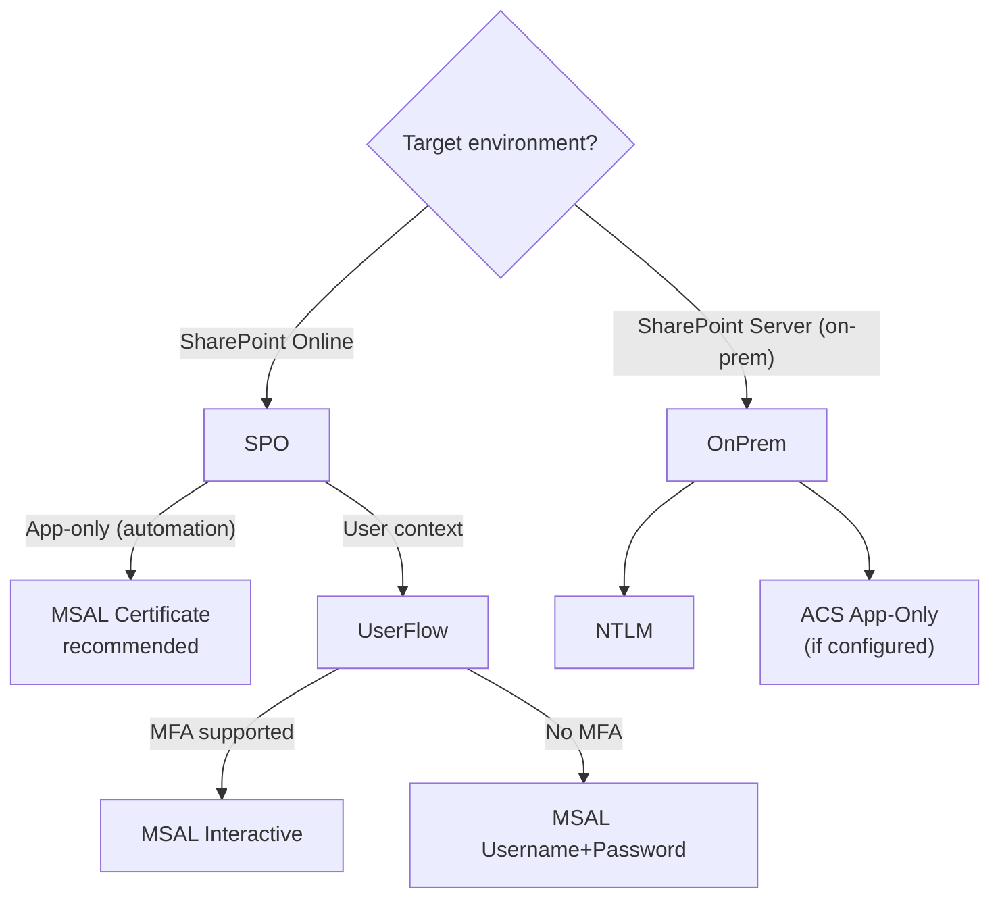

# SharePoint Authentication

`ClientContext` supports multiple authentication flows. Choose based on your
scenario and environment.

---

## Auth decision flow



---

## Modern (Azure AD, recommended for SharePoint Online)

| Flow | Method | File | Notes |
|---|---|---|---|
| **Certificate** | `with_client_certificate(tenant, client_id, thumbprint, cert_path)` | [`modern/with_certificate.py`](./modern/with_certificate.py) | App-only, recommended for automation |
| **Username & password** | `with_username_and_password(tenant, client_id, user, pass)` | [`modern/with_username_and_password.py`](./modern/with_username_and_password.py) | MSAL ROPC flow, **no MFA** |
| **Interactive** | `with_interactive(tenant, client_id)` | [`modern/with_interactive.py`](./modern/with_interactive.py) | User context with MFA support |
| **Device code** | `with_device_flow(tenant, client_id)` | [`modern/with_device_flow.py`](./modern/with_device_flow.py) | Headless / CLI with MFA |
| **Cookies** | `with_cookies(...)` | [`modern/with_cookies.py`](./modern/with_cookies.py) | Reuse browser session |
| **Capture cookies** | Playwright script | [`capture_cookies_with_playwright.py`](./capture_cookies_with_playwright.py) | Automated cookie capture |
| **Load cookies** | Playwright storage state | [`load_cookies_from_playwright.py`](./load_cookies_from_playwright.py) | Import ``storage_state.json`` from Playwright |

## Legacy, retired for SharePoint Online (on-prem only)

> **Important:** These flows have been **retired** for SharePoint Online.
> They remain available for **SharePoint Server (on-prem)** environments.
>
> - **ACS App-Only**, [Retired April 2, 2026](https://learn.microsoft.com/en-us/sharepoint/dev/sp-add-ins/add-ins-and-azure-acs-retirements-faq)
> - **SAML / WS-Trust (SharePointOnlineCredentials)**, [Deprecated for SPO](https://learn.microsoft.com/en-us/answers/questions/5629577/basic-authentication-for-sharepoint-online-is-depr)

| Flow | File | Status | Scope |
|---|---|---|---|
| **ACS app-only** | [`legacy/with_app_only.py`](./legacy/with_app_only.py) | 🚫 Retired Apr 2026 | On-prem only |
| **SAML user auth** | [`legacy/with_user_credential.py`](./legacy/with_user_credential.py) | 🚫 Retired May 2026 | On-prem only |
| **NTLM** | [`legacy/with_ntlm.py`](./legacy/with_ntlm.py) | ✅ Current | On-prem only |

---

## Quick start

```python
from office365.sharepoint.client_context import ClientContext

# — App-only automation (recommended) —
ctx = ClientContext("https://contoso.sharepoint.com/sites/team").with_client_certificate(
    tenant="contoso.onmicrosoft.com",
    client_id="your_client_id",
    thumbprint="your_thumbprint",
    cert_path="./cert.pem",
)

# — Interactive (user + MFA) —
ctx = ClientContext("https://contoso.sharepoint.com/sites/team").with_interactive(
    tenant="contoso.onmicrosoft.com",
    client_id="your_client_id",
)
```

---

## Official docs

- [SharePoint REST API](https://learn.microsoft.com/en-us/sharepoint/dev/apis/rest-api)
- [Security app-only Azure AD](https://learn.microsoft.com/en-us/sharepoint/dev/solution-guidance/security-apponly-azuread)
- [ACS retirement FAQ](https://learn.microsoft.com/en-us/sharepoint/dev/sp-add-ins/add-ins-and-azure-acs-retirements-faq)
- [Basic authentication deprecation](https://learn.microsoft.com/en-us/answers/questions/5629577/basic-authentication-for-sharepoint-online-is-depr)
