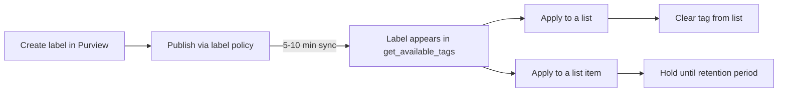

# SharePoint Compliance Tags (CSOM)

Examples for managing **compliance tags** (retention labels) on SharePoint
lists, libraries, and items via the SharePoint CSOM API.

---

## How compliance tags work

Compliance tags in SharePoint CSOM (`get_available_tags()`) are **retention
labels** created in Microsoft Purview. They are not created inside SharePoint —
they are **published** there.



| Step | What happens | Where |
|---|---|---|
| **Create** | Define the label and its retention action (e.g. delete after 3 years, block edit) | Purview portal or Graph API |
| **Publish** | A **label policy** makes the label available for manual application | Purview → Label policies |
| **Sync** | The label becomes visible in SharePoint's `get_available_tags()` | Automatic, 5-10 min |
| **Apply** | Set the tag on a list/library or a specific item | CSOM / this SDK |
| **Remove** | Clear the tag from a list/library | CSOM / this SDK |

### Label policy vs Retention policy

| Type | What it does | Needed here? |
|---|---|---|
| **Label policy** | Publishes existing labels to locations so they can be **manually applied** to items | ✅ Yes — makes labels appear in `get_available_tags()` |
| **Retention policy** | Applies retention rules **automatically** to all content (no label visible) | ❌ No |

---

## Prerequisites

| Permission | Description |
|---|---|
| `Sites.Read.All` | Read lists and compliance tags |
| `Sites.ReadWrite.All` | Apply compliance tags |
| `Sites.FullControl.All` | Apply tags with hold, clear tags |

---

## Setup — publishing a retention label to SharePoint

### Step 1: Create the label

Create the label either via the Graph API:

```bash
uv run examples/purview/records/retention_label.py
```

Or in the Purview portal: **Solutions → Data Lifecycle Management →
Retention labels → Create a label**.

### Step 2: Publish via a label policy

1. Go to [purview.microsoft.com](https://purview.microsoft.com)
2. Navigate to **Solutions → Data Lifecycle Management → Label policies**
3. Click **Create a label policy** → choose **"Publish labels"**
4. **Select the labels** you want to make available in SharePoint
5. **Policy scope**: **Full directory** (or a specific admin unit)
6. **Locations**: Set **SharePoint sites** to **All sites** (or specific sites)
7. **Name your policy** (e.g. "Publish all labels — test") and complete the wizard

### Step 3: Wait for sync

The policy takes **5-10 minutes** to sync. Afterwards the labels appear in
SharePoint's `get_available_tags()`.

### Step 4: Verify

```bash
uv run examples/sharepoint/compliance/retention_labels.py
```

If your labels appear in the output, they are ready to be applied.

---

## Applied / Removed

| Scope | Apply | Remove |
|---|---|---|
| **List / library** | `list.set_compliance_tag(tag_name)` | `list.set_compliance_tag("")` |
| **List item** | `item.set_compliance_tag_with_hold(tag_name)` — places the item under retention hold | Item tags are released when the retention period expires; clear at the list/library level |

Notes:

- Clearing is done by setting an **empty tag value** at the list/library level.
- Item-level tags applied **with hold** keep the item from being permanently deleted
  until the retention period ends — the hold cannot be removed early.
- Use `retention_labels.py` to confirm a tag exists before applying it.

---

## Examples

| Scenario | File | Permission |
|---|---|---|
| List available tags and inspect their settings | [`retention_labels.py`](./retention_labels.py) | `Sites.Read.All` |
| Apply a compliance tag to a list/library | [`add_tag.py`](./add_tag.py) | `Sites.ReadWrite.All` |
| Apply a compliance tag (with hold) to a list item | [`item_tag.py`](./item_tag.py) | `Sites.ReadWrite.All` |
| Report compliance tags across all lists | [`tag_report.py`](./tag_report.py) | `Sites.Read.All` |
| Clear the compliance tag from a list | [`remove_tag.py`](./remove_tag.py) | `Sites.FullControl.All` |

### Usage

```bash
# List available tags
uv run examples/sharepoint/compliance/retention_labels.py

# Apply a tag to the "Documents" library
uv run examples/sharepoint/compliance/add_tag.py --tag "Financial Records" --list-title Documents

# Apply a tag to a specific item
uv run examples/sharepoint/compliance/item_tag.py --tag "Financial Records" --item-id 42

# Report which lists have which tags
uv run examples/sharepoint/compliance/tag_report.py

# Clear a tag from a list
uv run examples/sharepoint/compliance/remove_tag.py --list-title Documents
```

---

## Official docs

- [SharePoint compliance tag REST API](https://learn.microsoft.com/en-us/sharepoint/dev/apis/rest-api/compliance/compliance-tag-rest-api)
- [Create retention labels via Graph API](../../purview/records/)
