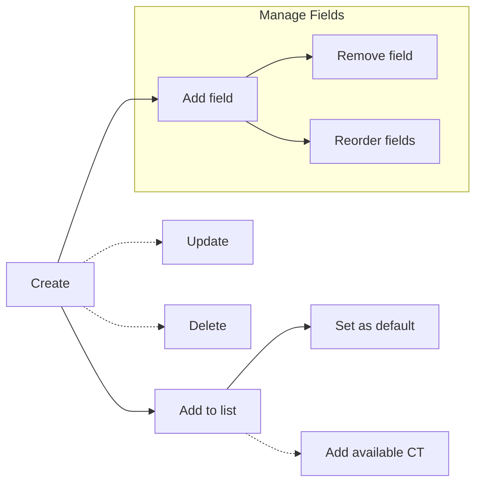

# Content Types

Manage content types on a SharePoint site — create, update, delete, add and
remove fields, reorder fields, and associate with lists.

---

## Prerequisites

| Requirement | Description | Reference |
|---|---|---|
| **Site Owner** or **Site Collection Administrator** role | Required to create, update, and delete content types at the site level. | [SharePoint admin roles](https://learn.microsoft.com/en-us/sharepoint/sharepoint-admin-role) |
| **Site Columns** (fields) must exist on the site | Needed when adding fields to a content type. | [Field examples](../fields/README.md) |

---

## How content types work

```mermaid
graph TD
    subgraph Site
        CT[Content Type]
        CT --> FL[Field Links<br/>(ordered display)]
        FL --> F1[Field: Title]
        FL --> F2[Field: Editor]
        FL --> F3[Field: CustomColumn]
    end

    subgraph List
        L[Document Library]
        L -->|has| CTs[Content Types]
        CTs --> D[Default CT]
        CTs --> O[Other CTs]
    end

    CT -.->|add to| L
```

A **content type** lives at the site level and defines a reusable
set of columns (fields) with their display order (field links).
It can then be associated with one or more lists.

---

## Lifecycle



---

## Examples

| Step | Operation | File | Required role | API reference |
|---|---|---|---|---|
| **1** | List — enumerate all content types on a site | [`list_all.py`](./list_all.py) | Read access | [Content type collection](https://learn.microsoft.com/en-us/sharepoint/dev/apis/rest-api/csom/contenttype) |
| **2** | Create — add a new content type to a site | [`create.py`](./create.py) | Site Owner | [Create](https://learn.microsoft.com/en-us/sharepoint/dev/apis/rest-api/csom/contenttype) |
| **3** | Create from parent — inherit from an existing content type | [`create_from_parent.py`](./create_from_parent.py) | Site Owner | [Create with parent](https://learn.microsoft.com/en-us/sharepoint/dev/apis/rest-api/csom/contenttype) |
| **4** | Get by name — retrieve a content type by name | [`get_by_name.py`](./get_by_name.py) | Read access | [Get by name](https://learn.microsoft.com/en-us/sharepoint/dev/apis/rest-api/csom/contenttype) |
| **5** | Get by ID — retrieve a content type by its identifier | [`get_by_id.py`](./get_by_id.py) | Read access | [Get by ID](https://learn.microsoft.com/en-us/sharepoint/dev/apis/rest-api/csom/contenttype) |
| **6** | Update — change description, group, or other properties | [`update.py`](./update.py) | Site Owner | [Update](https://learn.microsoft.com/en-us/sharepoint/dev/apis/rest-api/csom/contenttype) |
| **7** | Add field — add a site column to a content type | [`add_field.py`](./add_field.py) | Site Owner | [Add field link](https://learn.microsoft.com/en-us/sharepoint/dev/apis/rest-api/csom/contenttype) |
| **8** | Remove field — remove a field from a content type | [`remove_field.py`](./remove_field.py) | Site Owner | [Remove field link](https://learn.microsoft.com/en-us/sharepoint/dev/apis/rest-api/csom/contenttype) |
| **9** | Reorder fields — change field display order | [`reorder_fields.py`](./reorder_fields.py) | Site Owner | [Reorder fields](https://learn.microsoft.com/en-us/sharepoint/dev/apis/rest-api/csom/contenttype) |
| **10** | Add to list — associate a content type with a list | [`add_to_list.py`](./add_to_list.py) | Site Owner on target list | [Add to list](https://learn.microsoft.com/en-us/sharepoint/dev/apis/rest-api/csom/contenttype) |
| **11** | Add available — add an existing site content type to a list | [`add_available_to_list.py`](./add_available_to_list.py) | Site Owner on target list | [Add available CT](https://learn.microsoft.com/en-us/sharepoint/dev/apis/rest-api/csom/contenttype) |
| **12** | Set default — make a content type the default for a list | [`set_default.py`](./set_default.py) | Site Owner on target list | [Set default](https://learn.microsoft.com/en-us/sharepoint/dev/apis/rest-api/csom/contenttype) |
| **13** | Delete — remove a content type from a site | [`delete.py`](./delete.py) | Site Owner | [Delete](https://learn.microsoft.com/en-us/sharepoint/dev/apis/rest-api/csom/contenttype) |

---

## Quick start

```python
from office365.sharepoint.client_context import ClientContext

ctx = ClientContext("https://contoso.sharepoint.com/sites/team").with_client_secret(
    "contoso.onmicrosoft.com", "client_id", "client_secret"
)
```

---

## API reference

- [Content type REST API](https://learn.microsoft.com/en-us/sharepoint/dev/apis/rest-api/csom/contenttype)