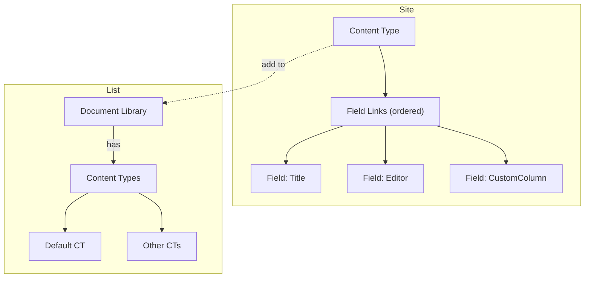

# Content Types

Manage content types on a SharePoint site — create, update, delete, add and
remove fields, reorder fields, and associate with lists.

---

## Prerequisites

| Requirement | Description | Reference |
|---|---|---|
| **Site Owner** or **Site Collection Administrator** role | Required to create, update, and delete content types at the site level. | [SharePoint admin roles](https://learn.microsoft.com/en-us/sharepoint/sharepoint-admin-role) |
| **Site Columns** (fields) must exist on the site | Needed when adding fields to a content type. | [Field examples](../fields/README.md) |

---

## How content types work


```mermaid
graph TD
    subgraph Site
        CT["Content Type"]
        CT --> FL["Field Links (ordered)"]
        FL --> F1["Field: Title"]
        FL --> F2["Field: Editor"]
        FL --> F3["Field: CustomColumn"]
    end

    subgraph List
        L["Document Library"]
        L -->|has| CTs["Content Types"]
        CTs --> D["Default CT"]
        CTs --> O["Other CTs"]
    end

    CT -.->|add to| L
```

A **content type** lives at the site level and defines a reusable
set of columns (fields) with their display order (field links).
It can then be associated with one or more lists.

---

## Examples

### Workflow

| Operation | File | Required role | API reference |
|---|---|---|---|
| End-to-end: create → add field → add to list → verify | [`basic_usage.py`](./basic_usage.py) | Site Owner | [Full workflow](https://learn.microsoft.com/en-us/sharepoint/dev/apis/rest-api/csom/contenttype) |

### Site-level content types

| Operation | File | Required role | API reference |
|---|---|---|---|
| List content types (site or list scope) | [`list_all.py`](./list_all.py) | Read access | [Content type collection](https://learn.microsoft.com/en-us/sharepoint/dev/apis/rest-api/csom/contenttype) |
| Get a content type by name or id | [`get.py`](./get.py) | Read access | [Get content type](https://learn.microsoft.com/en-us/sharepoint/dev/apis/rest-api/csom/contenttype) |
| Inspect a content type / export schema | [`inspect_ct.py`](./inspect_ct.py) | Read access | [Get content type](https://learn.microsoft.com/en-us/sharepoint/dev/apis/rest-api/csom/contenttype) |
| Create a content type | [`create.py`](./create.py) | Site Owner | [Create](https://learn.microsoft.com/en-us/sharepoint/dev/apis/rest-api/csom/contenttype) |
| Create a content type from a parent | [`create_from_parent.py`](./create_from_parent.py) | Site Owner | [Create with parent](https://learn.microsoft.com/en-us/sharepoint/dev/apis/rest-api/csom/contenttype) |
| Update a content type (description, group) | [`update.py`](./update.py) | Site Owner | [Update](https://learn.microsoft.com/en-us/sharepoint/dev/apis/rest-api/csom/contenttype) |
| Add a site column to a content type | [`add_field.py`](./add_field.py) | Site Owner | [Add field link](https://learn.microsoft.com/en-us/sharepoint/dev/apis/rest-api/csom/contenttype) |
| Remove a field from a content type | [`remove_field.py`](./remove_field.py) | Site Owner | [Remove field link](https://learn.microsoft.com/en-us/sharepoint/dev/apis/rest-api/csom/contenttype) |
| Reorder fields in a content type | [`reorder_fields.py`](./reorder_fields.py) | Site Owner | [Reorder fields](https://learn.microsoft.com/en-us/sharepoint/dev/apis/rest-api/csom/contenttype) |
| Delete a content type | [`delete.py`](./delete.py) | Site Owner | [Delete](https://learn.microsoft.com/en-us/sharepoint/dev/apis/rest-api/csom/contenttype) |

### List association

| Operation | File | Required role | API reference |
|---|---|---|---|
| Create a content type and add it to a list | [`add_to_list.py`](./add_to_list.py) | Site Owner on target list | [Add to list](https://learn.microsoft.com/en-us/sharepoint/dev/apis/rest-api/csom/contenttype) |
| Add an existing site content type to a list | [`add_available_to_list.py`](./add_available_to_list.py) | Site Owner on target list | [Add available CT](https://learn.microsoft.com/en-us/sharepoint/dev/apis/rest-api/csom/contenttype) |
| Set the default content type for a list | [`set_default.py`](./set_default.py) | Site Owner on target list | [Set default](https://learn.microsoft.com/en-us/sharepoint/dev/apis/rest-api/csom/contenttype) |
| Find which lists use a content type | [`find_usage.py`](./find_usage.py) | Read access | [Usage check](https://learn.microsoft.com/en-us/sharepoint/dev/apis/rest-api/csom/contenttype) |

### Migration

| Operation | File | Required role | API reference |
|---|---|---|---|
| Clone a content type (with fields) to another site | [`copy_to_site.py`](./copy_to_site.py) | Site Owner on both sites | [Provisioning](https://learn.microsoft.com/en-us/sharepoint/dev/apis/rest-api/csom/contenttype) |

---

## Quick start

```python
from office365.sharepoint.client_context import ClientContext
from office365.sharepoint.contenttypes.creation_information import ContentTypeCreationInformation

ctx = ClientContext("https://contoso.sharepoint.com/sites/team").with_client_secret(
    "contoso.onmicrosoft.com", "client_id", "client_secret"
)

# List all content types
cts = ctx.web.content_types.get().execute_query()
for ct in cts:
    print(f"  {ct.name}  (ID: {ct.id})")

# Create a new content type
info = ContentTypeCreationInformation(Name="Project Document", Description="For Contoso projects")
ct = ctx.web.content_types.add(info).execute_query()
print(f"Created: {ct.name}")
```

---

## API reference

- [Content type REST API](https://learn.microsoft.com/en-us/sharepoint/dev/apis/rest-api/csom/contenttype)
