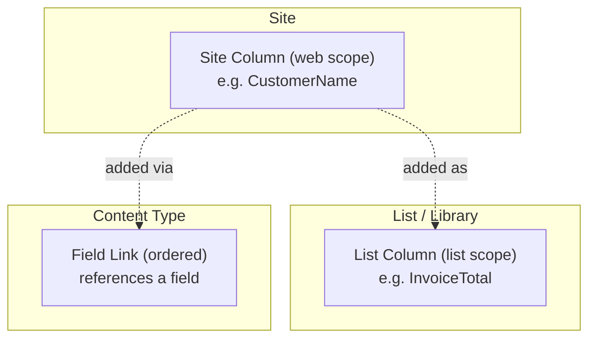

# Fields (Site Columns)

Create, read, update, delete, and copy fields (columns) in SharePoint.
Fields define the data types used across lists, libraries, and content types.

---

## Prerequisites

| Requirement | Description | Reference |
|---|---|---|
| **Site Owner** role | Required to create, update, and delete site columns. | [SharePoint admin roles](https://learn.microsoft.com/en-us/sharepoint/sharepoint-admin-role) |

---

## How fields work



A **site column** (web scope) is defined once and can be reused across
lists, libraries, and content types across the site. A **list column**
is scoped to a single list. When a site column is added to a content type,
it appears as a **field link** that defines the display order.

---

## Examples

| Step | Operation | File | Required role | API reference |
|---|---|---|---|---|
| **1** | List web — get all site columns (web scope) | [`get_fields_from_web.py`](./get_fields_from_web.py) | Read access | [Fields](https://learn.microsoft.com/en-us/sharepoint/dev/apis/rest-api) |
| **2** | List list — get all columns on a specific list | [`get_fields_from_list.py`](./get_fields_from_list.py) | Read access | [Fields](https://learn.microsoft.com/en-us/sharepoint/dev/apis/rest-api) |
| **3** | Create text — single line of text | [`create_text_field.py`](./create_text_field.py) | Site Owner | [Add field](https://learn.microsoft.com/en-us/sharepoint/dev/apis/rest-api) |
| **4** | Create number — numeric value | [`create_number_field.py`](./create_number_field.py) | Site Owner | [Add field](https://learn.microsoft.com/en-us/sharepoint/dev/apis/rest-api) |
| **5** | Create date — date/time column | [`create_date.py`](./create_date.py) | Site Owner | [Add field](https://learn.microsoft.com/en-us/sharepoint/dev/apis/rest-api) |
| **6** | Create choice — single or multi-value dropdown | [`create_choice.py`](./create_choice.py) | Site Owner | [Add field](https://learn.microsoft.com/en-us/sharepoint/dev/apis/rest-api) |
| **7** | Create lookup — reference another list | [`create_lookup.py`](./create_lookup.py) | Site Owner | [Add lookup](https://learn.microsoft.com/en-us/sharepoint/dev/apis/rest-api) |
| **8** | Create user — person/group picker | [`create_user_field.py`](./create_user_field.py) | Site Owner | [Add user field](https://learn.microsoft.com/en-us/sharepoint/dev/apis/rest-api) |
| **9** | Create calculated — formula-based value | [`create_calculated.py`](./create_calculated.py) | Site Owner | [Add calculated](https://learn.microsoft.com/en-us/sharepoint/dev/apis/rest-api) |
| **10** | Create taxonomy — managed metadata term set | [`create_taxonomy.py`](./create_taxonomy.py) | Site Owner | [Add taxonomy](https://learn.microsoft.com/en-us/sharepoint/dev/apis/rest-api) |
| **11** | Update — change title, required, or other properties | [`update_field.py`](./update_field.py) | Site Owner | [Update](https://learn.microsoft.com/en-us/sharepoint/dev/apis/rest-api) |
| **12** | Delete — remove a field from a list | [`delete_field.py`](./delete_field.py) | Site Owner | [Delete](https://learn.microsoft.com/en-us/sharepoint/dev/apis/rest-api) |
| **13** | Copy — duplicate a field between sites via schema XML | [`copy_field.py`](./copy_field.py) | Site Owner | [Copy](https://learn.microsoft.com/en-us/sharepoint/dev/apis/rest-api) |

---

## Quick start

```python
from office365.sharepoint.client_context import ClientContext

ctx = ClientContext("https://contoso.sharepoint.com/sites/team").with_client_secret(
    "contoso.onmicrosoft.com", "client_id", "client_secret"
)

# List all site columns (web scope)
fields = ctx.web.fields.get().execute_query()
for f in fields:
    print(f"  {f.title}  (Type: {f.properties.get('TypeDisplayName', '')})")

# Create a text field
field = ctx.web.fields.add_text_field("CustomerName").execute_query()
print(f"Created: {field.title}")
```

---

## API reference

- [SharePoint REST API — fields](https://learn.microsoft.com/en-us/sharepoint/dev/apis/rest-api)
