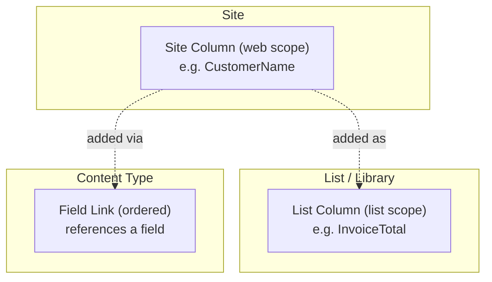

# Fields (Site Columns)

Create, read, update, delete, copy, and export fields (columns) in SharePoint.
Fields define the data types used across lists, libraries, and content types.

---

## Prerequisites

| Requirement | Description | Reference |
|---|---|---|
| **Site Owner** role | Required to create, update, and delete site columns. | [SharePoint admin roles](https://learn.microsoft.com/en-us/sharepoint/sharepoint-admin-role) |

---

## How fields work


```mermaid
graph TD
    subgraph Site
        SF["Site Column (web scope)\ne.g. CustomerName"]
    end

    subgraph "List / Library"
        LF["List Column (list scope)\ne.g. InvoiceTotal"]
        SF -.->|added as| LF
    end

    subgraph "Content Type"
        FL["Field Link (ordered)\nreferences a field"]
        SF -.->|added via| FL
    end
```

A **site column** (web scope) is defined once and can be reused across
lists, libraries, and content types. A **list column** is scoped to a
single list. When a site column is added to a content type, it appears
as a **field link** that defines the display order.

---

## Examples

| Operation | File | Required role | API reference |
|---|---|---|---|
| Field inventory: site columns and list columns | [`inventory.py`](./inventory.py) | Read access | [Fields API](https://learn.microsoft.com/en-us/sharepoint/dev/apis/rest-api) |
| Get field details including schema XML | [`get_field.py`](./get_field.py) | Read access | [Fields API](https://learn.microsoft.com/en-us/sharepoint/dev/apis/rest-api) |
| Provision multiple typed fields from a schema spec | [`provision_fields.py`](./provision_fields.py) | Site Owner | [Add field](https://learn.microsoft.com/en-us/sharepoint/dev/apis/rest-api) |
| Create a lookup field with a dependent lookup | [`lookup_field.py`](./lookup_field.py) | Site Owner | [Add lookup](https://learn.microsoft.com/en-us/sharepoint/dev/apis/rest-api) |
| Create a taxonomy (managed metadata) field | [`taxonomy_field.py`](./taxonomy_field.py) | Site Owner | [Add taxonomy](https://learn.microsoft.com/en-us/sharepoint/dev/apis/rest-api) |
| Update field settings, forms, and indexing | [`update_field.py`](./update_field.py) | Site Owner | [Update](https://learn.microsoft.com/en-us/sharepoint/dev/apis/rest-api) |
| Add a site column to a content type | [`content_type_fields.py`](./content_type_fields.py) | Site Owner | [Content type fields](https://learn.microsoft.com/en-us/sharepoint/dev/apis/rest-api) |
| Copy a field between sites via schema XML | [`copy_field.py`](./copy_field.py) | Site Owner | [Copy](https://learn.microsoft.com/en-us/sharepoint/dev/apis/rest-api) |
| Export field definitions to CSV or JSON | [`export_field_schema.py`](./export_field_schema.py) | Read access | [Fields API](https://learn.microsoft.com/en-us/sharepoint/dev/apis/rest-api) |
| Delete a field from a list | [`delete_field.py`](./delete_field.py) | Site Owner | [Delete](https://learn.microsoft.com/en-us/sharepoint/dev/apis/rest-api) |

---

## Quick start

```python
from office365.sharepoint.client_context import ClientContext

ctx = ClientContext("https://contoso.sharepoint.com/sites/team").with_client_secret(
    "contoso.onmicrosoft.com", "client_id", "client_secret"
)

# List all site columns (web scope)
fields = ctx.web.fields.get().execute_query()
for f in fields:
    print(f"  {f.title}  (Type: {f.properties.get('TypeDisplayName', '')})")

# Create a text field
field = ctx.web.fields.add_text_field("CustomerName").execute_query()
print(f"Created: {field.title}")
```

---

## API reference

- [SharePoint REST API](https://learn.microsoft.com/en-us/sharepoint/dev/apis/rest-api)
