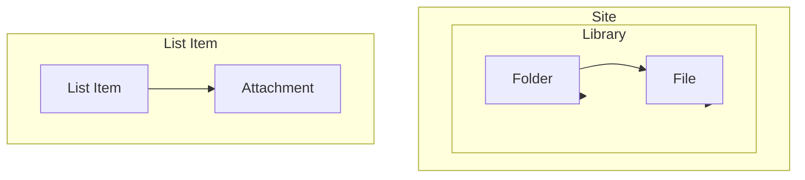

# Working with Files

Upload, download, copy, move, delete, share, and manage files in SharePoint
document libraries.

---

## Prerequisites

| Requirement | Description | Reference |
|---|---|---|
| **Site Owner** or **Member** role on the library | Required to upload, update, and delete files. Read access for download. | [SharePoint permissions](https://learn.microsoft.com/en-us/sharepoint/sharepoint-admin-role) |

---

## How files are stored



Files live inside **document libraries**. They can be organized in **folders**.
Separately, **list items** can have **attachments** — see
[`listitems/attachments/`](../listitems/attachments/) for attachment
operations.

---

## Getting started

```python
from office365.sharepoint.client_context import ClientContext

ctx = ClientContext("https://contoso.sharepoint.com/sites/team").with_client_secret(
    "contoso.onmicrosoft.com", "client_id", "client_secret"
)

# Upload a small file
with open("./report.docx", "rb") as f:
    uploaded = ctx.web.default_document_library().root_folder.upload_file("report.docx", f.read()).execute_query()
print(f"Uploaded: {uploaded.serverRelativeUrl}")

# Download it back
downloaded = uploaded.get_content().execute_query()
print(f"Downloaded: {len(downloaded.content)} bytes")
```

---

## Upload

| What | File | Notes |
|------|------|-------|
| **Upload small file** | [`upload.py`](./upload.py) | Upload file < 4 MB |
| **Upload large file** | [`upload_large.py`](./upload_large.py) | Chunked upload session for large files |
| **Upload with checksum** | [`upload_with_checksum.py`](./upload_with_checksum.py) | Upload with MD5 verification |
| **Upload CSV** | [`upload_csv.py`](./upload_csv.py) | Upload a CSV data file |
| **Upload JSON** | [`upload_json.py`](./upload_json.py) | Upload a JSON data file |
| **Replace content** | [`replace.py`](./replace.py) | Replace file content via binary stream |

## Download

| What | File | Notes |
|------|------|-------|
| **Download file** | [`download.py`](./download.py) | Simple file download |
| **Download large file** | [`download_large.py`](./download_large.py) | Streaming download with progress |
| **Download from URL** | [`download_from_url.py`](./download_from_url.py) | Download using absolute URL |
| **Download all from library** | [`download_from_lib.py`](./download_from_lib.py) | Batch download all files in a library |
| **Download by sharing link** | [`download_by_shared_link.py`](./download_by_shared_link.py) | Download via guest/anonymous link |
| **Download recent** | [`download_recent.py`](./download_recent.py) | Download most recently uploaded file |
| **Download versions** | [`download_versions.py`](./download_versions.py) | Download specific file versions |
| **Get content** | [`get_content.py`](./get_content.py) | Download as bytes in memory |

## Copy & Move

| What | File | Notes |
|------|------|-------|
| **Copy file** | [`copy_file.py`](./copy_file.py) | Copy to another folder |
| **Copy with new name** | [`copy_file_with_name.py`](./copy_file_with_name.py) | Copy and rename |
| **Copy by path** | [`copy_using_path.py`](./copy_using_path.py) | Copy using server-relative paths |
| **Move file** | [`move_file.py`](./move_file.py) | Move to another folder |

## Delete

| What | File | Notes |
|------|------|-------|
| **Delete / recycle** | [`delete.py`](./delete.py) | Permanent delete or recycle |

## Metadata & Browse

| What | File | Notes |
|------|------|-------|
| **Get properties** | [`get_props.py`](./get_props.py) | Name, size, URL, timestamps |
| **Get extended properties** | [`get_extended_props.py`](./get_extended_props.py) | List item all fields |
| **Get system metadata** | [`get_system_metadata.py`](./get_system_metadata.py) | Author, modified by, created |
| **Check existence** | [`exists.py`](./exists.py) | Check if a file exists |
| **List all items** | [`get_all_items.py`](./get_all_items.py) | Enumerate files and folders in a library |
| **Get recent files** | [`get_recent_files.py`](./get_recent_files.py) | Recently modified files |
| **Get download link** | [`get_download_link.py`](./get_download_link.py) | Pre-authorized download URL |

## Check Out & Approvals

| What | File | Notes |
|------|------|-------|
| **Check out / check in** | [`checkout_checkin.py`](./checkout_checkin.py) | Lock, edit, and release a file |
| **Get checked-out files** | [`get_checked_out.py`](./get_checked_out.py) | List all checked-out files in a library |
| **Get checkout type** | [`get_checkout_type.py`](./get_checkout_type.py) | Check if a file is checked out and by whom |
| **Publish / unpublish** | [`publish_unpublish.py`](./publish_unpublish.py) | Submit for content approval |
| **Approve / deny** | [`approve_deny.py`](./approve_deny.py) | Approve or reject a submitted file |

## Sharing

> Sharing operations for files are in the [`sharing/`](../sharing/) directory.

| What | File | Notes |
|------|------|-------|
| **Get by sharing link** | [`get_by_sharing_link.py`](./get_by_sharing_link.py) | Resolve file from a sharing link |
| **Download by sharing link** | [`download_by_shared_link.py`](./download_by_shared_link.py) | Download via guest/anonymous link |

## Create Documents

| What | File | Notes |
|------|------|-------|
| **Create Excel** | [`create_excel.py`](./create_excel.py) | Create an Excel workbook |
| **Create Word** | [`create_word.py`](./create_word.py) | Create a Word document |
| **Create wiki page** | [`create_wiki.py`](./create_wiki.py) | Create a wiki page |
| **Rename** | [`rename_page.py`](./rename_page.py) | Rename a file |

## Permissions

| What | File | Notes |
|------|------|-------|
| **Get permissions** | [`permissions/get.py`](./permissions/get.py) | Effective permissions for a file |
| **List permissions** | [`permissions/list.py`](./permissions/list.py) | User effective permissions |
| **Check permission** | [`permissions/check.py`](./permissions/check.py) | Does user have specific access? |
| **Assign permission** | [`permissions/assign.py`](./permissions/assign.py) | Grant permissions via role assignment |

## Versions

| What | File | Notes |
|------|------|-------|
| **List versions** | [`versions/list.py`](./versions/list.py) | All versions of a file |
| **Get by label** | [`versions/get_by_label.py`](./versions/get_by_label.py) | Get a specific version |
| **Restore version** | [`versions/restore_version.py`](./versions/restore_version.py) | Restore a previous version |

## Attachments

| What | File | Notes |
|------|------|-------|
| **Upload attachment** | [`../listitems/attachments/upload.py`](../listitems/attachments/upload.py) | Attach a file to a list item |
| **Download attachment** | [`../listitems/attachments/download.py`](../listitems/attachments/download.py) | Download from a list item |
| **List attachments** | [`../listitems/attachments/list.py`](../listitems/attachments/list.py) | Enumerate attachments on an item |
| **Delete attachment** | [`../listitems/attachments/delete.py`](../listitems/attachments/delete.py) | Remove an attachment |

> **Note:** Attachments are files attached to **list items**, not documents in a library.
> See [`listitems/attachments/`](../listitems/attachments/) for all attachment operations.

---

## API reference

- [SharePoint files REST API](https://learn.microsoft.com/en-us/sharepoint/dev/apis/rest-api)
- [Working with files and folders REST](https://learn.microsoft.com/en-us/sharepoint/dev/sp-add-ins/working-with-folders-and-files-with-rest)
