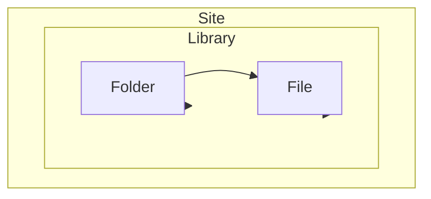

# Working with Files

Upload, download, copy, move, delete, share, and manage files in SharePoint
document libraries — the everyday operations for building on top of documents.

Files live inside **document libraries**, organized in **folders**. Separately,
**list items** can have **attachments** — see
[`listitems/attachments/`](../listitems/attachments/) for those.


```mermaid
graph TD
    subgraph Site
        Library["Document Library e.g. Shared Documents"]
    end

    subgraph Library
        Folder["Folder"]
        File["File"]
        Folder --> File
    end

    Library --> Folder
    Library --> File
```

---

## Authentication

SharePoint's `/_api` app-only flow does **not** accept a client secret — use a
delegated sign-in (username & password, no MFA) or a client certificate for
app-only automation. The examples here use username & password:

```python
from office365.sharepoint.client_context import ClientContext

ctx = ClientContext("https://contoso.sharepoint.com/sites/team").with_username_and_password(
    tenant="contoso.onmicrosoft.com", client_id="client_id", username="user@contoso.com", password="password"
)
```

> **`with_client_secret(...)` is a common mistake for SharePoint.** It works
> for **Microsoft Graph**, but not for `ClientContext` — use
> `with_username_and_password` (below) or `with_client_certificate(...)`
> (app-only). See [`auth/`](../auth/) for the full matrix.

## Quick start

Upload a small file, then download it back:

```python
# Upload a file (< 4 MB)
with open("./report.docx", "rb") as f:
    uploaded = ctx.web.default_document_library().root_folder.upload_file("report.docx", f.read()).execute_query()
print(f"Uploaded: {uploaded.server_relative_url}")

# Download it back
downloaded = uploaded.get_content().execute_query()
print(f"Downloaded: {len(downloaded.content)} bytes")
```

---

## Upload

| What | File | Notes |
|------|------|-------|
| Upload a small file | [`upload.py`](./upload.py) | File < 4 MB |
| Upload a large file | [`upload_large.py`](./upload_large.py) | Chunked upload session |
| Upload with checksum | [`upload_with_checksum.py`](./upload_with_checksum.py) | MD5 verification |
| Upload CSV data | [`upload_csv.py`](./upload_csv.py) | Data files |
| Upload JSON data | [`upload_json.py`](./upload_json.py) | Data files |
| Replace content | [`replace.py`](./replace.py) | Overwrite via binary stream |

## Download

| What | File | Notes |
|------|------|-------|
| Download a file | [`download.py`](./download.py) | To disk |
| Download a large file | [`download_large.py`](./download_large.py) | Streaming with progress |
| Download by URL | [`download_from_url.py`](./download_from_url.py) | Absolute URL |
| Download a whole library | [`download_from_lib.py`](./download_from_lib.py) | Every file, preserving folders |
| Download most recent | [`download_recent.py`](./download_recent.py) | Latest uploaded file |
| Download a version | [`download_versions.py`](./download_versions.py) | A specific file version |
| Read bytes in memory | [`get_content.py`](./get_content.py) | Without touching disk |

```python
# Download to a local file
with open("report.docx", "wb") as f:
    ctx.web.get_file_by_server_relative_path("Shared Documents/report.docx").download(f).execute_query()
```

## Bulk operations

The highest-leverage scripts for migrations and backups:

| What | File | Notes |
|------|------|-------|
| Upload many files in one batch | [`upload_batch.py`](./upload_batch.py) | `execute_batch`, one request per batch |
| Zip a folder incl. version history | [`download_folder_with_versions.py`](./download_folder_with_versions.py) | Current content + every previous version |

```python
# Bulk upload: queue, then flush in one batch request
for name in os.listdir("./data"):
    with open(f"./data/{name}", "rb") as f:
        target_folder.upload_file(name, f.read())   # queue
ctx.execute_batch()                                  # one request per batch

# Backup a folder with its full version history
with open("archive.zip", "wb") as f:
    folder.download_folder(f, include_versions=True).execute_query()
```

## Copy & Move

| What | File | Notes |
|------|------|-------|
| Copy to another folder | [`copy_file.py`](./copy_file.py) | |
| Copy and rename | [`copy_file_with_name.py`](./copy_file_with_name.py) | |
| Copy by path | [`copy_using_path.py`](./copy_using_path.py) | Server-relative paths |
| Move | [`move_file.py`](./move_file.py) | Between folders |

## Delete

| What | File | Notes |
|------|------|-------|
| Delete / recycle | [`delete.py`](./delete.py) | Permanent or recycle bin |

## Metadata & Browse

| What | File | Notes |
|------|------|-------|
| Basic properties | [`get_props.py`](./get_props.py) | Name, size, URL, timestamps |
| Extended properties | [`get_extended_props.py`](./get_extended_props.py) | Every list-item field |
| System metadata | [`get_system_metadata.py`](./get_system_metadata.py) | Author, modified-by, created |
| Check existence | [`exists.py`](./exists.py) | |
| Enumerate a library | [`get_all_items.py`](./get_all_items.py) | Files and folders |
| Recently modified | [`get_recent_files.py`](./get_recent_files.py) | |
| Pre-authorized download URL | [`get_download_link.py`](./get_download_link.py) | Time-limited link |

## Check Out & Approvals

For libraries with required check-out or content approval:

| What | File | Notes |
|------|------|-------|
| Check out / in | [`checkout_checkin.py`](./checkout_checkin.py) | Lock, edit, release |
| Checked-out files | [`get_checked_out.py`](./get_checked_out.py) | Who has files locked |
| Checkout type | [`get_checkout_type.py`](./get_checkout_type.py) | Status of one file |
| Publish / unpublish | [`publish_unpublish.py`](./publish_unpublish.py) | Submit for approval |
| Approve / deny | [`approve_deny.py`](./approve_deny.py) | Review submitted files |

## Sharing

| What | File | Notes |
|------|------|-------|
| Resolve a sharing link | [`get_by_sharing_link.py`](./get_by_sharing_link.py) | Link → file |
| Download via shared link | [`download_by_shared_link.py`](./download_by_shared_link.py) | Guest / anonymous link |

## Create Documents

| What | File | Notes |
|------|------|-------|
| Excel workbook | [`create_excel.py`](./create_excel.py) | |
| Word document | [`create_word.py`](./create_word.py) | |
| Wiki page | [`create_wiki.py`](./create_wiki.py) | |
| Rename a file | [`rename_page.py`](./rename_page.py) | |

## Permissions

| What | File | Notes |
|------|------|-------|
| Effective permissions | [`permissions/get.py`](./permissions/get.py) | For a file |
| Per-user permissions | [`permissions/list.py`](./permissions/list.py) | |
| Check a specific access | [`permissions/check.py`](./permissions/check.py) | Does a user have access? |
| Grant permissions | [`permissions/assign.py`](./permissions/assign.py) | Role assignment |

## Versions

| What | File | Notes |
|------|------|-------|
| List versions | [`versions/list.py`](./versions/list.py) | |
| Get by label | [`versions/get_by_label.py`](./versions/get_by_label.py) | A specific version |
| Restore a version | [`restore_version.py`](./restore_version.py) | Roll back |

## Audit & Compliance

| What | File | Notes |
|------|------|-------|
| Sensitivity-label baseline | [`find_label_downgrades.py`](./find_label_downgrades.py) | Purview labels (via Graph) |
| Unused files | [`find_unused_files.py`](./find_unused_files.py) | No user access in N days |
| Version storage report | [`version_storage_report.py`](./version_storage_report.py) | Version count & storage cost |

## Attachments

Attachments are files attached to **list items**, not documents in a library —
see [`listitems/attachments/`](../listitems/attachments/) for upload, download,
list, and delete operations.

---

## API reference

- [SharePoint files REST API](https://learn.microsoft.com/en-us/sharepoint/dev/apis/rest-api)
- [Working with files and folders REST](https://learn.microsoft.com/en-us/sharepoint/dev/sp-add-ins/working-with-folders-and-files-with-rest)
