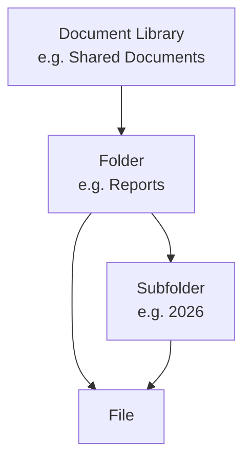

# Working with Folders

Create, copy, move, rename, download, delete, and share folders in SharePoint
document libraries.

---

## Prerequisites

| Requirement | Description | Reference |
|---|---|---|
| **Site Owner** or **Member** role on the library | Required to create, update, and delete folders. Read access for browsing. | [SharePoint permissions](https://learn.microsoft.com/en-us/sharepoint/sharepoint-admin-role) |

---

## How folders work



Folders are containers inside document libraries. They can be nested
and are identified by a server-relative path
(e.g. `/sites/team/Shared Documents/Reports`).

---

## Getting started

```python
from office365.sharepoint.client_context import ClientContext

ctx = ClientContext("https://contoso.sharepoint.com/sites/team").with_client_secret(
    "contoso.onmicrosoft.com", "client_id", "client_secret"
)

# Create a folder
folder = ctx.web.folders.add("/sites/team/Shared Documents/Reports").execute_query()
print(f"Created: {folder.serverRelativeUrl}")

# List files inside
files = folder.files.get().execute_query()
for f in files:
    print(f"  {f.name}")
```

---

## Create & Set Up

| What | File | Notes |
|------|------|-------|
| **Create a folder** | [`create.py`](./create.py) | By server-relative path |
| **Create if not exists** | [`create_if_not_exist.py`](./create_if_not_exist.py) | No error if already there |
| **Create with color** | [`create_with_color.py`](./create_with_color.py) | Folder coloring in modern UI |
| **Create a document set** | [`create_doc_set.py`](./create_doc_set.py) | A special folder with metadata |

## Browse & Discover

| What | File | Notes |
|------|------|-------|
| **Get folder by path** | [`get_by_path.py`](./get_by_path.py) | By server-relative path |
| **Check if exists** | [`folder_exists.py`](./folder_exists.py) | Returns True / False |
| **Check if exists (v2)** | [`folder_exists_v2.py`](./folder_exists_v2.py) | Alternative approach |
| **Get by sharing link** | [`get_by_shared_link.py`](./get_by_shared_link.py) | Resolve a sharing link |
| **Get metadata** | [`get_props.py`](./get_props.py) | Name, path, size, item count |
| **Get system metadata** | [`get_system_metadata.py`](./get_system_metadata.py) | Internal SharePoint fields |
| **List files inside** | [`list_files.py`](./list_files.py) | All files in a folder |
| **List subfolders** | [`list_folders.py`](./list_folders.py) | Direct children only |
| **List with custom scope** | [`list_folders_custom.py`](./list_folders_custom.py) | Recursive or filtered |
| **Get files list** | [`get_files.py`](./get_files.py) | Alternative file listing |

## Move, Copy & Rename

| What | File | Notes |
|------|------|-------|
| **Move** | [`move.py`](./move.py) | Move to a new location |
| **Move (alternative)** | [`move_alt.py`](./move_alt.py) | Different API endpoint |
| **Copy** | [`copy_folder.py`](./copy_folder.py) | Duplicate with all contents |
| **Copy by path** | [`copy_folder_using_path.py`](./copy_folder_using_path.py) | Uses server-relative path |
| **Rename** | [`rename.py`](./rename.py) | Change the folder name |

## Download

| What | File | Notes |
|------|------|-------|
| **Download as ZIP** | [`download_as_zip.py`](./download_as_zip.py) | Entire folder as a .zip |
| **Download files** | [`download.py`](./download.py) | Download files inside |

## Delete

| What | File | Notes |
|------|------|-------|
| **Delete a folder** | [`delete.py`](./delete.py) | Moves to recycle bin |

## Share

> Sharing operations for folders are in the [`sharing/`](../sharing/) directory.

## Update Properties

| What | File | Notes |
|------|------|-------|
| **Set properties** | [`set_properties.py`](./set_properties.py) | Change folder metadata fields |

---

## API reference

- [Working with folders — SharePoint REST API](https://learn.microsoft.com/en-us/sharepoint/dev/sp-add-ins/working-with-folders-and-files-with-rest#working-with-folders-by-using-rest)
