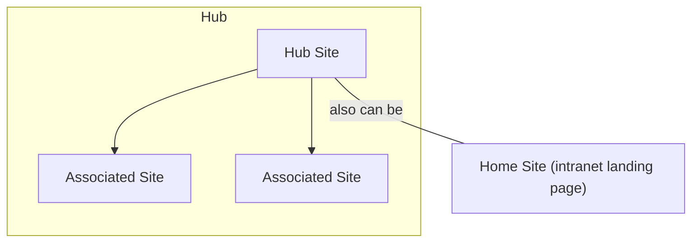

# Hub Sites & Home Sites

Manage hub sites — register, associate, enumerate, and set as the intranet
landing page.

---

## Prerequisites

| Requirement | Description | Reference |
|---|---|---|
| **SharePoint Administrator** role | Required to register, unregister, and manage hub sites. | [SharePoint admin roles](https://learn.microsoft.com/en-us/sharepoint/sharepoint-admin-role) |
| **Site Owner** role (on target site) | Required to associate a site with a hub. | |

---

## How hub sites work



A **hub site** groups related sites under a common navigation and branding.
An associated site inherits the hub's theme and navigation.
A hub site can also be set as the **home site** (intranet landing page).

---

## Examples

| Step | Operation | File | Required role | API reference |
|---|---|---|---|---|
| **1** | List hubs — enumerate all hub sites | [`list_hub_sites.py`](./list_hub_sites.py) | Read access | [List hubs](https://learn.microsoft.com/en-us/sharepoint/dev/apis/rest-api/csom/hubsites) |
| **2** | Register — make a site a hub | [`register_hub_site.py`](./register_hub_site.py) | SharePoint Admin | [Register hub](https://learn.microsoft.com/en-us/sharepoint/dev/apis/rest-api/csom/hubsites) |
| **3** | Associate — join a site to an existing hub | [`associate_site.py`](./associate_site.py) | Site Owner on target site | [Associate](https://learn.microsoft.com/en-us/sharepoint/dev/apis/rest-api/csom/hubsites) |
| **4** | Connected hubs — list hubs associated with a hub | [`get_connected_hubs.py`](./get_connected_hubs.py) | Read access | [Get connected](https://learn.microsoft.com/en-us/sharepoint/dev/apis/rest-api/csom/hubsites) |
| **5** | Unregister — remove hub status from a site | [`unregister_hub_site.py`](./unregister_hub_site.py) | SharePoint Admin | [Unregister](https://learn.microsoft.com/en-us/sharepoint/dev/apis/rest-api/csom/hubsites) |
| **6** | Set home — set a site as intranet landing page | [`set_home_site.py`](./set_home_site.py) | SharePoint Admin | [Set home](https://learn.microsoft.com/en-us/sharepoint/dev/apis/rest-api/csom/hubsites) |
| **7** | List home — enumerate all home sites | [`list_home_sites.py`](./list_home_sites.py) | Read access | [List home](https://learn.microsoft.com/en-us/sharepoint/dev/apis/rest-api/csom/hubsites) |

---

## Quick start

```python
from office365.sharepoint.client_context import ClientContext

ctx = ClientContext("https://contoso-admin.sharepoint.com").with_client_secret(
    "contoso.onmicrosoft.com", "client_id", "client_secret"
)

# List all hub sites
hub_sites = ctx.hub_sites.get().execute_query()
for hub in hub_sites:
    print(f"  {hub.title}  ({hub.site_url})")
```

---

## API reference

- [SharePoint hub sites overview](https://learn.microsoft.com/en-us/sharepoint/dev/features/hub-site/hub-site-overview)
- [SharePoint REST API — hub sites](https://learn.microsoft.com/en-us/sharepoint/dev/apis/rest-api/csom/hubsites)