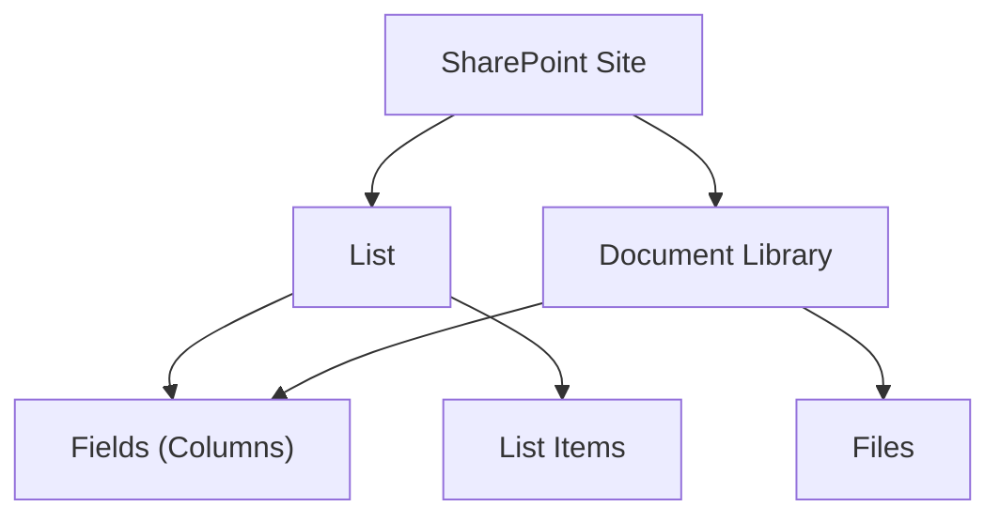

# Working with Lists

A **list** is a container for rows of data — like a database table.
A **document library** is a special kind of list that also stores files.
Every list has a title and a unique ID (GUID).

---

## Prerequisites

| Requirement | Description | Reference |
|---|---|---|
| **Site Owner** or **Member** role | Required to create, update, and delete lists. Read access for browsing. | [SharePoint permissions](https://learn.microsoft.com/en-us/sharepoint/sharepoint-admin-role) |

---

## How lists work



---

## Getting started

```python
from office365.sharepoint.client_context import ClientContext

ctx = ClientContext("https://contoso.sharepoint.com/sites/team").with_client_secret(
    "contoso.onmicrosoft.com", "client_id", "client_secret"
)

# Read all lists on the site
all_lists = ctx.web.lists.get().execute_query()
for l in all_lists:
    print(f"  {l.title}  (ID: {l.id})")

# Get a specific list by title
target = ctx.web.lists.get_by_title("Documents").get().execute_query()
print(f"Items: {target.item_count}, Fields: {len(target.fields)}")
```

---

## Create & Manage

| What | File | Notes |
|------|------|-------|
| **Create a list** | [`create.py`](./create.py) | With title and description |
| **Delete a list** | [`delete.py`](./delete.py) | Moves to recycle bin |
| **Save as template** | [`save_as_template.py`](./save_as_template.py) | Export as `.stp` file |
| **Clear all items** | [`clear.py`](./clear.py) | Removes every item |
| **Show / hide columns** | [`show_hide_columns.py`](./show_hide_columns.py) | Toggle column visibility in views |

## Read & Browse

| What | File | Notes |
|------|------|-------|
| **Read list properties** | [`read_properties.py`](./read_properties.py) | Title, ID, description, item count |
| **Read list schema** | [`read_schema.py`](./read_schema.py) | Fields, content types, settings |
| **Read all lists** | [`read_all.py`](./read_all.py) | All lists on a site |
| **Read with paging** | [`read_paged.py`](./read_paged.py) | Paginated item rows |
| **Get list size** | [`read_lib_size.py`](./read_lib_size.py) | Total storage used |
| **Get changes** | [`get_changes.py`](./get_changes.py) | Change log since a time stamp |
| **Get data as stream** | [`get_data_as_stream.py`](./get_data_as_stream.py) | Low-level data access |
| **Export list metadata** | [`export_list.py`](./export_list.py) | List definition as XML |

## Import

| What | File | Notes |
|------|------|-------|
| **Import from CSV** | [`import_list.py`](./import_list.py) | Creates items from a `.csv` file |
| **Import into library** | [`import_lib.py`](./import_lib.py) | Import files into a library |

## Filter & Query

| What | File | Notes |
|------|------|-------|
| **Filter with OData** | [`read_items_with_filter.py`](./read_items_with_filter.py) | `$filter` query syntax |
| **Filter with CAML** | [`read_items_with_caml_query.py`](./read_items_with_caml_query.py) | XML-based query language |
| **Filter list collection** | [`filter.py`](./filter.py) | Filter which lists are returned |

## Advanced

| What | File | Notes |
|------|------|-------|
| **Diagnose broken taxonomy** | [`assessment/broken_tax_field_value.py`](./assessment/broken_tax_field_value.py) | Fix broken taxonomy field values |

---

## API reference

- [Working with lists — SharePoint REST API](https://learn.microsoft.com/en-us/sharepoint/dev/sp-add-ins/working-with-lists-and-list-items-with-rest#retrieving-lists-and-list-properties-with-rest)
