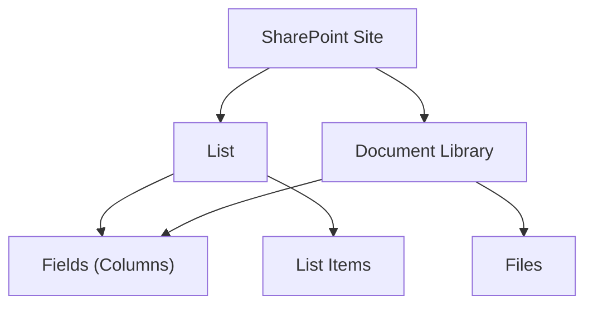

# Lists

A **list** is a container for rows of data, like a database table.
A **document library** is a special kind of list that also stores files.
Every list has a title and a unique ID (GUID).

---

## Prerequisites

| Requirement | Description | Reference |
|---|---|---|
| **Site Owner** or **Member** role | Required to create, update, and delete lists. Read access for browsing. | [SharePoint admin roles](https://learn.microsoft.com/en-us/sharepoint/sharepoint-admin-role) |

---

## How lists work



---

## Examples

### Create and manage

| Step | Operation | File | Required role | API reference |
|---|---|---|---|---|
| **1** | Create a list | [`create.py`](./create.py) | Member on site | [Lists REST API](https://learn.microsoft.com/en-us/sharepoint/dev/sp-add-ins/working-with-lists-and-list-items-with-rest) |
| **2** | Update list properties | [`update_list.py`](./update_list.py) | Member on site | [Lists REST API](https://learn.microsoft.com/en-us/sharepoint/dev/sp-add-ins/working-with-lists-and-list-items-with-rest) |
| **3** | Delete a list | [`delete.py`](./delete.py) | Member on site | [Lists REST API](https://learn.microsoft.com/en-us/sharepoint/dev/sp-add-ins/working-with-lists-and-list-items-with-rest) |
| **4** | Save as template | [`save_as_template.py`](./save_as_template.py) | Member on site | [Lists REST API](https://learn.microsoft.com/en-us/sharepoint/dev/sp-add-ins/working-with-lists-and-list-items-with-rest) |
| **5** | Clear all items | [`clear.py`](./clear.py) | Member on site | [Lists REST API](https://learn.microsoft.com/en-us/sharepoint/dev/sp-add-ins/working-with-lists-and-list-items-with-rest) |
| **6** | Show or hide columns | [`show_hide_columns.py`](./show_hide_columns.py) | Member on site | [Lists REST API](https://learn.microsoft.com/en-us/sharepoint/dev/sp-add-ins/working-with-lists-and-list-items-with-rest) |

### Read and browse

| Step | Operation | File | Required role | API reference |
|---|---|---|---|---|
| **7** | Read list properties | [`read_properties.py`](./read_properties.py) | Read access | [Lists REST API](https://learn.microsoft.com/en-us/sharepoint/dev/sp-add-ins/working-with-lists-and-list-items-with-rest) |
| **8** | Read list schema | [`read_schema.py`](./read_schema.py) | Read access | [Lists REST API](https://learn.microsoft.com/en-us/sharepoint/dev/sp-add-ins/working-with-lists-and-list-items-with-rest) |
| **9** | Read all lists on site | [`read_all.py`](./read_all.py) | Read access | [Lists REST API](https://learn.microsoft.com/en-us/sharepoint/dev/sp-add-ins/working-with-lists-and-list-items-with-rest) |
| **10** | Read with paging | [`read_paged.py`](./read_paged.py) | Read access | [Lists REST API](https://learn.microsoft.com/en-us/sharepoint/dev/sp-add-ins/working-with-lists-and-list-items-with-rest) |
| **11** | Get list storage size | [`read_lib_size.py`](./read_lib_size.py) | Read access | [Lists REST API](https://learn.microsoft.com/en-us/sharepoint/dev/sp-add-ins/working-with-lists-and-list-items-with-rest) |
| **12** | Get changes (change log) | [`get_changes.py`](./get_changes.py) | Read access | [Lists REST API](https://learn.microsoft.com/en-us/sharepoint/dev/sp-add-ins/working-with-lists-and-list-items-with-rest) |
| **13** | Get data as stream | [`get_data_as_stream.py`](./get_data_as_stream.py) | Read access | [Lists REST API](https://learn.microsoft.com/en-us/sharepoint/dev/sp-add-ins/working-with-lists-and-list-items-with-rest) |
| **14** | Export list metadata (XML) | [`export_list.py`](./export_list.py) | Read access | [Lists REST API](https://learn.microsoft.com/en-us/sharepoint/dev/sp-add-ins/working-with-lists-and-list-items-with-rest) |

### Import, filter, and query

| Step | Operation | File | Required role | API reference |
|---|---|---|---|---|
| **15** | Import from CSV | [`import_list.py`](./import_list.py) | Member on list | [Lists REST API](https://learn.microsoft.com/en-us/sharepoint/dev/sp-add-ins/working-with-lists-and-list-items-with-rest) |
| **16** | Import into library | [`import_lib.py`](./import_lib.py) | Member on library | [Lists REST API](https://learn.microsoft.com/en-us/sharepoint/dev/sp-add-ins/working-with-lists-and-list-items-with-rest) |
| **17** | Filter with OData | [`read_items_with_filter.py`](./read_items_with_filter.py) | Read access | [Lists REST API](https://learn.microsoft.com/en-us/sharepoint/dev/sp-add-ins/working-with-lists-and-list-items-with-rest) |
| **18** | Filter with CAML | [`read_items_with_caml_query.py`](./read_items_with_caml_query.py) | Read access | [Lists REST API](https://learn.microsoft.com/en-us/sharepoint/dev/sp-add-ins/working-with-lists-and-list-items-with-rest) |
| **19** | Filter list collection | [`filter.py`](./filter.py) | Read access | [Lists REST API](https://learn.microsoft.com/en-us/sharepoint/dev/sp-add-ins/working-with-lists-and-list-items-with-rest) |

### Advanced

| Step | Operation | File | Required role | API reference |
|---|---|---|---|---|
| **20** | Diagnose broken taxonomy field | [`assessment/broken_tax_field_value.py`](./assessment/broken_tax_field_value.py) | Site Owner | [Lists REST API](https://learn.microsoft.com/en-us/sharepoint/dev/sp-add-ins/working-with-lists-and-list-items-with-rest) |

---

## Quick start

```python
from office365.sharepoint.client_context import ClientContext

ctx = ClientContext("https://contoso.sharepoint.com/sites/team").with_client_secret(
    "contoso.onmicrosoft.com", "client_id", "client_secret"
)

# Read all lists on the site
all_lists = ctx.web.lists.get().execute_query()
for l in all_lists:
    print(f"  {l.title}  (ID: {l.id})")

# Get a specific list by title
target = ctx.web.lists.get_by_title("Documents").get().execute_query()
print(f"Items: {target.item_count}, Fields: {len(target.fields)}")
```

---

## API reference

- [Working with lists, SharePoint REST API](https://learn.microsoft.com/en-us/sharepoint/dev/sp-add-ins/working-with-lists-and-list-items-with-rest)
